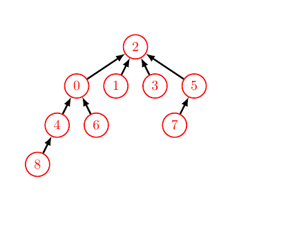
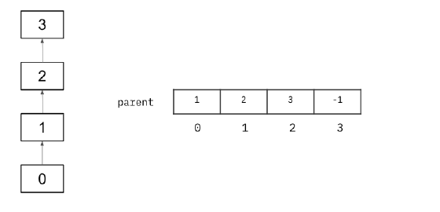
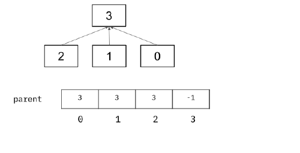
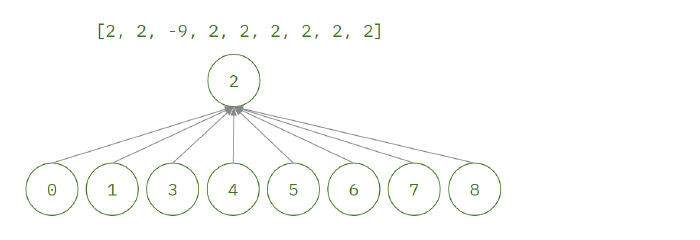

# Discussion 05 — Asymptotics, Disjoint Sets / 渐近分析与不相交集合

> UC Berkeley CS 61B, Spring 2024
> Discussion date: February 19, 2024

## Regular

### Question 1 — Asymptotics / 渐近分析

#### 1a

Say we have a function `findMax` that iterates through an unsorted `int` array one time and returns the maximum element found in that array. Give the tightest lower and upper bounds ($\Omega(\cdot)$ and $O(\cdot)$) of `findMax` in terms of $N$, the length of the array. Is it possible to define a $\Theta(\cdot)$ bound for `findMax`?

> **中文翻译：** 假设有一个函数 `findMax`，它遍历一个未排序的 `int` 数组一次，并返回数组中的最大元素。请用数组长度 $N$ 表示 `findMax` 最紧的下界与上界（$\Omega(\cdot)$ 和 $O(\cdot)$）。能否为 `findMax` 定义一个 $\Theta(\cdot)$ 界？

#### ✍️ My Answer

> 在这里作答

<details>
<summary>✅ 查看答案与解析</summary>

#### 官方答案

Lower bound: $\Omega(N)$, Upper bound: $O(N)$

Because the array is unsorted, we don’t know where the max will be, so we have to iterate through the entire array to ensure that we find the true max. Therefore, we know that we can never go faster than linear time with respect to the length of the array. Since the function is both lower and upper bounded by $N$, we can say that the function is theta-bounded by $N$ as well ($\Theta(N)$).

#### 解析

未排序数组的最大值可能出现在任意位置。为了确认某个候选值确实最大，算法必须检查所有 $N$ 个元素，因此工作量至少是 $\Omega(N)$；题目又明确说 `findMax` 只完整遍历一次，所以工作量至多是 $O(N)$。上下界相同，故可合并为 $\Theta(N)$。

这里讨论的是给定实现的运行时间，而不是某个幸运输入下能否提前猜中最大值。即使最大值恰好在第一个位置，不读取后续元素也无法证明它就是最大值。

#### 考点

- $O$、$\Omega$ 与 $\Theta$ 的关系
- 紧确渐进界
- 未排序数组的最大值查找
- 最坏情况与输入无关的必需工作

</details>

#### 1b

Give the worst case and best case runtime in terms of $M$ and $N$. Assume `ping` is in $\Theta(1)$ and returns an `int`.

> **中文翻译：** 用 $M$ 和 $N$ 表示下面代码的最坏情况与最好情况运行时间。假设 `ping` 的运行时间为 $\Theta(1)$，并返回一个 `int`。

```java
for (int i = N; i > 0; i--) {
    for (int j = 0; j <= M; j++) {
        if (ping(i, j) > 64) { break; }
    }
}
```

#### ✍️ My Answer

> 在这里作答

<details>
<summary>✅ 查看答案与解析</summary>

#### 官方答案

Worst: $\Theta(MN)$, Best: $\Theta(N)$

We repeat the outer loop $N$ times, no matter what. For the inner loop, we see the amount of times we repeat it depends on the result of `ping`. In the best case, it returns true immediately, such that we’ll only ever look at the inner loop once and then break the inner loop. In the worst case, `ping` is always false and we complete the inner loop $M$ times for every value of $N$ in the outer loop.

#### 解析

外层循环固定执行 $N$ 次。最好情况下，每次第一次调用 `ping(i, 0)` 就得到大于 64 的整数并立刻 `break`，所以每轮只做常数工作，总计 $\Theta(N)$。最坏情况下，条件始终不成立，内层循环执行 $M+1$ 次；渐进记号忽略常数差异，因此总计 $\Theta(N(M+1))=\Theta(MN)$（通常假设 $M$ 为正且随输入增长）。

**补充分析（非官方答案）：** 官方解释把 `ping` 的结果写成了 “returns true” 和 “always false”，但题目明确说明它返回 `int`。严格来说，应理解为“返回值是否满足 `ping(i, j) > 64`”。这是官方文字表述上的类型不一致，不影响给出的渐进答案。

#### 考点

- 嵌套循环的复杂度
- `break` 对最好情况的影响
- $M+1$ 与 $M$ 的渐进等价
- 布尔条件与返回值类型

</details>

#### 1c

Below we have a function that returns true if every `int` has a duplicate in the array, and false if there is any unique `int` in the array. Assume `sort(array)` is in $\Theta(N\log N)$ and returns `array` sorted.

> **中文翻译：** 下面的函数在数组中的每个 `int` 都有重复项时返回 `true`，只要存在任何唯一的 `int` 就返回 `false`。假设 `sort(array)` 的运行时间为 $\Theta(N\log N)$，并返回排序后的 `array`。

```java
public static boolean noUniques(int[] array) {
    array = sort(array);
    int N = array.length;
    for (int i = 0; i < N; i += 1) {
        boolean hasDuplicate = false;
        for (int j = 0; j < N; j += 1) {
            if (i != j && array[i] == array[j]) {
                hasDuplicate = true;
            }
        }
        if (!hasDuplicate) return false;
    }
    return true;
}
```

Give the worst case and best case runtime where $N=\texttt{array.length}$.

> **中文翻译：** 当 $N=\texttt{array.length}$ 时，给出该函数的最坏情况与最好情况运行时间。

#### ✍️ My Answer

> 在这里作答

<details>
<summary>✅ 查看答案与解析</summary>

#### 官方答案

Notice that we call `sort` at the beginning of the function, which we are told runs in $\Theta(N\log N)$.

First, we consider the best case. We notice that if `hasDuplicate` is false after the inner loop (i.e, `!hasDuplicate` has truth value true) we can exit the for loop early via the return statement on line 11. Thus, the best case is when we never set `hasDuplicate` to be true during the first time we run the inner loop. In this case, we can return after only looping through the array once, giving us $\Theta(N\log N+N)=\Theta(N\log N)$.

For the worst case, we notice that if `hasDuplicate` is always set to true by the inner loop, we never return on line 11. Thus, we consider the worst case where `hasDuplicate` is always set to true in every loop, forcing us to have to loop fully through both the inner and outer loop. One such input is an array of all the same integer! Since we have to fully loop through both loops, our worst-case runtime is $\Theta(N\log N+N^2)=\Theta(N^2)$.

#### 解析

排序成本无论输入内容如何都会发生，因此最好情况不可能低于 $\Theta(N\log N)$。排序后，如果第一个元素没有重复项，第一次内层循环扫描 $N$ 个元素后即可返回 `false`，总时间为 $\Theta(N\log N+N)=\Theta(N\log N)$。

最坏情况下，每个元素都有重复项，外层循环无法提前返回，两个循环共执行 $N^2$ 次比较；加上排序后是 $\Theta(N\log N+N^2)=\Theta(N^2)$。全体元素相同就是官方给出的一个最坏情况实例。

虽然数组已经排序，本可只检查相邻元素来避免二重循环，但题目要求分析给定实现，不能把潜在优化当成当前代码的运行时间。

#### 考点

- 多阶段算法的复杂度相加
- 提前返回与最好情况
- 主导项化简
- 分析给定代码而非理想算法

</details>

### Question 2 — Disjoint Sets, a.k.a. Union Find / 不相交集合（并查集）

In lecture, we discussed the Disjoint Sets ADT. Some authors call this the Union Find ADT. Today, we will use union find terminology so that you have seen both.

> **中文翻译：** 课堂上介绍了不相交集合 ADT。有些作者把它称为 Union Find ADT（并查集）。本题使用 union find 术语，以便熟悉这两种叫法。

#### 2a

Assume we have nine items, represented by integers 0 through 8. All items are initially unconnected to each other. Draw the union find tree, draw its array representation after the series of `connect()` and `find()` operations, and write down the result of `find()` operations using **WeightedQuickUnion** without path compression. **Break ties by choosing the smaller integer to be the root.**

Note: `find(x)` returns the root of the tree for item `x`.

> **中文翻译：** 假设有九个元素，用整数 0 到 8 表示，初始时彼此都不连通。使用不带路径压缩的 **WeightedQuickUnion** 执行下面一系列 `connect()` 和 `find()` 操作后，画出并查集树及其数组表示，并写出各次 `find()` 的结果。**当两个集合大小相同时，选择较小的整数作为根。**
>
> 注意：`find(x)` 返回元素 `x` 所在树的根。

```java
connect(2, 3);
connect(1, 2);
connect(5, 7);
connect(8, 4);
connect(7, 2);
find(3);
connect(0, 6);
connect(6, 4);
connect(6, 3);
find(8);
find(6);
```

#### ✍️ My Answer

> 在这里作答

<details>
<summary>✅ 查看答案与解析</summary>

#### 官方答案

`find()` returns 2, 2, 2 respectively.

The array is `[2, 2, -9, 2, 0, 2, 0, 5, 4]`.



A walkthrough of how we arrive at this result can be found on the website, [linked here](https://docs.google.com/presentation/d/1sahjWafzaU4SdIFeCUEHMTIIzc9epZ4nD6VpfzxW6ZU/edit#slide=id.g15cdd662168_0_120).

#### 解析

Weighted Quick Union 总是把较小集合的根连接到较大集合的根；大小相等时，本题指定较小编号为根。数组中根节点保存负的集合大小，非根节点保存父节点编号。

关键合并过程如下：

1. `connect(2, 3)` 后 2 为大小 2 的根；`connect(1, 2)` 把 1 接到 2。
2. `connect(5, 7)` 后 5 为根；`connect(8, 4)` 后 4 为根。
3. `connect(7, 2)` 把大小 2 的 `{5,7}` 接到大小 3 的根 2。
4. `connect(0, 6)` 后 0 为根；`connect(6, 4)` 合并两个大小 2 的集合，较小根 0 胜出。
5. `connect(6, 3)` 把根 0 的大小 4 集合接到根 2 的大小 5 集合，最终根 2 记录 `-9`。

因为没有路径压缩，8 仍沿着 $8\to4\to0\to2$ 查找，6 沿着 $6\to0\to2$ 查找；三次 `find` 都返回 2。

#### 考点

- Weighted Quick Union
- 负数根节点与集合大小
- 按大小合并和相同大小时的规则
- 不使用路径压缩时的父指针

</details>

The following implementation of `find` is used for parts 2b and 2c. Given an integer `val`, `find(val)` returns the root value of the set `val` is in. The helper method `parent(int val)` returns the direct parent of `val` in the Disjoint Set representation. Assume that this implementation only uses **QuickUnion**.

> **中文翻译：** 下面的 `find` 实现用于 2b 和 2c。给定整数 `val`，`find(val)` 返回 `val` 所在集合的根值。辅助方法 `parent(int val)` 返回 `val` 在不相交集合表示中的直接父节点。假设该实现只使用 **QuickUnion**。

```java
public int find(int val) {
    int p = parent(val);
    if (p == -1) {
        return val;
    } else {
        int root = find(p);
        return root;
    }
}
```

#### 2b

If $N$ is the number of nodes in the set, what is the runtime of `find` in the worst case? Draw out the structure of the Disjoint Set representation for this worst case.

> **中文翻译：** 如果 $N$ 是集合中的节点数，`find` 的最坏情况运行时间是多少？画出产生该最坏情况的不相交集合结构。

#### ✍️ My Answer

> 在这里作答

<details>
<summary>✅ 查看答案与解析</summary>

#### 官方答案

$\Theta(N)$

The worst case would occur if we have to traverse up $N-1$ nodes to find the root set representative as shown below for `find(0)`. Suppose we started out with elements 0, 1, 2, and 3. Consider the following Disjoint Set:



The worst case runtime of `find` is $\Theta(N)$, for `find(0)`. Since this implementation does not use WeightQuickUnion, this could potentially arise if we unioned 0 to 1, setting 1 as the root, then unioning 1 to 2, setting 2 as the root, and finally unioning 2 to 3, setting 3 as the root (try drawing this out for yourself!). WQU solves this ”spindly set” problem by ensuring that the smaller set is merged into the larger one, so when we try unioning 1 to 2, 1 must be the root and not the 2.

Note that this function also does not implement path compression, making the disjoint set more susceptible to worst cases like this.

#### 解析

普通 Quick Union 不限制树高，因此可能形成 $0\to1\to2\to\cdots\to N-1$ 的链。对最深叶节点调用 `find` 要沿 $N-1$ 条边到达根，每一层只做常数工作，所以时间为 $\Theta(N)$，递归调用栈也需要 $\Theta(N)$ 空间。

WQU 通过把较小树挂到较大树下，将树高限制在 $O(\log N)$，从结构上避免这种细长链。

#### 考点

- Quick Union 的最坏树形
- 树高与 `find` 复杂度
- 递归调用栈
- Quick Union 与 Weighted Quick Union 的差别

</details>

#### 2c

Using a function `setParent(int val, int newParent)`, which updates the value of `val`’s parent to `newParent`, modify `find` to achieve a faster runtime using path compression. You may add at most one line to the provided implementation.

> **中文翻译：** 使用函数 `setParent(int val, int newParent)`（它把 `val` 的父节点更新为 `newParent`）修改 `find`，通过路径压缩获得更快的运行时间。最多只能在给定实现中增加一行。

#### ✍️ My Answer

> 在这里作答

<details>
<summary>✅ 查看答案与解析</summary>

#### 官方答案

```java
public int find(int val) {
    int p = parent(val);
    if (p == -1) {
        return val;
    } else {
        int root = find(p);
        setParent(val, root); // sets the val's parent to be the root of the set.
        return root;
    }
}
```

> **代码注释翻译：** 将 `val` 的父节点设为该集合的根。

Although our worst case would still be $\Theta(N)$ runtime as in the call to `find(0)` above. However, after one call to `find(0)`, the structure of the disjoint set would change so subsequent calls to `find` would be completed in amortized $O(\log^*(N))$.

Here’s the structure of the set after one call to `find(0)`:



#### 解析

递归先找到根并把它保存在 `root` 中；递归回溯时，新增的 `setParent(val, root)` 会把搜索路径上的每个节点直接连接到根。第一次在长度为 $N$ 的链上调用 `find` 仍需 $\Theta(N)$，但之后同一路径上的查询会显著变短。

**补充分析（非官方答案）：** 上面的“摊还 $O(\log^*N)$”是 Solutions PDF 的原文。仅使用路径压缩、但不配合按大小或按秩合并时，通常不能直接套用 WQU 加路径压缩的经典近常数摊还界；严格界取决于采用的合并策略和所分析的操作序列。因此此处保留官方答案，但不把该复杂度推广为所有“仅 Quick Union + 路径压缩”实现的通用结论。

#### 考点

- 路径压缩
- 递归回溯时更新父指针
- 单次最坏复杂度与摊还复杂度
- 合并策略对理论界的影响

</details>

#### 2d

**Extra Practice:** Draw out the tree and array representation for the following WeightedQuickUnion with path compression that has 9 elements from 0 to 8. Break ties by choosing the smaller integer to be root.

> **中文翻译：** **额外练习：** 对下面包含 0 到 8 共 9 个元素、带路径压缩的 WeightedQuickUnion，画出树和数组表示。大小相同时选择较小整数作为根。

```java
connect(2, 3);
connect(1, 2);
connect(5, 7);
connect(8, 4);
connect(7, 2);
find(3);
connect(0, 6);
connect(7, 4);
connect(6, 3);
find(8);
find(6);
```

#### ✍️ My Answer

> 在这里作答

<details>
<summary>✅ 查看答案与解析</summary>

#### 官方答案



#### 解析

最终数组为 `[2, 2, -9, 2, 2, 2, 2, 2, 2]`，所有非根节点都直接指向根 2。这个文字化数组是对官方图的读取与补充说明；Solutions PDF 的“Solution”区域本身只给出了上图。

`find(3)` 时 3 已直接指向 2。后续合并使所有 9 个元素归入以 2 为根的集合；`find(8)` 压缩 8 所在路径，`find(6)` 再压缩 6 所在路径，最终得到图中的扁平星形结构。

#### 考点

- WQU 与路径压缩的组合
- `find` 对树结构的副作用
- 数组表示与树表示的互相转换
- 根节点保存负的集合大小

</details>

# Exam Prep

### Question 1 — Asymptotics Introduction / 渐近分析入门

Give the runtime of the following functions in $\Theta$ notation. Your answer should be as simple as possible with no unnecessary leading constants or lower order terms.

> **中文翻译：** 用 $\Theta$ 记号给出下列函数的运行时间。答案应尽可能简洁，不要包含不必要的常数因子或低阶项。

```java
private void f1(int N) {
    for (int i = 1; i < N; i++) {
        for (int j = 1; j < i; j++) {
            System.out.println("shreyas 1.0");
        }
    }
}
```

$\Theta(\_\_\_)$

```java
private void f2(int N) {
    for (int i = 1; i < N; i *= 2) {
        for (int j = 1; j < i; j++) {
            System.out.println("shreyas 2.0");
        }
    }
}
```

$\Theta(\_\_\_)$

#### ✍️ My Answer

> 在这里作答

<details>
<summary>✅ 查看答案与解析</summary>

#### 官方答案

```java
private void f1(int N) {
    for (int i = 1; i < N; i++) {
        for (int j = 1; j < i; j++) {
            System.out.println("shreyas 1.0");
        }
    }
}
```

$\Theta(N^2)$

```java
private void f2(int N) {
    for (int i = 1; i < N; i *= 2) {
        for (int j = 1; j < i; j++) {
            System.out.println("shreyas 2.0");
        }
    }
}
```

$\Theta(N)$

Explanation (1): The inner loop does up to $i$ work each time, and the outer loop increments $i$ each time. Summing over each loop, we get that $1+2+3+4+\cdots+N=\Theta(N^2)$.

Explanation (2): The inner loop does $i$ work each time, and we double $i$ each time until reaching $N$. $1+2+4+8+\cdots+N=\Theta(N)$.

#### 解析

`f1` 的总打印次数是一个等差级数：

$$
\sum_{i=1}^{N-1}(i-1)=\frac{(N-1)(N-2)}{2}=\Theta(N^2).
$$

`f2` 的外层变量依次为 $1,2,4,\ldots$，虽然外层只有 $\Theta(\log N)$ 轮，但每轮内层工作量也随 $i$ 增长。几何级数之和由最后一项主导：

$$
1+2+4+\cdots+2^k=2^{k+1}-1=\Theta(N).
$$

常见错误是看到 `f2` 的外层倍增就直接回答 $\Theta(\log N)$，却忽略每轮不断增长的内层循环。

#### 考点

- 等差级数与平方复杂度
- 几何级数
- 倍增循环
- 不能简单相乘非独立循环的界

</details>

### Question 2 — Disjoint Sets / 不相交集合

For each of the arrays below, write whether this could be the array representation of a weighted quick union with path compression and explain your reasoning. **Break ties by choosing the smaller integer to be the root.**

> **中文翻译：** 对下面每个数组，判断它能否表示一个带路径压缩的 weighted quick union，并解释理由。**大小相同时选择较小整数作为根。**

| | `i` | 0 | 1 | 2 | 3 | 4 | 5 | 6 | 7 | 8 | 9 |
|---|---|---:|---:|---:|---:|---:|---:|---:|---:|---:|---:|
| A | `a[i]` | 1 | 2 | 3 | 0 | 1 | 1 | 1 | 4 | 4 | 5 |
| B | `a[i]` | 9 | 0 | 0 | 0 | 0 | 0 | 9 | 9 | 9 | -10 |
| C | `a[i]` | 1 | 2 | 3 | 4 | 5 | 6 | 7 | 8 | 9 | -10 |
| D | `a[i]` | -10 | 0 | 0 | 0 | 0 | 1 | 1 | 1 | 6 | 2 |
| E | `a[i]` | -10 | 0 | 0 | 0 | 0 | 1 | 1 | 1 | 6 | 8 |
| F | `a[i]` | -7 | 0 | 0 | 1 | 1 | 3 | 3 | -3 | 7 | 7 |

#### ✍️ My Answer

> 在这里作答

<details>
<summary>✅ 查看答案与解析</summary>

#### 官方答案

There are three criteria here that invalidates a representation:

1. If there is a cycle in the parent-link.
2. For each parent-child link, the tree rooted at the parent is smaller than the tree rooted at the child before the link (you would have merged the other way around).
3. The height of the tree is greater than $\log_2 n$, where $n$ is the number of elements.

Therefore, we have the following verdicts.

- A. Impossible: has a cycle 0-1, 1-2, 2-3, and 3-0 in the parent-link representation.
- B. Impossible: the nodes 1, 2, 3, 4, and 5 must link to 0 when 0 is a root; hence, 0 would not link to 9 because 0 is the root of the larger tree.
- C. Impossible: tree rooted at 9 has height $9>\log_2 10$.
- D. Possible: 8-6, 7-1, 6-1, 5-1, 9-2, 3-0, 4-0, 2-0, 1-0.
- E. Impossible: tree rooted at 0 has height $4>\log_2 10$.
- F. Impossible: tree rooted at 0 has height $3>\log_2 7$.

#### 解析

数组中的负值表示根及集合大小，非负值表示父节点。

- A 的 $0\to1\to2\to3\to0$ 构成环，不可能是树。
- B 要让 1–5 都直接挂在 0 下，0 在被接到 9 之前已经代表更大的集合；WQU 不会把大树挂到小树下。
- C 是长度为 10 的细长链，高度 9，超过 WQU 的对数高度上界。
- D 能按官方列出的父子连接顺序构造，因此可能。
- E 的路径 $9\to2\to0$ 与 $8\to6\to1\to0$ 等结构产生高度 4，超过允许上界。
- F 中根 0 的集合大小为 7，但存在高度 3 的路径；7 个元素的 WQU 高度最多为 $\lfloor\log_2 7\rfloor=2$。

路径压缩只会缩短已有路径，不会帮助产生超过 WQU 高度限制的结构。

#### 考点

- 并查集数组的合法性
- 环检测
- WQU 的按大小合并不变量
- $O(\log N)$ 树高上界
- 路径压缩只能缩短路径

</details>

### Question 3 — Asymptotics of Weighted Quick Unions / 加权快速合并的渐近分析

Note: for all big $\Omega$ and big $O$ bounds, give the tightest bound possible.

> **中文翻译：** 注意：所有大 $\Omega$ 和大 $O$ 界都应给出尽可能紧的界。

#### 3a

Suppose we have a Weighted Quick Union (WQU) without path compression with $N$ elements.

1. What is the runtime, in big $\Omega$ and big $O$, of `isConnected`?

   $\Omega(\_\_\_\_\_\_),\ O(\_\_\_\_\_\_)$

2. What is the runtime, in big $\Omega$ and big $O$, of `connect`?

   $\Omega(\_\_\_\_\_\_),\ O(\_\_\_\_\_\_)$

> **中文翻译：** 假设有一个包含 $N$ 个元素、且不带路径压缩的 Weighted Quick Union（WQU）。分别给出 `isConnected` 和 `connect` 最紧的 $\Omega$ 与 $O$ 运行时间界。

#### ✍️ My Answer

> 在这里作答

<details>
<summary>✅ 查看答案与解析</summary>

#### 官方答案

1. $\Omega(1),\ O(\log(N))$
2. $\Omega(1),\ O(\log(N))$

In the best-case, if we’re checking if `a` and `b` are connected, `a` is the root, and `b` is a node directly below the root. This means we only have to traverse one edge of the tree, which is constant time. In the worst-case, we have to traverse the entire height of the tree, and Weighted Quick Union gives us a worst-case height of $\log N$, hence the upper-bound of $O(\log N)$. Similar logic applies to the `connect` method.

#### 解析

两种操作都要查找一个或两个元素的根。最好情况下元素本身就是根或离根只有常数距离，因而是 $\Omega(1)$；最坏情况下要走到 WQU 树的底部，而按大小合并保证树高不超过 $O(\log N)$。

`connect` 在找到两个根后，只需更新一个父指针和一个大小值，这部分是 $O(1)$，所以总体仍由两次 `find` 主导。

#### 考点

- WQU 的树高
- `isConnected` 与 `connect` 对 `find` 的依赖
- 最紧上下界

</details>

#### 3b

Suppose we add the method `addToWQU` to a WQU without path compression. The method takes in a list of elements and connects them in a random order, stopping when all elements are connected. Assume that all the elements are disconnected before the method call.

> **中文翻译：** 假设在不带路径压缩的 WQU 中加入方法 `addToWQU`。该方法接收一个元素列表，以随机顺序连接它们，并在所有元素连通时停止。假设方法调用前所有元素均不连通。

```java
void addToWQU(int[] elements) {
    int[][] pairs = pairs(elements);
    for (int[] pair: pairs) {
        if (size() == elements.length) {
            return;
        }
        connect(pair[0], pair[1]);
    }
}
```

The `pairs` method takes in a list of elements and generates all possible pairs of elements in a random order. For example, `pairs([1, 2, 3])` might return `[[1, 3], [2, 3], [1, 2]]` or `[[1, 2], [1, 3], [2, 3]]`.

The `size` method calculates the size of the largest component in the WQU.

Assume that `pairs` and `size` run in constant time.

What is the runtime of `addToWQU` in big $\Omega$ and big $O$?

$\Omega(\_\_\_\_\_\_),\ O(\_\_\_\_\_\_)$

Hint: Consider the number of calls to `connect` in the best case and worst case. Then, consider the best/worst case time complexity for one call to `connect`.

> **中文翻译：** `pairs` 方法接收一个元素列表，以随机顺序生成所有可能的元素对。例如，`pairs([1, 2, 3])` 可能返回 `[[1, 3], [2, 3], [1, 2]]`，也可能返回 `[[1, 2], [1, 3], [2, 3]]`。`size` 方法计算 WQU 中最大连通分量的大小。假设 `pairs` 和 `size` 均为常数时间。求 `addToWQU` 最紧的 $\Omega$ 与 $O$ 运行时间界。
>
> 提示：先考虑最好和最坏情况下调用 `connect` 的次数，再考虑单次 `connect` 的最好/最坏时间复杂度。

#### ✍️ My Answer

> 在这里作答

<details>
<summary>✅ 查看答案与解析</summary>

#### 官方答案

$\Omega(N),\ O(N^2\log(N))$

Note that the if-statement terminates the method when the disjoint set becomes fully connected. The best case occurs when there is a sequence of pairs such that each `connect()` operation takes constant time and the tree becomes connected as quickly as possible. This will happen if we have a sequence $(0,1),(0,2),\ldots,(0,N-1)$, which consists of $N-1$ operations each taking constant time (ie. the best case for `connect` from part a). Note that long running-times occur when an element (e.g. 0) is not connected for many operations, and in the worst-case, 0 is not connected until the last $N$ operations. This results in a tree of height $\log N$ and requires up to $N^2-N+1$ iterations.

#### 解析

从 $N$ 个独立分量变成 1 个分量至少需要 $N-1$ 次成功合并，因此最好情况是 $\Omega(N)$；官方给出的星形连接顺序可以让每次查根为常数时间，从而达到线性量级。

`pairs` 含有 $\binom{N}{2}=\Theta(N^2)$ 个无序元素对。最坏情况下可能在接近末尾才连通，并且不带路径压缩的 WQU 单次 `connect` 最坏为 $O(\log N)$，所以总上界是 $O(N^2\log N)$。

**补充分析（非官方答案）：** 官方解释中的精确数字“up to $N^2-N+1$ iterations”与 `pairs` 生成“所有可能的元素对”不一致：无序元素对总数只有 $N(N-1)/2$，不可能执行更多循环。若让一个元素一直孤立到最后，连通前最多可先处理其余 $N-1$ 个元素内部的 $\binom{N-1}{2}$ 对，再用 1 个跨分量对完成连通。这个问题不改变官方给出的渐进上界 $O(N^2\log N)$；修正属于补充分析，不是官方答案。

#### 考点

- 全部无序元素对的数量
- 连通 $N$ 个分量至少需要 $N-1$ 次合并
- 循环次数与单次操作成本相乘
- 精确计数与渐进上界的区别

</details>

#### 3c

Let us define a **matching size connection** as connecting two components in a WQU of equal size. For instance, suppose we have two trees, one with values 1 and 2, and another with the values 3 and 4. Calling `connect(1, 4)` is a matching size connection since both trees have 2 elements.

What is the **minimum** and **maximum** number of matching size connections that can occur after executing `addToWQU`. Assume $N$, i.e. `elements.length`, is a power of two. Your answers should be exact.

minimum: _____, maximum: _____

> **中文翻译：** 定义一次 **matching size connection（等大小连接）** 为：连接 WQU 中两个大小相同的连通分量。例如，一棵树含 1、2，另一棵树含 3、4，则 `connect(1, 4)` 是等大小连接，因为两棵树都含 2 个元素。执行 `addToWQU` 后，等大小连接次数的最小值和最大值分别是多少？假设 $N$（即 `elements.length`）是 2 的幂。答案必须是精确值。

#### ✍️ My Answer

> 在这里作答

<details>
<summary>✅ 查看答案与解析</summary>

#### 官方答案

minimum: 1, maximum: $N-1$

The minimum number occurs for the sequence above, where there is only one matching size connection: $(0,1)$. The maximum number is a bit more tricky, but occurs if we pairwise-connect the elements together, then pairwise connect those, and so on. An example for $N=8$ elements is as follows: $(0,1)$, $(2,3)$, $(4,5)$, $(6,7)$, $(0,2)$, $(4,6)$, $(0,4)$. In general, there are $N/2$ matching-size connections of size 1, $N/4$ matching-size connections of size 2, and so on, up until one matching-size connection of size $N/2$. This is the sum $N/2+N/4+N/8+\cdots+2+1$, which simplifies to $N-1$.

#### 解析

第一次成功连接必然连接两个大小为 1 的单元素分量，所以至少有 1 次等大小连接。之后始终把当前大分量与一个单元素分量连接，就不会再出现等大小，故最小值 1 可达到。

最大化时，每一层都把大小相同的分量两两合并：先做 $N/2$ 次 $1+1$，再做 $N/4$ 次 $2+2$，直到最后一次 $N/2+N/2$。这是等比级数：

$$
\frac N2+\frac N4+\frac N8+\cdots+1=N-1.
$$

这也等于把 $N$ 个独立分量合并成一个分量所需的成功连接总数，因此已经达到绝对上限。

#### 考点

- WQU 的相同大小合并
- 连通分量数量变化
- 等比级数
- 构造达到上下界的操作序列

</details>

---

## 完整性检查

- Regular：原题与 Solutions 均包含 Question 1 的 1a、1b、1c，以及 Question 2 的 2a、2b、2c、2d，题号一一对应。
- Exam Prep：原题与 Solutions 均包含 Question 1、Question 2，以及 Question 3 的 3a、3b、3c，题号一一对应。
- 图片提取：从 Regular Solutions PDF 原页提取 4 张并查集结构图，分别用于 2a 最终树、2b 最坏情况、2c 路径压缩后结构和 2d 最终树；Exam Prep 无需额外图片，数组已转换为 Markdown Table。
- 官方答案和补充分析严格分区；官方原文中的返回值类型表述、路径压缩复杂度适用条件和元素对迭代次数问题均只在中文“解析”中说明，没有静默修改官方答案。

## 官方资料

- [Regular PDF](https://sp24.datastructur.es/assets/discussions/regular05.pdf)
- [Regular Solutions PDF](https://sp24.datastructur.es/assets/discussions/regular05sol.pdf)
- [Exam Prep PDF](https://sp24.datastructur.es/assets/discussions/examlevel05.pdf)
- [Exam Prep Solutions PDF](https://sp24.datastructur.es/assets/discussions/examlevel05sol.pdf)
