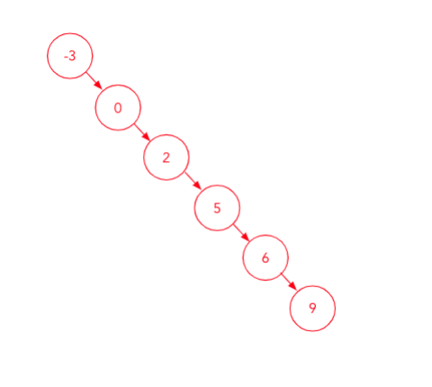
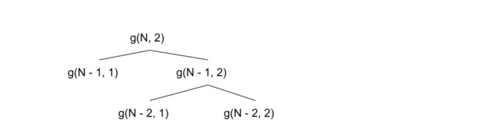
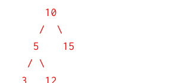

# Discussion 06 — ADTs, Asymptotics II, BSTs / 抽象数据类型、渐近分析 II 与二叉搜索树

> UC Berkeley CS 61B, Spring 2024
> Discussion date: February 26, 2024

## Regular

### Question 1 — ADT Matchmaking / ADT 配对

Match each task to the best Abstract Data Type for the job and justify your answer (ie. explain why other options would be less ideal). The options are `List`, `Map`, `Queue`, `Set`, and `Stack`. Each ADT will be used once.

> **中文翻译：** 为每项任务选择最合适的抽象数据类型，并说明理由（即解释其他选项为什么不够理想）。选项为 `List`、`Map`、`Queue`、`Set` 和 `Stack`，每种 ADT 恰好使用一次。

#### 1

You want to keep track of all the unique users who have logged on to your system.

> **中文翻译：** 你想记录所有登录过系统的不同用户。

#### ✍️ My Answer

> 在这里作答

<details>
<summary>✅ 查看答案与解析</summary>

#### 官方答案

You should use a set because we only want to keep track of unique users (i.e. if a user logs on twice, they shouldn’t show up in our data structure twice). Additionally, our task doesn’t seem to require that the structure is ordered.

#### 解析

`Set` 保证元素不重复，重复登录不会新增第二份记录。本任务也不要求按登录次序保存用户，因此 `List` 或队列结构没有额外优势。

#### 考点

- `Set` 的唯一性语义
- 根据需求选择 ADT

</details>

#### 2

You are creating a version control system and want to associate each file name with a Blob.

> **中文翻译：** 你正在创建版本控制系统，希望把每个文件名与一个 Blob 关联起来。

#### ✍️ My Answer

> 在这里作答

<details>
<summary>✅ 查看答案与解析</summary>

#### 官方答案

You should use a map. Maps naturally let you pair a key and value, and here we could have the file name be the key, and the blob be the value.

#### 解析

`Map` 直接表达“文件名 → Blob”的键值映射。文件名作为键可定位相应 Blob，而其他 ADT 没有内建的键值关联语义。

#### 考点

- `Map` 的键值映射
- 键和值的建模

</details>

#### 3

We are grading a pile of exams and want to grade starting from the top of the pile (Hint: what order do we pile papers in?).

> **中文翻译：** 我们要批改一摞试卷，并希望从最上面开始批改（提示：试卷是按什么顺序摞起来的？）。

#### ✍️ My Answer

> 在这里作答

<details>
<summary>✅ 查看答案与解析</summary>

#### 官方答案

We should use a Stack. When papers are added to a pile, the top of the pile is the last paper added. Since we want to grade the top of the pile first, it makes sense for us to use a last-in-first-out (LIFO) approach in which we continually pop papers off the top of our Stack as we grade them.

#### 解析

最后放上去的试卷最先被取走，正是 `Stack` 的 LIFO（后进先出）。核心操作是从栈顶 `push` 和 `pop`。

#### 考点

- 栈
- LIFO 顺序

</details>

#### 4

We are running a server and want to service clients in the order they arrive.

> **中文翻译：** 我们运行一台服务器，希望按照客户端到达的顺序提供服务。

#### ✍️ My Answer

> 在这里作答

<details>
<summary>✅ 查看答案与解析</summary>

#### 官方答案

We should use a Queue. We can push clients to the front of the Queue as they arrive, and pop them off the Queue as we service them.

#### 解析

需求是 FIFO（先进先出），因此应使用 `Queue`。标准队列通常把新客户端加入队尾，并从队首移除最早到达者。

官方文字写成“push clients to the front”，如果加入与移除都发生在同一端，就会变成 LIFO；这与题意不符。这里保留官方原文，并把标准队列方向作为补充说明。

#### 考点

- 队列
- FIFO 顺序
- 入队端与出队端

</details>

#### 5

We have a lot of books at our library and we want our website to display them in some sorted order. We have multiple copies of some books and we want each listing to be separate.

> **中文翻译：** 图书馆有很多书，希望网站按某种排序显示它们；某些书有多份副本，并且每份都要单独列出。

#### ✍️ My Answer

> 在这里作答

<details>
<summary>✅ 查看答案与解析</summary>

#### 官方答案

We should use a List because a List is an ordered collection of items. Additionally, we need to allow for duplicate items because we have multiple copies of some books.

#### 解析

`List` 既保留顺序又允许重复元素，适合排序后逐项展示每一本副本。`Set` 会去重，因而不符合“每份单独列出”的要求。

#### 考点

- `List` 的顺序性
- 重复元素
- `List` 与 `Set` 的差别

</details>

Some geometric sums you may find helpful in the rest of the worksheet:

$$
1+2+3+4+5+\cdots+N\in\Theta(N^2)
$$

$$
1+2+4+8+16+\cdots+N\in\Theta(N)
$$

General case:

$$
1+2+3+4+5+\cdots+f(N)\in\Theta(f(N)^2)
$$

$$
1+2+4+8+16+\cdots+f(N)\in\Theta(f(N))
$$

> **中文翻译：** 以上是后续题目可能用到的求和公式：等差增长序列由末项平方量级主导，倍增的几何序列由末项量级主导。

### Question 2 — I Am Speed / 我就是速度

#### 2a

For each code block below, fill in the blank(s) so that the function has the desired runtime. Do not use any commas. If the answer is impossible, just write ”impossible” in the blank. Assume that `System.out.println` runs in constant time. You may use Java’s `Math.pow(x, y)` to raise `x` to the power of `y`.

> **中文翻译：** 填写每段代码中的空格，使函数达到指定运行时间。答案中不要使用逗号；若不可能，则在空格中写 `impossible`。假设 `System.out.println` 为常数时间。可以使用 Java 的 `Math.pow(x, y)` 计算 `x` 的 `y` 次幂。

```java
// Desired Runtime: Θ(N)
public static void f1(int N) {
    for (int i = 1; i < N; ____________){
        System.out.println("hi Dom");
    }
}
```

```java
// Desired Runtime: Θ(log N)
public static void f2(int N) {
    for (int i = 1; i < N; ____________) {
        System.out.println("howdy Ergun");
    }
}
```

```java
// Desired Runtime: Θ(1)
public static void f3(int N) {
    for (int i = 1; ______________; i += 1) { System.out.println("hello Anniyat"); }
}
```

```java
// Desired Runtime: Θ(2^N)
// This one is tricky! Hint: think about the dominating term in 1 + 2 + 4 + 8 + ... + f(N)
public static void f4(int N) {
    for (int i = 1; ___________________; i *= 2) {
        for (int j = 0; j < i; j += 1) {
            System.out.println("what's up Alyssa");
        }
    }
}
```

> **代码注释翻译：** 四段代码的目标运行时间依次为 $\Theta(N)$、$\Theta(\log N)$、$\Theta(1)$ 和 $\Theta(2^N)$。第四段提示关注 $1+2+4+8+\cdots+f(N)$ 的主导项。

#### ✍️ My Answer

> 在这里作答

<details>
<summary>✅ 查看答案与解析</summary>

#### 官方答案

```java
// Desired Runtime: Θ(N)
public static void f1(int N) {
    for (int i = 1; i < N; i += 1){
        System.out.println("hi Dom");
    }
}
```

Note the solution could be `i += C`, where `C` is some constant independent of `N`. This is because even if we did for example, `i += 10`, we would do $N/10$ work in total, which is still $\Theta(N)$.

```java
// Desired Runtime: Θ(log N)
public static void f2(int N) {
    for (int i = 1; i < N; i *= 2) {
        System.out.println("howdy Ergun");
    }
}
```

Here, the solution could be `i *= C`, where `C` is some constant independent of `N`. This is because even if we did for example, `i *= 5`, we would do $\log_5(N)$ work in total, and in general $\log_i(N)$ work, which is still $O(\log n)$.

```java
// Desired Runtime: Θ(1)
public static void f3(int N) {
    for (int i = 1; i < 1000; i += 1) {
        System.out.println("hello Anniyat");
    }
}
```

Again, the solution is actually just `i < C`, where `C` is some constant independent of the input `N`.

```java
// Desired Runtime: Θ(2^N)
// This one is tricky! Hint: think about the dominating term in 1 + 2 + 4 + 8 + ... + f(N)
public static void f4(int N) {
    for (int i = 1; i < Math.pow(2, N); i *= 2) {
        for (int j = 0; j < i; j += 1) {
            System.out.println("what's up Alyssa");
        }
    }
}
```

#### 解析

`f1` 每次增加常数，迭代次数与 $N$ 成正比；`f2` 每次乘以固定常数，迭代次数为对数；`f3` 的上界与输入无关；`f4` 的内层工作量依次为 $1,2,4,\ldots,2^N$，总和为 $\Theta(2^N)$。

官方 `f2` 解释中的 “in general $\log_i(N)$” 记号容易误导：倍乘常数是 `C`，更准确应写 $\log_C N$。这只是补充记号说明，官方答案代码保持原样。

#### 考点

- 线性递增与倍增循环
- 常数边界
- 几何级数
- 构造指定复杂度

</details>

#### 2b

**Extra:** Give the worst case and best case running time in $\Theta(\cdot)$ notation in terms of $M$ and $N$. Assume that `kachow()` runs in $\Theta(N^2)$ time and returns a boolean.

> **中文翻译：** **额外练习：** 用 $M$ 和 $N$ 表示下面代码的最坏与最好运行时间。假设 `kachow()` 返回布尔值，且每次运行耗时 $\Theta(N^2)$。

```java
for (int i = 0; i < N; i += 1) {
    for (int j = 1; j <= M; ) {
        if (kachow()) {
            j += 1;
        } else {
            j *= 2;
        }
    }
}
```

#### ✍️ My Answer

> 在这里作答

<details>
<summary>✅ 查看答案与解析</summary>

#### 官方答案

Worst case: $\Theta(N^3M)$, Best case: $\Theta(N^3\log M)$

To see this, note that in the best case `kachow()` always returns false. Regardless of best/worst case, `kachow()` runs with each iteration of the inner loop. Hence `j` multiplies by 2 each inner loop iteration, which means the inner loop would take $N^2\log M$ time for each iteration of the outer loop. In the worst case, `kachow()` always returns true, thus the inner loop iterates $M$ times, each time calling `kachow()`, so the inner loop would take $N^2M$. Since the outer loop always iterates $N$ times, we get the worst and best case by multiplying the time the inner loop takes by $N$.

#### 解析

外层固定运行 $N$ 次，每次内层都会调用成本 $\Theta(N^2)$ 的 `kachow()`。若始终为 `false`，`j` 倍增，内层为 $\Theta(\log M)$ 次；若始终为 `true`，`j` 线性增加，内层为 $\Theta(M)$ 次。分别乘上单次成本和外层次数即可得到官方答案。

#### 考点

- 多参数复杂度
- 分支控制循环变量
- 单次调用成本
- 最好与最坏情况

</details>

### Question 3 — Re-cursed with Asymptotics! / 用递归再做渐近分析

The official Solutions PDF provides a [video walkthrough](https://www.youtube.com/watch?v=iedH3lkY-mQ&list=PLnp31xXvnfRpBCAx-EGDwnOY4YW0zwczO&index=5) for this problem.

#### 3a

What is the runtime of the code below in terms of `n`?

> **中文翻译：** 用 `n` 表示下面代码的运行时间。

```java
public static int curse(int n) {
    if (n <= 0) {
        return 0;
    } else {
        return n + curse(n - 1);
    }
}
```

#### ✍️ My Answer

> 在这里作答

<details>
<summary>✅ 查看答案与解析</summary>

#### 官方答案

$\Theta(n)$. On each recursive call, we do a constant amount of work. We make $n$ recursive calls, because we go from $n$ to 1. Then $n$ recursive layers with 1 work at each layer is overall $\Theta(n)$ work.

#### 解析

递推式为 $T(n)=T(n-1)+\Theta(1)$，深度是 $n$，因此时间和递归栈空间均为 $\Theta(n)$。

#### 考点

- 线性递归
- 递推式
- 调用栈空间

</details>

#### 3b

Can you find a runtime bound for the code below? We can assume the `System.arraycopy` method takes $\Theta(N)$ time, where $N$ is the number of elements copied. The official signature is `System.arrayCopy(Object sourceArr, int srcPos, Object dest, int destPos, int length)`. Here, `srcPos` and `destPos` are the starting points in the source and destination arrays to start copying and pasting in, respectively, and `length` is the number of elements copied.

> **中文翻译：** 求下面代码的运行时间界。假设 `System.arraycopy` 的耗时为 $\Theta(N)$，其中 $N$ 是复制的元素数。`srcPos` 和 `destPos` 分别是源数组与目标数组的起始位置，`length` 是复制长度。

```java
public static void silly(int[] arr) {
    if (arr.length <= 1) {
        System.out.println("You won!");
        return;
    }

    int newLen = arr.length / 2;
    int[] firstHalf = new int[newLen];
    int[] secondHalf = new int[newLen];

    System.arraycopy(arr, 0, firstHalf, 0, newLen);
    System.arraycopy(arr, newLen, secondHalf, 0, newLen);

    silly(firstHalf);
    silly(secondHalf);
}
```

#### ✍️ My Answer

> 在这里作答

<details>
<summary>✅ 查看答案与解析</summary>

#### 官方答案

At each level, we do $N$ work, because the call to `System.arraycopy`. You can see that at the top level, this is $N$ work. At the next level, we make two calls that each operate on arrays of length $N/2$, but that total work sums up to $N$. On the level after that, in four separate recursive function frames we’ll call `System.arraycopy` on arrays of length $N/4$, which again sums up to $N$ for that whole layer of recursive calls.

Now we look for the height of our recursive tree. Each time, we halve the length of $N$, which means that the length of the array $N$ on recursive level $k$ is roughly $N\cdot(1/2)^k$. Then we will finally reach our base case `N <= 1` when we have $N\cdot(1/2)^k=1$. Doing some math, we see this can be transformed into $N=2^k$, which means $k=\log_2(N)$. In other words, the number of layers in our recursive tree is $\log_2(N)$. If we have $\log_2(N)$ layers with $\Theta(N)$ work on each layer, we must have $\Theta(N\log(N))$ runtime.

#### 解析

递推式是 $T(N)=2T(N/2)+\Theta(N)$。递归树每层总复制量为 $\Theta(N)$，共有 $\Theta(\log N)$ 层，所以总时间为 $\Theta(N\log N)$；同时创建的数组总空间也需结合对象生命周期分析。

官方题干把 Java 方法签名写成了 `System.arrayCopy`，但代码中使用的 `System.arraycopy` 才是实际 API 名称。另当数组长度为奇数时，两个长度均为 `floor(N/2)` 的子数组会遗漏最后一个元素；这不改变复杂度结论，但会影响函数的数据语义。两点均属补充分析。

#### 考点

- 分治递推式
- 递归树逐层求和
- `System.arraycopy`
- 奇数长度边界条件

</details>

#### 3c

Given that `exponentialWork` runs in $\Theta(3^N)$ time with respect to input $N$, what is the runtime of `ronnie`?

> **中文翻译：** 已知 `exponentialWork` 关于输入 $N$ 的运行时间为 $\Theta(3^N)$，求 `ronnie` 的运行时间。

```java
public void ronnie(int N) {
    if (N <= 1) {
        return;
    }
    ronnie(N - 2);
    ronnie(N - 2);
    ronnie(N - 2);
    exponentialWork(N); // Runs in Θ(3^N) time
}
```

> **代码注释翻译：** `exponentialWork(N)` 的运行时间为 $\Theta(3^N)$。

#### ✍️ My Answer

> 在这里作答

<details>
<summary>✅ 查看答案与解析</summary>

#### 官方答案

$\Theta(3^N)$. Drawing out the recursive tree, the first level has $\Theta(3^N)$ work, the next level has $\Theta(3^{N-1})$ work, and so on until the last level which has approximately $\Theta(3^{N/2})$ work. This gives the sum $\Theta(3^N)+\Theta(3^{N-1})+\cdots+\Theta(3^{N/2})=\Theta(3^N)$.

#### 解析

递推式为 $T(N)=3T(N-2)+\Theta(3^N)$。第 $k$ 层有 $3^k$ 个节点，每个节点的本地工作为 $3^{N-2k}$，该层合计 $3^{N-k}$；逐层形成递减几何级数，由首项主导，故为 $\Theta(3^N)$。

#### 考点

- 多分支递归
- 递归树每层总工作
- 指数级几何级数

</details>

### Question 4 — BST Asymptotics / BST 渐近分析

Below we define the `find` method of a BST (Binary Search Tree) as in lecture, which returns the BST rooted at the node with key `sk` in our overall BST. In this setup, assume a BST has a key (the value of the tree root) and then pointers to two other child BSTs, `left` and `right`.

> **中文翻译：** 下面定义课堂中的 BST（Binary Search Tree，二叉搜索树）`find` 方法。它返回整棵 BST 中以键 `sk` 所在节点为根的 BST。假设 BST 有一个键以及指向左右子 BST 的 `left`、`right` 指针。

```java
public static BST find(BST tree, Key sk) {
    if (tree == null) {
        return null;
    }
    if (sk.compareTo(tree.key) == 0) {
        return tree;
    } else if (sk.compareTo(tree.key) < 0) {
        return find(tree.left, sk);
    } else {
        return find(tree.right, sk);
    }
}
```

#### 4a

Assume our BST is perfectly bushy. What is the runtime of a single `find` operation in terms of $N$, the number of nodes in the tree? Can we generalize the runtime of `find` to a tight bound?

> **中文翻译：** 假设 BST 完美茂密（完全平衡）。用节点数 $N$ 表示一次 `find` 的运行时间。能否把 `find` 的运行时间概括为一个紧确界？

#### ✍️ My Answer

> 在这里作答

<details>
<summary>✅ 查看答案与解析</summary>

#### 官方答案

Find operations on a perfectly bushy BST take $O(\log(N))$ time, as the height of a perfectly bushy BST is $\log(N)$. In the worst case scenario, the key we’re looking at is all the way at a leaf, so we have to traverse a path from root to leaf of length $\log(N)$.

We cannot generalize the runtime of `find` to a tight bound because the lower and upper bounds are different. It is lower-bounded by $\Omega(1)$ (the case where the key we are looking for is at the root of the BST provided) and upper-bounded by $O(\log(N))$ (mentioned above as the path from root to leaf). Therefore, there is no tight bound for `find`.

#### 解析

平衡 BST 高度为 $\Theta(\log N)$。查找根节点只需 $\Theta(1)$，查找叶节点或不存在的键可能走到最深层，需 $\Theta(\log N)$。因此若不指定键的位置，只能给出 $\Omega(1)$ 与 $O(\log N)$；若问最坏情况，则是 $\Theta(\log N)$。

#### 考点

- BST 高度
- 查找路径
- 单次操作的上下界
- 最坏情况与紧确界

</details>

#### 4b

Say we have an empty BST and want to insert the keys `[6, 2, 5, 9, 0, -3]` (in some order). In what order should we insert the keys into the BST such that the runtime of a single `find` operation after all keys are inserted is $O(N)$? Draw out the resulting BST.

> **中文翻译：** 从空 BST 开始，以某种顺序插入键 `[6, 2, 5, 9, 0, -3]`。应按什么顺序插入，才能使全部插入后一次 `find` 的运行时间为 $O(N)$？画出结果 BST。

#### ✍️ My Answer

> 在这里作答

<details>
<summary>✅ 查看答案与解析</summary>

#### 官方答案

We should insert the keys in ascending sorted order: `[-3, 0, 2, 5, 6, 9]`. This results in a perfectly linear BST, which means that the longest path for `find` (from root to leaf) traverses every single node in the BST. The resulting BST looks like a direct chain of nodes:



Alternatively, we could insert the keys in descending sorted order, which also results in a perfectly linear BST (but the keys would chain left from 9 → 6 → 5 → 2 → 0 → -3).

#### 解析

升序插入时，每个新键都成为前一节点的右孩子，树高为 $N-1$；降序插入则形成全左链。最深位置的查找为 $\Theta(N)$。

题干只要求 $O(N)$，而平衡树的 $O(\log N)$ 也属于 $O(N)$，所以从严格渐进定义看并不能唯一要求线性链。官方显然意在构造最坏查找为线性的 BST；这是题意措辞的补充说明。

#### 考点

- 插入顺序决定 BST 形状
- 退化 BST
- $O(\log N)$ 也是 $O(N)$
- 最坏查找路径

</details>

# Exam Prep

### Question 1 — Finish the Runtimes / 补全运行时间

Below we see the standard nested for loop, but with missing pieces!

```java
for (int i = 1; i < ______; i = ______) {
    for (int j = 1; j < ______; j = ______) {
        System.out.println("Circle is the best TA");
    }
}
```

For each part below, some of the blanks will be filled in, and a desired runtime will be given. Fill in the remaining blanks to achieve the desired runtime! There may be more than one correct answer.

Hint: You may find `Math.pow` helpful.

> **中文翻译：** 上面是缺少部分表达式的标准嵌套循环。下面每小题会预填一部分空格并给出目标运行时间，请补全剩余空格。可能有多个正确答案。提示：`Math.pow` 可能有帮助。

#### 1a

Desired runtime: $\Theta(N^2)$

```java
for (int i = 1; i < N; i = i + 1) {
    for (int j = 1; j < i; j = ______) {
        System.out.println("This is one is low key hard");
    }
}
```

> **中文翻译：** 补全 `j` 的更新表达式，使运行时间为 $\Theta(N^2)$。

#### ✍️ My Answer

> 在这里作答

<details>
<summary>✅ 查看答案与解析</summary>

#### 官方答案

```java
for (int i = 1; i < N; i = i + 1) {
    for (int j = 1; j < i; j = j + 1) {
        System.out.println("This is one is low key hard");
    }
}
```

Explanation: Remember the arithmetic series $1+2+3+4+\cdots+N=\Theta(N^2)$. We get this series by incrementing `j` by 1 per inner loop.

#### 解析

第 `i` 轮内层执行 $i-1$ 次，总和是等差级数 $\Theta(N^2)$。

#### 考点

- 等差级数
- 三角形嵌套循环

</details>

#### 1b

Desired runtime: $\Theta(\log(N))$

```java
for (int i = 1; i < N; i = i * 2) {
    for (int j = 1; j < ______; j = j * 2) {
        System.out.println("This is one is mid key hard");
    }
}
```

> **中文翻译：** 补全内层循环上界，使总运行时间为 $\Theta(\log N)$。

#### ✍️ My Answer

> 在这里作答

<details>
<summary>✅ 查看答案与解析</summary>

#### 官方答案

Any constant would work here, 2 was chosen arbitrarily.

```java
for (int i = 1; i < N; i = i * 2) {
    for (int j = 1; j < 2; j = j * 2) {
        System.out.println("This is one is mid key hard");
    }
}
```

Explanation: The outer loop already runs $\log n$ times, since `i` doubles each time. This means the inner loop must do constant work (so any constant `j < k` would work).

#### 解析

外层运行 $\Theta(\log N)$ 次；固定常数上界使内层每轮为 $\Theta(1)$，总量保持 $\Theta(\log N)$。

#### 考点

- 倍增循环
- 常数内层工作

</details>

#### 1c

Desired runtime: $\Theta(2^N)$

```java
for (int i = 1; i < N; i = i + 1) {
    for (int j = 1; j < ______; j = j + 1) {
        System.out.println("This is one is high key hard");
    }
}
```

> **中文翻译：** 补全内层循环上界，使总运行时间为 $\Theta(2^N)$。

#### ✍️ My Answer

> 在这里作答

<details>
<summary>✅ 查看答案与解析</summary>

#### 官方答案

```java
for (int i = 1; i < N; i = i + 1) {
    for (int j = 1; j < Math.pow(2, i); j = j + 1) {
        System.out.println("This is one is high key hard");
    }
}
```

Explanation: Remember the geometric series $1+2+4+\cdots+2^N=\Theta(2^N)$. We notice that `i` increments by 1 each time, so in order to achieve this $2^N$ runtime, we must run the inner loop $2^i$ times per outer loop iteration.

#### 解析

总工作为 $\sum_{i=1}^{N-1}2^i=\Theta(2^N)$，由几何级数末项主导。

#### 考点

- 指数型内层循环
- 几何级数

</details>

#### 1d

Desired runtime: $\Theta(N^3)$

```java
for (int i = 1; i < ______; i = i * 2) {
    for (int j = 1; j < N * N; j = ______) {
        System.out.println("yikes");
    }
}
```

> **中文翻译：** 补全外层循环上界与内层更新表达式，使总运行时间为 $\Theta(N^3)$。

#### ✍️ My Answer

> 在这里作答

<details>
<summary>✅ 查看答案与解析</summary>

#### 官方答案

```java
for (int i = 1; i < Math.pow(2, N); i = i * 2) {
    for (int j = 1; j < N * N; j = j + 1) {
        System.out.println("yikes");
    }
}
```

Explanation: One way to get $N^3$ runtime is to have the outer loop run $N$ times, and the inner loop run $N^2$ times per outer loop iteration. To make the outer loop run $N$ times, we need stop after multiplying `i = i * 2` $N$ times, giving us the condition `i < Math.pow(2, N)`. To make the inner loop run $N^2$ times, we can simply increment by 1 each time.

#### 解析

外层从 1 倍增到 $2^N$，恰有 $\Theta(N)$ 轮；内层每轮 $\Theta(N^2)$，乘积为 $\Theta(N^3)$。

#### 考点

- 用指数边界制造线性轮数
- 复杂度乘法

</details>

### Question 2 — Asymptotics is Fun! / 渐近分析很有趣

#### 2a

Using the function `g` defined below, what is the runtime of the following function calls? Write each answer in terms of $N$. Feel free to draw out the recursion tree if it helps.

> **中文翻译：** 使用下面定义的函数 `g`，求所列函数调用的运行时间，并用 $N$ 表示。可以画递归树辅助分析。

```java
void g(int N, int x) {
    if (N == 0) {
        return;
    }
    for (int i = 1; i <= x; i++) {
        g(N - 1, i);
    }
}
```

`g(N, 1)`: $\Theta(\quad)$

`g(N, 2)`: $\Theta(\quad)$

#### ✍️ My Answer

> 在这里作答

<details>
<summary>✅ 查看答案与解析</summary>

#### 官方答案

`g(N, 1)`: $\Theta(N)$

When `x` is 1, the loop gets executed once and makes a single recursive call to `g(N - 1)`. The recursion goes `g(N)`, `g(N - 1)`, `g(N - 2)`, and so on. This is a total of $N$ recursive calls, each doing constant work.

`g(N, 2)`: $\Theta(N^2)$

When `x` is 2, the loop gets executed twice. This means a call to `g(N)` makes 2 recursive calls to `g(N - 1, 1)` and `g(N - 1, 2)`. The recursion tree looks like this:



From the first part, we know `g(..., 1)` does linear work. Thus, this is a recursion tree with $N$ levels, and the total work is $(N-1)+(N-2)+\cdots+1=\Theta(N^2)$ work.

#### 解析

当 `x=1` 时每层只有一个子调用，所以是线性链。当 `x=2` 时，递推关系可写为 $T_2(N)=T_2(N-1)+T_1(N-1)+\Theta(1)$，而 $T_1(k)=\Theta(k)$；累加线性项得到平方复杂度。

#### 考点

- 参数影响递归分支
- 非完整二叉递归树
- 等差求和

</details>

#### 2b

Suppose we change line 6 to `g(N - 1, x)` and change the stopping condition in the for loop to `i <= f(x)` where `f` returns a random number between 1 and `x`, inclusive. For the following function calls, find the tightest $\Omega$ and big $O$ bounds. Feel free to draw out the recursion tree if it helps.

> **中文翻译：** 把第 6 行改为 `g(N - 1, x)`，并把循环条件改为 `i <= f(x)`，其中 `f` 随机返回 1 到 `x`（含端点）的整数。求下列调用最紧的 $\Omega$ 与 $O$ 界，可以画递归树。

```java
void g(int N, int x) {
    if (N == 0) {
        return;
    }
    for (int i = 1; i <= f(x); i++) {
        g(N - 1, x);
    }
}
```

`g(N, 2)`: $\Omega(\quad), O(\quad)$

`g(N, N)`: $\Omega(\quad), O(\quad)$

#### ✍️ My Answer

> 在这里作答

<details>
<summary>✅ 查看答案与解析</summary>

#### 官方答案

`g(N, 2)`: $\Omega(N), O(2^N)$

`g(N, N)`: $\Omega(N), O(N^N)$

Suppose `f(x)` always returns 1. Then, this is the same as case 1 from (a), resulting in a linear runtime.

On the other hand, suppose `f(x)` always returns `x`. Then `g(N, x)` makes `x` recursive calls to `g(N - 1, x)`, each of which makes `x` recursive calls to `g(N - 2, x)`, and so on, so the recursion tree has $1,x,x^2,\ldots$ nodes per level. Outside of the recursion, the function `g` does `x` work per node. Thus, the overall work is $x\cdot1+x\cdot x+x\cdot x^2+\cdots+x\cdot x^{N-1}=x(1+x+x^2+\cdots+x^{N-1})$.

Plug in $x=2$ to get $2(1+2+2^2+\cdots+2^{N-1})=O(2^N)$ for our first upper bound. Plug in $x=N$ to get $N(1+N+N^2+\cdots+N^{N-1})=O(N^N)$ (ignoring lower-order terms).

#### 解析

随机值每次至少为 1，所以最少形成深度 $N$ 的单链，给出 $\Omega(N)$。最大分支数固定为 `x`，递归树最多有指数数量节点：`x=2` 得 $O(2^N)$，`x=N` 得 $O(N^N)$。

#### 考点

- 随机分支的上下界
- 递归树节点数
- 参数代入

</details>

### Question 3 — Is This a BST? / 这是 BST 吗？

In this setup, assume a BST (Binary Search Tree) has a key (the value of the tree root represented as an `int`) and pointers to two other child BSTs, `left` and `right`.

> **中文翻译：** 假设 BST 的键是表示树根值的 `int`，并有指向左右子 BST 的 `left` 与 `right` 指针。

#### 3a

The following code should check if a given binary tree is a BST. However, for some trees, it returns the wrong answer. Give an example of a binary tree for which `brokenIsBST` fails.

> **中文翻译：** 下面代码应检查给定二叉树是否为 BST，但它会对某些树返回错误答案。给出一个使 `brokenIsBST` 失败的二叉树示例。

```java
public static boolean brokenIsBST(BST tree) {
    if (tree == null) {
        return true;
    } else if (tree.left != null && tree.left.key > tree.key) {
        return false;
    } else if (tree.right != null && tree.right.key < tree.key) {
        return false;
    } else {
        return brokenIsBST(tree.left) && brokenIsBST(tree.right);
    }
}
```

#### ✍️ My Answer

> 在这里作答

<details>
<summary>✅ 查看答案与解析</summary>

#### 官方答案

Here is an example of a binary tree for which `brokenIsBST` fails:



The method fails for some binary trees that are not BSTs because it only checks that the value at a node is greater than its left child and less than its right child, not that its value is greater than every node in the left subtree and less than every node in the right subtree. Above is an example of a tree for which it fails.

It is important to note that the method does indeed return true for every binary tree that actually is a BST (it correctly identifies proper BSTs).

#### 解析

反例中节点 12 是节点 5 的右孩子，因此满足局部关系 $5<12$；但它同时位于根 10 的左子树，却有 $12>10$，违反了来自祖先 10 的全局上界。只比较父子节点无法验证整个子树。

#### 考点

- BST 全局不变量
- 局部检查的不足
- 祖先边界信息

</details>

#### 3b

Now, write `isBST` that fixes the error encountered in part (a).

Hint: You will find `Integer.MIN_VALUE` and `Integer.MAX_VALUE` helpful.

Hint 2: You want to somehow store information about the keys from previous layers, not just the direct parent and children. How do you use the parameters given to do this?

> **中文翻译：** 编写 `isBST` 修复 3a 的错误。提示：`Integer.MIN_VALUE` 和 `Integer.MAX_VALUE` 会有帮助；需要保存来自之前层级的键信息，而不只是直接父子关系，请思考如何利用给定参数。

```java
public static boolean isBST(BST T) {
    return isBSTHelper(____________________________________________);
}

public static boolean isBSTHelper(BST T, int min, int max) {
    if (________________________________________) {
        ______________________________________________
    } else if (__________________________________________________) {
        ______________________________________________
    } else {
        ______________________________________________
    }
}
```

#### ✍️ My Answer

> 在这里作答

<details>
<summary>✅ 查看答案与解析</summary>

#### 官方答案

```java
public static boolean isBST(BST T) {
    return isBSTHelper(T, Integer.MIN_VALUE, Integer.MAX_VALUE);
}

public static boolean isBSTHelper(BST T, int min, int max) {
    if (T == null) {
        return true;
    } else if (T.key <= min || T.key >= max) {
        return false;
    } else {
        return isBSTHelper(T.left, min, T.key)
                && isBSTHelper(T.right, T.key, max);
    }
}
```

A BST is a naturally recursive structure, so it makes sense to use a recursive helper to go through the BST and ensure it is valid. Specifically, our recursive helper will traverse the BST while tracking the minimum and maximum valid values for subsequent nodes along our current path. We can get these minimum and maximum values by remembering the key property of BSTs: nodes to the left of our current node are always less than the current value, and nodes to the right of our current node are always greater than our current value. So for example, if we encounter a node with value 5, anything to the left must be < 5.

In our base case, an empty BST is always valid. Otherwise, we can check the current node. If it doesn’t fall within our precomputed `min`/`max`, we know this is invalid, and return immediately.

Otherwise, we use the properties of BSTs to bound our subsequent `min` and `max` values. If we traverse to the left, everything must be less than or equal to the current value, so the value of our current node becomes the new `max` for the tree at `T.left`. Similar logic applies to the right.

#### 解析

辅助函数携带当前节点允许的开区间 `(min, max)`。左子树继承下界并把当前键设为新上界；右子树继承上界并把当前键设为新下界。每个节点访问一次，时间 $\Theta(N)$，递归栈为 $O(H)$，其中 $H$ 是树高。

官方实现有一个整数端点边界问题：顶层使用 `Integer.MIN_VALUE` 和 `Integer.MAX_VALUE`，同时用严格开区间检查，会把键恰好等于这两个合法 `int` 端点的树判为无效。可用 `long min, long max` 并传入 `Long.MIN_VALUE`、`Long.MAX_VALUE` 修复；这属于补充修正，不是官方答案。

此外，官方解释末段说左侧必须 “less than or equal to” 当前值，但代码通过 `T.key >= max` 实际要求严格小于；若课程 BST 不允许重复键，代码方向是正确的，文字中的 “or equal to” 不一致。

#### 考点

- 上下界递归
- BST 的全局有序性
- 整数端点边界
- 重复键策略
- 时间与栈空间复杂度

</details>

---

## 完整性检查

- Regular：原题与 Solutions 均包含 Question 1 的 5 个配对项、Question 2 的 2a–2b、Question 3 的 3a–3c、Question 4 的 4a–4b，题号一一对应。
- Exam Prep：原题与 Solutions 均包含 Question 1 的 1a–1d、Question 2 的 2a–2b、Question 3 的 3a–3b，题号一一对应。
- 图片提取：从 Solutions PDF 原页提取 3 张图，分别为 Regular 4b 的线性 BST、Exam Prep 2a 的递归树和 Exam Prep 3a 的 BST 反例。
- 官方答案和补充分析严格分区；队列方向、API 大小写、奇数数组、`O(N)` 题意、整数端点与严格不等号等问题均只在中文“解析”中说明。

## 官方资料

- [Regular PDF](https://sp24.datastructur.es/assets/discussions/regular06.pdf)
- [Regular Solutions PDF](https://sp24.datastructur.es/assets/discussions/regular06sol.pdf)
- [Exam Prep PDF](https://sp24.datastructur.es/assets/discussions/examlevel06.pdf)
- [Exam Prep Solutions PDF](https://sp24.datastructur.es/assets/discussions/examlevel06sol.pdf)
