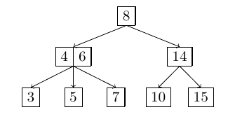
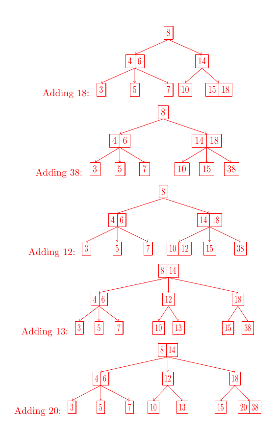
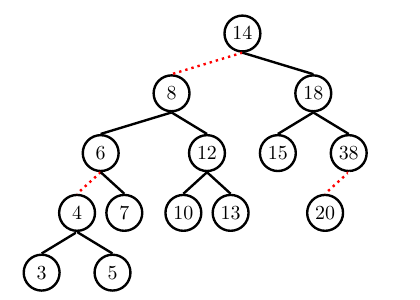
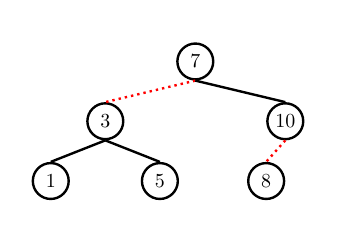
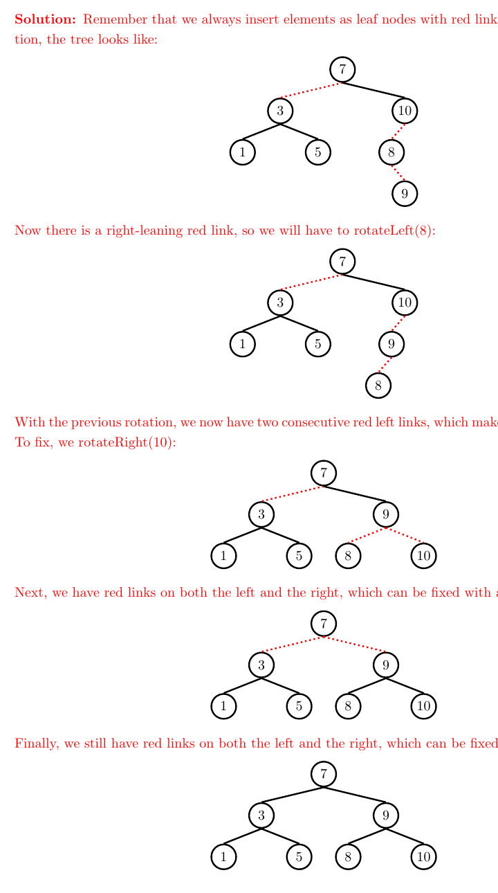
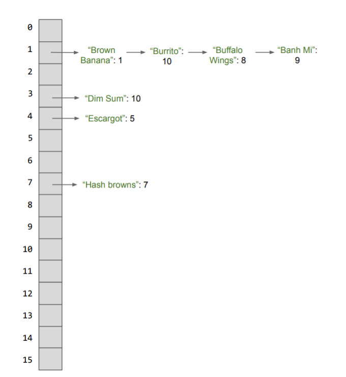
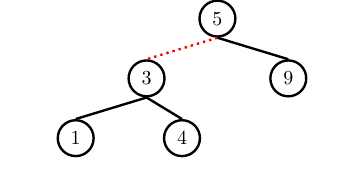
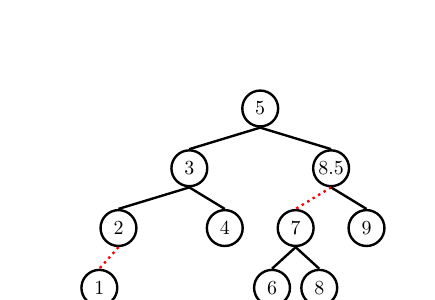
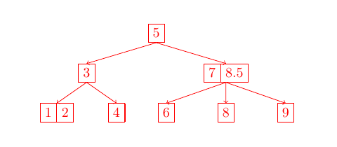
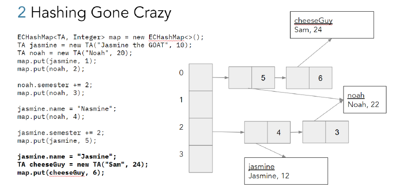

# Discussion 07 — B-Trees, LLRBs, Hashing / B 树、左倾红黑树与哈希

> UC Berkeley CS 61B, Spring 2024
> Discussion date: March 4, 2024

## Regular

### Question 1 — 2-3 Trees and LLRB’s / 2-3 树与左倾红黑树

#### 1a

Draw what the following 2-3 tree would look like after inserting 18, 38, 12, 13, and 20.

> **中文翻译：** 依次插入 18、38、12、13 和 20 后，画出下面这棵 2-3 树的样子。



#### ✍️ My Answer

> 在这里作答

<details>
<summary>✅ 查看答案与解析</summary>

#### 官方答案



#### 解析

官方图示的最终树根结点为 `[8, 14]`：左子树根为 `[4, 6]`，叶结点为 `3`、`5`、`7`；中间子树根为 `12`，叶结点为 `10`、`13`；右子树根为 `18`，叶结点为 `15` 和 `[20, 38]`。这段文字是对官方图的中文转录，不属于 Solutions PDF 的额外文字答案。

- 插入 `18` 后，右侧叶结点成为 `[15, 18]`。
- 插入 `38` 使该叶结点暂时出现三个键，分裂后把 `18` 上推，父结点成为 `[14, 18]`。
- 插入 `12` 得到叶结点 `[10, 12]`。
- 插入 `13` 后该叶结点分裂并上推 `12`，父结点溢出；再次分裂把 `14` 上推到根，得到根 `[8, 14]`。
- 插入 `20` 后，最右叶结点由 `38` 变为 `[20, 38]`。

2-3 树的所有叶结点始终处于相同深度。结点溢出时，中间键上推，左右键分别成为两个子结点。

#### 考点

- 2-3 树插入
- 结点分裂与中间键上推
- 平衡树的不变量

</details>

#### 1b

Now, convert the resulting 2-3 tree to a left-leaning red-black tree.

> **中文翻译：** 现在，把得到的 2-3 树转换为左倾红黑树。

#### ✍️ My Answer

> 在这里作答

<details>
<summary>✅ 查看答案与解析</summary>

#### 官方答案



#### 解析

每个 2-3 树中的三结点 `[a, b]` 对应 LLRB 中一个黑色结点 `b` 与它的红色左孩子 `a`。普通二结点则对应单个黑色结点。

因此根 `[8, 14]` 转换为黑色 `14`，其红色左孩子是 `8`；`[4, 6]` 转换为黑色 `6` 与红色左孩子 `4`；`[20, 38]` 转换为黑色 `38` 与红色左孩子 `20`。其余连接均为黑色。

#### 考点

- 2-3 树与 LLRB 的等价表示
- 红链接表示三结点
- 左倾红链接不变量

</details>

#### 1c

If a 2-3 tree has depth $H$ (that is, the leaves are at distance $H$ from the root), what is the maximum number of comparisons done in the corresponding red-black tree to find whether a certain key is present in the tree?

> **中文翻译：** 如果一棵 2-3 树的深度为 $H$（即叶结点到根的距离为 $H$），那么在对应的红黑树中查找某个键是否存在时，最多会进行多少次比较？

#### ✍️ My Answer

> 在这里作答

<details>
<summary>✅ 查看答案与解析</summary>

#### 官方答案

$2H + 2$ comparisons.

The maximum number of comparisons occur from a root to leaf path with the most nodes. Because the height of the tree is $H$, we know that there is a path down the leaf-leaning red-black tree that consists of at most $H$ black links, for black links in the left-leaning red-black tree are the links that add to the height of the corresponding 2-3 tree. This means that there are $H + 1$ nodes on the path from the root to the leaf, since there is one less link than nodes.

In the worst case, in the 2-3 tree representation, this path can consist entirely of nodes with two items, meaning in the left-leaning red-black tree representation, each blank link is followed by a red link. This doubles the amount of nodes on this path from the root to the leaf.

This example will represent our longest path, which is $2H + 2$ nodes long, meaning we make at most $2H + 2$ comparisons in the left-leaning red-black tree.

#### 解析

2-3 树从根到叶有 $H$ 条边、$H+1$ 个结点。最坏情况下，路径上的每个结点都是包含两个键的三结点；转换成 LLRB 时，每个三结点展开成两个红黑树结点，因此路径最多包含 $2(H+1)=2H+2$ 个结点。搜索每访问一个结点进行一次键比较，所以最多为 $2H+2$ 次。

官方原文中的 “leaf-leaning” 和 “blank link” 应结合上下文理解为 “left-leaning” 与 “black link”；此处保留官方答案措辞，没有静默改写。

#### 考点

- LLRB 黑高
- 2-3 树结点到红黑树结点的展开
- 最坏情况查找路径

</details>

#### 1d

Now, insert 9 into the LLRB Tree. Describe where you would insert this node, and what balancing operations (`rotateLeft`, `rotateRight`, `colorSwap`) you’d take to balance the tree after insertion. Assume that in the given LLRB, dotted links between nodes are red and solid links between nodes are black.

> **中文翻译：** 现在向这棵 LLRB 插入 9。说明该结点应插入的位置，以及插入后为恢复平衡需要依次执行哪些操作（`rotateLeft`、`rotateRight`、`colorSwap`）。假设图中虚线链接为红色，实线链接为黑色。



#### ✍️ My Answer

> 在这里作答

<details>
<summary>✅ 查看答案与解析</summary>

#### 官方答案

Remember that we always insert elements as leaf nodes with red links, so after initial insertion, the tree looks like the first state below.

Now there is a right-leaning red link, so we will have to `rotateLeft(8)`.

With the previous rotation, we now have two consecutive red left links, which makes our tree unbalanced. To fix, we `rotateRight(10)`.

Next, we have red links on both the left and the right, which can be fixed with a `colorFlip(9)`.

Finally, we still have red links on both the left and the right, which can be fixed with a `colorFlip(7)`.



#### 解析

首先按 BST 规则把 `9` 插为 `8` 的右孩子，并用红链接连接。然后依次执行：

1. `rotateLeft(8)`：消除右倾红链接。
2. `rotateRight(10)`：消除连续的两条左红链接。
3. `colorFlip(9)`：拆分临时四结点。
4. `colorFlip(7)`：根的左右链接都为红色，再进行颜色翻转。

最终得到以 `7` 为根的完全黑链接结构，左右子树根分别为 `3` 和 `9`，叶结点为 `1`、`5`、`8`、`10`。

**补充分析（非官方答案）：** 原题把颜色翻转操作写作 `colorSwap`，而 Solutions 使用 `colorFlip`。两处指的是同类颜色翻转操作，但术语不一致；上面均忠实保留原材料。

#### 考点

- LLRB 插入后的三种修复规则
- 左旋、右旋与颜色翻转
- 红链接方向与连续红链接

</details>

### Question 2 — Hashing / 哈希

#### 2a

Here are five potential implementations of the `Integer` class’s `hashCode()` method. Categorize each as (1) invalid, (2) valid but not good, and (3) valid and good. If it is invalid, explain why. If it is valid but not good, point out a flaw or disadvantage. For the 2nd implementation, note that `intValue()` will return that Integer’s number value as an `int`, and assume that Integer’s `equals` method checks for equality of the compared Integers’ `intValue`s.

> **中文翻译：** 下面给出 `Integer` 类的五种潜在 `hashCode()` 实现。把每一种归类为：(1) 无效，(2) 有效但不好，或 (3) 有效且良好。若无效，请解释原因；若有效但不好，请指出缺陷或劣势。对于第二种实现，`intValue()` 返回该 `Integer` 的 `int` 数值，并假设 `Integer.equals` 通过比较双方的 `intValue` 判断相等。

```java
public int hashCode() {
    return -1;
}
```

```java
public int hashCode() {
    return intValue() * intValue();
}
```

```java
public int hashCode() {
    return super.hashCode(); // Object's hashCode() is based on memory location
}
```

> **代码注释翻译：** `Object` 的 `hashCode()` 基于内存位置。

```java
public int hashCode() {
    return (int) (new Date()).getTime(); // returns the current time as an int
}
```

> **代码注释翻译：** 以 `int` 返回当前时间。

```java
public int hashCode() {
    return intValue() + 3;
}
```

#### ✍️ My Answer

> 在这里作答

<details>
<summary>✅ 查看答案与解析</summary>

#### 官方答案

1. `return -1;`

   Valid but not good. As required, this hash function returns the same `hashCode` for Integers that are `equals()` to each other. However, this is a terrible hash function because collisions are extremely frequent (collisions occur 100% of the time).

2. `return intValue() * intValue();`

   Valid but not good. Similar to (a), this hash function returns the same `hashCode` for Integers that are equal. However, integers that share the same absolute values will collide (for example, `x = 5` and `x = -5` will have the same hash code). A better hash function would be to just return the `intValue` itself.

3. `return super.hashCode();`

   Invalid. When we call `super.hashCode()` here, we will ulimately end up returning `Object.hashCode()`. This hash function returns some number corresponding to the Integer object’s location in memory.

   However, note what happens below:

   ```java
   Integer x = new Integer(5);
   Integer y = new Integer(5);
   ```

   Here, `x` and `y` are both instantiated as separate objects, meaning they’ll be at two distinct memory addresses! Then `x` and `y` would receive different hashcodes according to our current `hashCode()` implementation. However, this is not desired/valid behavior, because `x` and `y` are equal according to the `equals()` method, so their hashcodes should be the same.

4. `return (int) (new Date()).getTime();`

   Invalid. This function shouldn’t ever have collisions (except for possible collisions as a result of effectively truncating the `long` to an `int`), but it’s also not consistent because of this: calling `hashCode()` on the same object twice will result in two different ints.

5. `return intValue() + 3;`

   Valid and good. This function will return the same `hashCode` for Integers that are `equals`, and it is consistent (always returns the same value for the same object). It is also a good hash function; there will actually be no collisions here and generally distributes elements evenly, as there is no overlap in `intValue` for two distinct integers (and by proxy, there will be no overlap in `intValue() + 3`).

#### 解析

合法性的底线是：若 `a.equals(b)` 为 `true`，则 `a.hashCode() == b.hashCode()` 必须成立，而且对象在未改变参与相等性判断的状态时，多次调用结果应保持一致。哈希值不同可以推出对象不相等；哈希值相同却不能推出对象相等。

- 常量哈希满足契约，却把所有元素挤进同一桶，哈希表操作可能退化为线性时间。
- 平方哈希使正负相反的整数发生碰撞；`int` 溢出还会产生更多碰撞，但不破坏“相等对象哈希相同”的契约。
- `Object.hashCode()` 不能保证两个值相等但实例不同的 `Integer` 获得相同哈希值。
- 当前时间随调用变化，导致已放入哈希表的键之后可能无法在原桶中找到。
- `intValue() + 3` 在 Java 的 32 位补码溢出语义下仍是对全部 `int` 值的双射，因此不同 `int` 不会因加 3 而合并。

**补充分析（非官方答案）：** 官方称时间方案除截断外“不应发生碰撞”，但同一毫秒内的调用也可能返回相同时间；从 `long` 转为 `int` 的截断还会周期性重复。无论碰撞多少，这一实现最根本的问题仍是非确定性。

#### 考点

- `equals`/`hashCode` 契约
- 碰撞与均匀分布
- 可变或非确定性哈希值
- 哈希质量与正确性的区别

</details>

#### 2b

For each of the following questions, answer Always, Sometimes, or Never.

> **中文翻译：** 对下面每个问题回答 Always（总是）、Sometimes（有时）或 Never（从不）。

##### 1

If you were able to modify a key that has been inserted into a `HashMap` would you be able to retrieve that entry again later? For example, let us suppose you were mapping ID numbers to student names, and you did a `put(303, "Elisa")` operation. Now, let us suppose we somehow went to that item in our `HashMap` and manually changed the key to be 304. If we later do `get(304)`, will we be able to find and return `"Elisa"`? Explain.

> **中文翻译：** 如果能够修改已经插入 `HashMap` 的键，之后还能取回该条目吗？例如，将 ID 映射到学生姓名，先执行 `put(303, "Elisa")`，随后直接把该条目的键改为 304。之后执行 `get(304)` 时，能否找到并返回 `"Elisa"`？请解释。

#### ✍️ My Answer

> 在这里作答

<details>
<summary>✅ 查看答案与解析</summary>

#### 官方答案

Sometimes. If the `hashCode` for the key happens to change as a result of the modification, then we won’t be able to retrieve the entry in our hashtable (unless we were to recompute which bucket the new key would belong to). Changing the key can potentially (and likely) change which bucket a key would now be indexed to.

In our example, let us suppose the `hashCode` for a key was just it’s integer value, and the bucket was calculated as that number modulo the number of buckets. Let’s say we had 10 buckets. In this scenario, 303 would be mapped to bucket 3, and 304 would be mapped to bucket 4. So when we `put(303, "Elisa")`, this item goes to bucket 3. Then we change the key to be 304, but don’t change anything else, so this item remains in bucket 3. Now, let us suppose we later do `get(304)`. We will compute which bucket the key 304 would correspond to, which would be bucket 4. We look in bucket 4 and don’t see the time there, so we cannot successfully return the item.

#### 解析

修改键对象不会触发自动重新哈希。若修改改变了桶索引，条目仍留在旧桶，而 `get` 会到新桶搜索，于是无法找到。回答是 “Sometimes”，因为某些修改可能不影响哈希值或最终桶索引；但依赖这种偶然性是不安全的。参与 `equals` 或 `hashCode` 的字段作为键存入哈希表后应保持不可变。

#### 考点

- 可变键的风险
- 桶索引与重新哈希
- `get` 的查找流程

</details>

##### 2

When you modify a value that has been inserted into a `HashMap` will you be able to retrieve that entry again? For example, in the above scenario, suppose we first inserted `put(303, "Elisa")` and then changed that item’s value from `"Elisa"` to `"William"`. If we later do `get(303)`, will we be able to find and return `"William"`? Explain.

> **中文翻译：** 修改已经插入 `HashMap` 的值后，还能取回该条目吗？例如，先执行 `put(303, "Elisa")`，再把该条目的值从 `"Elisa"` 改为 `"William"`。之后执行 `get(303)` 时，能否找到并返回 `"William"`？请解释。

#### ✍️ My Answer

> 在这里作答

<details>
<summary>✅ 查看答案与解析</summary>

#### 官方答案

Always. The bucket index for an entry in a `HashMap` is decided by the key, not the value. Mutating the value does not affect the lookup procedure.

In our example this would work, because when we do `get(303)` we will still go to the correct bucket.

#### 解析

哈希表用键的哈希值选桶，再用键的相等性定位条目。修改值不会改变这两步，因此仍能用键 `303` 到原桶找到条目，并返回更新后的 `"William"`。

#### 考点

- 键与值的不同作用
- 哈希表查找流程

</details>

### Question 3 — A Side of Hash Browns / 一份薯饼配菜

We want to map food items to their yumminess. We want to be able to find this information in constant time, so we’ve decided to use Java’s built-in `HashMap` class! Here, the key is an `String` representing the food item and the value is an `int` yumminess rating.

For simplicity, let’s say that here a String’s hashcode is the first letter’s position in the alphabet (`A = 0`, `B = 1`... `Z = 25`). For example, the String `"Hashbrowns"` starts with ”H”, and ”H” is 7th letter in the alphabet (0 indexed), so the `hashCode` would be 7. Note that in reality, a String has a much more complicated `hashCode` implementation.

Our `HashMap` will compute the index as the key’s hashcode value modulo the number of buckets in our `HashMap`. Assume the initial size is 4 buckets, and we double the size of our `HashMap` as soon as the load factor reaches 3/4. If we try to put in a duplicate key, simply replace the value associated with that key with the new value.

> **中文翻译：** 我们要把食物映射到美味度评分。为了以常数时间查找，使用 Java 内置 `HashMap`；键是表示食物的 `String`，值是表示美味度的 `int`。为简化问题，字符串哈希值等于首字母在字母表中的 0 起始位置（`A = 0`、`B = 1`……`Z = 25`）。例如 `"Hashbrowns"` 以 H 开头，哈希值为 7；真实的 Java `String.hashCode()` 更复杂。桶索引为键的哈希值对桶数取模。初始有 4 个桶，负载因子一达到 3/4 就把桶数翻倍；若插入重复键，则用新值替换旧值。

#### 3a

Draw what the `HashMap` would look like after the following operations.

> **中文翻译：** 画出执行下面操作后 `HashMap` 的结构。

```java
HashMap<String, Integer> hm = new HashMap<>();
hm.put("Hashbrowns", 7);
hm.put("Dim sum", 10);
hm.put("Escargot", 5);
hm.put("Brown bananas", 1);
hm.put("Burritos", 2);
hm.put("Buffalo wings", 8);
hm.put("Banh mi", 9);
hm.put("Burritos", 10);
```

#### ✍️ My Answer

> 在这里作答

<details>
<summary>✅ 查看答案与解析</summary>

#### 官方答案

Note that we resize from 4 to 8 when adding escargot (because we have 3 items and 4 buckets) and then from 8 to 16 when adding buffalo wings (because we have 6 items and 8 buckets).



#### 解析

插入 `Escargot` 后共有 3 个条目，负载因子达到 $3/4$，桶数由 4 扩到 8；插入 `Buffalo wings` 后共有 6 个条目，再次达到 $6/8=3/4$，桶数扩到 16。扩容必须把现有条目按新桶数重新分桶。

最终键的桶索引为：

| 桶 | 条目 |
|---:|---|
| 1 | `("Brown bananas", 1)` → `("Burritos", 10)` → `("Buffalo wings", 8)` → `("Banh mi", 9)` |
| 3 | `("Dim sum", 10)` |
| 4 | `("Escargot", 5)` |
| 7 | `("Hashbrowns", 7)` |

第二次 `put("Burritos", 10)` 更新已有键的值，不增加条目数量。

**补充分析（非官方答案）：** 官方图中把若干键写成了 `"Brown Banana"`、`"Burrito"`、`"Buffalo Wings"`、`"Banh Mi"` 和 `"Hash browns"`，与原代码的大小写、单复数或空格不完全一致。Java 字符串键对这些差异敏感；上图忠实保留官方图，表格则列出原题实际插入的精确字符串。

#### 考点

- 负载因子与扩容阈值
- 扩容后的重新分桶
- 外部链式法
- 重复键更新值

</details>

#### 3b

Do you see a potential problem here with the behavior of our `HashMap`? How could we solve this?

> **中文翻译：** 你是否看出了这个 `HashMap` 行为中的潜在问题？可以怎样解决？

#### ✍️ My Answer

> 在这里作答

<details>
<summary>✅ 查看答案与解析</summary>

#### 官方答案

Here, adding a bunch of food items that start with the letter ”B” result in one bucket with a lot of items. No matter how many times we resize, our current `hashCode` will result in this problem! Imagine if we added in 100 more items that started with the letter b. Though we would resize and keep our load factor low, it wouldn’t change the fact that our operations will now be slow (hint: linear time) because now we essentially have to iterate over a linked list with pretty much all the items in the `hashMap` to do things like `get("Burrito")`, for example.

A solution to this would be to have a better `hashCode` implementation. A better implementation would distribute the Strings more randomly and evenly. While knowing how to write such a `hashCode` is difficult and out of scope for this class, you can look at the real `hashCode` implementation for Java Strings if you’re curious!

#### 解析

只使用首字母意味着所有 B 开头的食物必然碰撞。扩容只能改变“哈希值对桶数取模”的结果，无法区分本来就具有相同哈希值的键。因此该桶的链会越来越长，`put`、`get` 和 `remove` 的最坏时间复杂度会退化到 $\Theta(N)$。

解决办法是让哈希函数综合字符串中的多个字符，使常见输入尽量均匀分布。良好的扩容策略与良好的哈希函数缺一不可：低负载因子本身不能消除系统性碰撞。

#### 考点

- 哈希碰撞
- 均匀分布
- 外部链长度与复杂度退化
- 扩容的局限

</details>

# Exam Prep

### Question 1 — LLRB Insertions / LLRB 插入

Given the LLRB below, perform the following insertions and draw the final state of the LLRB. In addition, for each insertion, write the balancing operations needed in the correct order (rotate right, rotate left, or color flip). If no balancing operations are needed, write ”Nothing”. Assume that the link between 5 and 3 is red and all other links are black at the start.

> **中文翻译：** 给定下面的 LLRB，依次执行指定插入并画出最终状态。对每次插入，按正确顺序写出所需的平衡操作（右旋、左旋或颜色翻转）；若不需要操作，写 “Nothing”。初始时 `5` 与 `3` 之间的链接为红色，其余链接均为黑色。



#### 1a

1. Insert 7
2. Insert 6
3. Insert 2
4. Insert 8
5. Insert 8.5
6. Final state

> **中文翻译：** 依次插入 `7`、`6`、`2`、`8`、`8.5`，并画出最终状态。

#### ✍️ My Answer

> 在这里作答

<details>
<summary>✅ 查看答案与解析</summary>

#### 官方答案

For a visualization of the process, [see here](https://docs.google.com/presentation/d/1uWEnm4L2cNTmFNeT4qqATHWRA9tbYbcV78uJRFIZtqw/edit#slide=id.g8336e82847_0_2584).

1. Insert 7
   - Nothing
2. Insert 6
   - `rotateRight(9)`
   - `colorFlip(7)`
   - `colorFlip(5)`
3. Insert 2
   - `rotateLeft(1)`
4. Insert 8
   - Nothing
5. Insert 8.5
   - `rotateLeft(8)`
   - `rotateRight(9)`
   - `colorFlip(8.5)`
   - `rotateLeft(7)`
6. Final state:



#### 解析

LLRB 插入先按 BST 规则加入红色叶结点，再由下向上修复：右红链接要左旋；连续两条左红链接要右旋；同一结点的左右链接都为红色时进行颜色翻转。

- 插入 `7` 后它是 `9` 的红色左孩子，不违反规则。
- 插入 `6` 形成连续左红链接，围绕 `9` 右旋，再对 `7` 和 `5` 进行颜色翻转。
- 插入 `2` 后 `1→2` 是右红链接，因此左旋 `1`。
- 插入 `8` 后无需修复。
- 插入 `8.5` 依次触发右红、连续左红、临时四结点和上层右红四种情形，故执行官方列出的四步。

最终根为 `5`；左子树根为 `3`，其孩子为 `2` 和 `4`，`2` 有红色左孩子 `1`；右子树根为 `8.5`，其红色左孩子为 `7`、黑色右孩子为 `9`，`7` 的孩子为 `6` 和 `8`。

#### 考点

- LLRB 插入修复顺序
- 局部旋转与颜色翻转
- 红黑链接不变量

</details>

#### 1b

Convert the final LLRB to its corresponding 2-3 Tree.

> **中文翻译：** 把最终 LLRB 转换为对应的 2-3 树。

#### ✍️ My Answer

> 在这里作答

<details>
<summary>✅ 查看答案与解析</summary>

#### 官方答案



#### 解析

把每条红色左链接两端的键合并为一个三结点：`2` 与红色左孩子 `1` 合并为 `[1, 2]`；`8.5` 与红色左孩子 `7` 合并为 `[7, 8.5]`。黑链接保持为 2-3 树的父子关系。

最终根为 `5`，第二层为 `3` 与 `[7, 8.5]`，叶结点依次为 `[1, 2]`、`4`、`6`、`8`、`9`。

#### 考点

- LLRB 到 2-3 树的转换
- 红链接收缩
- 三结点表示

</details>

### Question 2 — Hashing Gone Crazy / 疯狂哈希

For this question, use the following `TA` class for reference.

> **中文翻译：** 本题使用下面的 `TA` 类作为参考。

```java
public class TA {
    int semester;
    String name;
    TA(String name, int semester) {
        this.name = name;
        this.semester = semester;
    }
    @Override
    public boolean equals(Object o) {
        TA other = (TA) o;
        return other.name.charAt(0) == this.name.charAt(0);
    }
    @Override
    public int hashCode() {
        return semester;
    }
}
```

Assume that the `hashCode` of a `TA` object returns `semester`, and the `equals` method returns true if and only if two `TA` objects have the same first letter in their name.

Assume that the `ECHashMap` is a `HashMap` implemented with external chaining as depicted in lecture. The `ECHashMap` instance begins at size 4 and, for simplicity, does not resize. Draw the contents of `map` after the executing the insertions below:

> **中文翻译：** 假设 `TA` 对象的 `hashCode` 返回 `semester`，而且当且仅当两个 `TA` 对象名字的首字母相同时，`equals` 返回 `true`。`ECHashMap` 是课堂中所示、使用外部链式法实现的 `HashMap`。实例初始有 4 个桶，并且为简化问题不会扩容。画出执行下面操作后的 `map` 内容。

```java
ECHashMap<TA, Integer> map = new ECHashMap<>();
TA jasmine = new TA("Jasmine the GOAT", 10);
TA noah = new TA("Noah", 20);
map.put(jasmine, 1);
map.put(noah, 2);

noah.semester += 2;
map.put(noah, 3);

jasmine.name = "Nasmine";
map.put(noah, 4);

jasmine.semester += 2;
map.put(jasmine, 5);

jasmine.name = "Jasmine";
TA cheeseguy = new TA("Sam", 24);
map.put(cheeseguy, 6);
```

#### ✍️ My Answer

> 在这里作答

<details>
<summary>✅ 查看答案与解析</summary>

#### 官方答案



**Line 4:** `jasmine` has semester value 10. $10\bmod 4=2$, so `jasmine` is placed in bucket 2 with value 1.

```text
0: [], 1: [], 2: [(jasmine, 1)], 3: []
```

**Line 5:** `noah` is placed in bucket 0 with value 2.

```text
0: [(noah, 2)], 1: [], 2: [(jasmine, 1)], 3: []
```

**Line 7:** Increasing the `semester` value of `noah` does not cause it to be rehashed! (This is why modifying objects in a Hashmap is dangerous–it can change the hashcode of your object and make it impossible to find which bucket it belongs to).

**Line 8:** `noah` now has semester 4, so bucket 2 also has a node pointing to `noah`, with value 3. (Note that the two `noah`s refer to the same object).

```text
0: [(noah, 2)], 1: [], 2: [(jasmine, 1), (noah, 3)], 3: []
```

**Line 11, 12:** `noah` with semester 22 hashes to bucket 2. However, since we have changed `jasmine`’s name to be `"Nasmine"`, `noah.equals(jasmine)` returns true. Since we are hashing a key that is already present in the dictionary according to `.equals`, we replace `jasmine`’s old value with the new value, 4.

```text
0: [(noah, 2)], 1: [], 2: [(jasmine, 4), (noah, 3)], 3: []
```

**Line 13, 14:** `jasmine` with semester 12 hashes to bucket 0. However, since we have changed `jasmine`’s name to be `"Nasmine"`, `jasmine.equals(noah)` returns true. Since we are hashing a key that is already present in the dictionary according to `.equals`, we replace `noah`’s old value with the new value, 5.

```text
0: [(noah, 5)], 1: [], 2: [(jasmine, 4), (noah, 3)], 3: []
```

**Line 16, 17, 18:** `cheeseGuy` hashes to bucket 0. `cheeseGuy.equals(noah)` returns false, so we add a new node after `noah` with value 6.

```text
0: [(noah, 5), (cheeseGuy, 6)], 1: [], 2: [(jasmine, 4), (noah, 3)], 3: []
```

#### 解析

这段代码同时破坏了哈希表的两个关键前提：键存入后不应改变哈希字段；相等对象必须拥有相同哈希值。

- `noah.semester` 从 20 变为 22 后，旧条目仍留在桶 0；再次 `put(noah, 3)` 会到桶 2，因而让同一个对象同时出现在两个桶。
- 把 `jasmine.name` 改成 `"Nasmine"` 后，它与 `noah` 按 `equals` 相等，但二者哈希值可以不同。桶 2 中的 `put(noah, 4)` 会遇到 `jasmine` 并替换它的值。
- `jasmine.semester` 变为 12 后索引为 0；在桶 0 中又因首字母 N 与 `noah` 相等，替换 `noah` 的值。
- 恢复 `jasmine` 的名字并插入 `cheeseguy` 后，`cheeseguy` 进入桶 0，但名字首字母 S 与 N 不同，所以追加新结点。

**补充分析（非官方答案）：** Solutions 在 Line 8 写道 “`noah` now has semester 4”，但代码实际执行 $20+2=22$；其桶索引仍为 $22\bmod4=2$，所以官方后续桶结构没有因此改变。原文已在“官方答案”中保留。`equals` 还直接强制类型转换，遇到 `null` 或非 `TA` 对象时可能抛异常；这不是官方本题重点。

#### 考点

- 可变键导致条目遗失或重复
- `equals`/`hashCode` 契约
- 外部链式哈希表的逐桶查找
- 对象别名与同一对象的多处引用

</details>

### Question 3 — Buggy Hash / 有缺陷的哈希

The following classes may contain a bug in one of its methods. Identify those errors and briefly explain why they are incorrect and in which situations would the bug cause problems.

> **中文翻译：** 下面的类可能在某个方法中包含缺陷。找出错误，简要解释它为什么不正确，以及在什么情况下会造成问题。

#### Timezone

```java
class Timezone {
    String timeZone; // "PST", "EST" etc.
    boolean dayLight;
    String location;
    ...
    public int currentTime() {
        // return the current time in that time zone
    }
    public int hashCode() {
        return currentTime();
    }
    public boolean equals(Object o) {
        Timezone tz = (Timezone) o;
        return tz.timeZone.equals(timeZone);
    }
}
```

> **代码注释翻译：** `timeZone` 的示例值包括 `"PST"`、`"EST"` 等；`currentTime()` 返回该时区的当前时间。

#### Course

```java
class Course {
    int courseCode;
    int yearOffered;
    String[] staff;
    ...
    public int hashCode() {
        return yearOffered + courseCode;
    }
    public boolean equals(Object o) {
        Course c = (Course) o;
        return c.courseCode == courseCode;
    }
}
```

#### ✍️ My Answer

> 在这里作答

<details>
<summary>✅ 查看答案与解析</summary>

#### 官方答案

**Timezone**

Although equal objects will have the same hashcode, but the problem here is that `hashCode()` is not deterministic. This may result in weird behaviors (e.g. the element getting lost) when we try to put or access elements.

**Course**

The problem with this `hashCode()` is that not all equal objects have the same hashcode. This may produce unexpected behavior, e.g. multiple ”equal” objects may be exist in different buckets in the `HashMap`, the `containsKey` operation may return false, etc. One key thing to remember is that when we override the `equals()` method, we have to also override the `hashCode()` method to ensure equal objects have the same `hashCode`.

#### 解析

`Timezone.equals` 只比较 `timeZone`，但 `hashCode()` 返回随时间变化的 `currentTime()`。即使对象没有被修改，两次查找也可能计算出不同的桶索引，使已插入元素“丢失”。哈希值必须在对象相关状态不变期间保持稳定。

`Course.equals` 只比较 `courseCode`，而 `hashCode()` 还加入 `yearOffered`。两个课程代码相同、年份不同的对象会被判定相等，却得到不同哈希值，违反“相等对象必须具有相同哈希值”的契约。一个与当前 `equals` 一致的简单实现可以只返回 `courseCode`。

**补充分析（非官方答案）：** 两个类的 `equals` 都未检查 `o == null` 和运行时类型，传入 `null` 或其他类型时可能抛出 `NullPointerException` 或 `ClassCastException`。官方答案只指出哈希相关的核心缺陷，此处不把额外问题混入官方答案。

#### 考点

- 哈希值的确定性与稳定性
- `equals`/`hashCode` 一致性
- `containsKey` 的桶定位
- 健壮的 `equals` 实现

</details>

## 完整性检查

- Regular：Question 1（1a–1d）、Question 2（2a–2b，其中 2b 含两个编号情形）和 Question 3（3a–3b）均已与 Regular Solutions 对应。
- Exam Prep：Question 1（1a–1b）、Question 2 和 Question 3 均已与 Exam Prep Solutions 对应；Question 3 的 `Timezone` 与 `Course` 两部分均已保留。
- 图片提取情况：从四份官方 PDF 的渲染页直接提取 10 张图，涵盖初始树、插入过程、转换结果、最终哈希表；没有重新绘制原图。
- 官方答案和补充分析的分区情况：Solutions 内容位于“官方答案”，术语不一致、字符串标签差异、数值笔误及额外边界条件均在中文“解析”中明确标为补充分析。

## 官方资料

- [Regular PDF](https://sp24.datastructur.es/assets/discussions/regular07.pdf)
- [Regular Solutions PDF](https://sp24.datastructur.es/assets/discussions/regular07sol.pdf)
- [Exam Prep PDF](https://sp24.datastructur.es/assets/discussions/examlevel07.pdf)
- [Exam Prep Solutions PDF](https://sp24.datastructur.es/assets/discussions/examlevel07sol.pdf)
