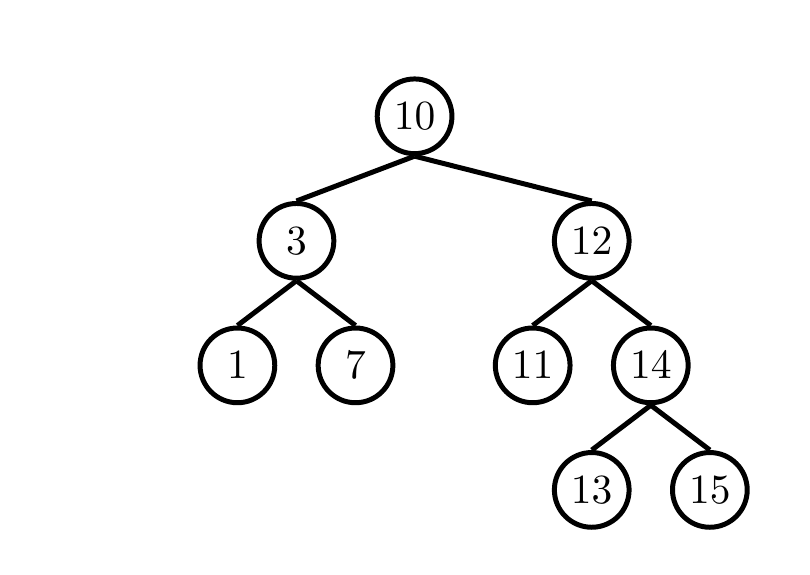
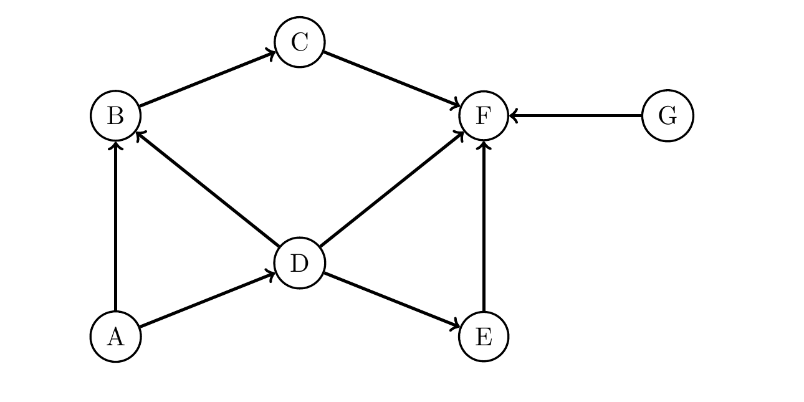
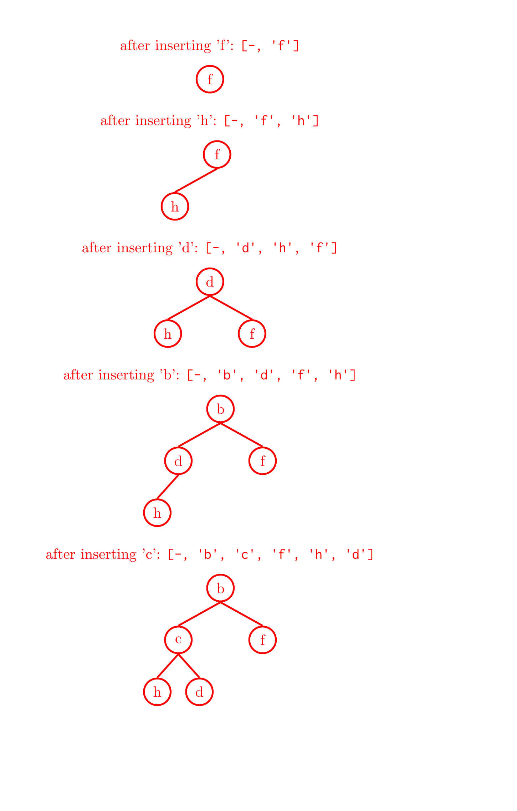
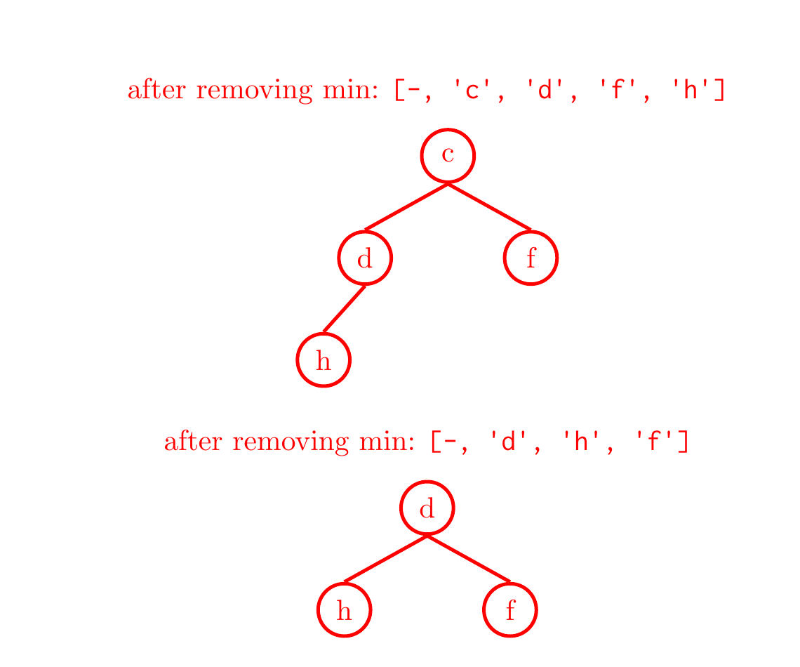
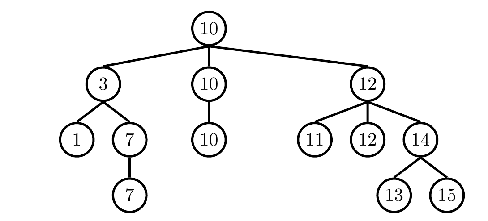

# Discussion 08 — Graphs, Heaps / 图与堆

> UC Berkeley CS 61B, Spring 2024
> Discussion date: March 11, 2024

## Regular

### Question 1 — Trees, Graphs, and Traversals, Oh My! / 树、图与遍历

#### 1a

Write the following traversals of the BST below.

> **中文翻译：** 写出下面这棵二叉搜索树的各种遍历顺序。



- Pre-order:
- In-order:
- Post-order:
- Level-order (BFS):

#### ✍️ My Answer

> 在这里作答

<details>
<summary>✅ 查看答案与解析</summary>

#### 官方答案

- Pre-order: `10 3 1 7 12 11 14 13 15`
- In-order: `1 3 7 10 11 12 13 14 15`
- Post-order: `1 7 3 11 13 15 14 12 10`
- Level-order (BFS): `10 3 12 1 7 11 14 13 15`

#### 解析

- 前序遍历按“根—左—右”访问，因此先访问根 `10`，再完成左子树，最后完成右子树。
- 中序遍历按“左—根—右”访问。由于该树是 BST，结果恰好按升序排列。
- 后序遍历按“左—右—根”访问，根 `10` 最后出现。
- 层序遍历使用队列，逐层从左到右访问。

四种遍历都访问每个结点一次，时间复杂度为 $\Theta(N)$；递归遍历的辅助空间为 $\Theta(H)$，BFS 队列最坏需要 $\Theta(N)$ 空间。

#### 考点

- 树的前序、中序与后序遍历
- BFS 层序遍历
- BST 的中序有序性

</details>

#### 1b

Write the graph below as an adjacency matrix, then as an adjacency list. What would be different if the graph were undirected instead?

> **中文翻译：** 先把下面的图写成邻接矩阵，再写成邻接表。如果该图改为无向图，这两种表示会有什么不同？



#### ✍️ My Answer

> 在这里作答

<details>
<summary>✅ 查看答案与解析</summary>

#### 官方答案

For the directed graph, rows are start nodes and columns are end nodes.

| Start $\backslash$ End | A | B | C | D | E | F | G |
|---|---:|---:|---:|---:|---:|---:|---:|
| A | 0 | 1 | 0 | 1 | 0 | 0 | 0 |
| B | 0 | 0 | 1 | 0 | 0 | 0 | 0 |
| C | 0 | 0 | 0 | 0 | 0 | 1 | 0 |
| D | 0 | 1 | 0 | 0 | 1 | 1 | 0 |
| E | 0 | 0 | 0 | 0 | 0 | 1 | 0 |
| F | 0 | 0 | 0 | 0 | 0 | 0 | 0 |
| G | 0 | 0 | 0 | 0 | 0 | 1 | 0 |

- `A: {B, D}`
- `B: {C}`
- `C: {F}`
- `D: {B, E, F}`
- `E: {F}`
- `F: {}`
- `G: {F}`

For the undirected version of the graph, the representations look a bit more symmetric. For your reference, the representations are included below:

| Start $\backslash$ End | A | B | C | D | E | F | G |
|---|---:|---:|---:|---:|---:|---:|---:|
| A | 0 | 1 | 0 | 1 | 0 | 0 | 0 |
| B | 1 | 0 | 1 | 1 | 0 | 0 | 0 |
| C | 0 | 1 | 0 | 0 | 0 | 1 | 0 |
| D | 1 | 1 | 0 | 0 | 1 | 1 | 0 |
| E | 0 | 0 | 0 | 1 | 0 | 1 | 0 |
| F | 0 | 0 | 1 | 1 | 1 | 0 | 1 |
| G | 0 | 0 | 0 | 0 | 0 | 1 | 0 |

- `A: {B, D}`
- `B: {A, C, D}`
- `C: {B, F}`
- `D: {A, B, E, F}`
- `E: {D, F}`
- `F: {C, D, E, G}`
- `G: {F}`

#### 解析

在有向图中，矩阵第 $u$ 行、第 $v$ 列的 `1` 表示边 $u\to v$；邻接表只在起点一侧记录终点。改成无向图后，每条边 $u-v$ 必须同时记录为 $u$ 的邻居中有 $v$、$v$ 的邻居中有 $u$，所以邻接矩阵关于主对角线对称。

邻接矩阵占 $\Theta(V^2)$ 空间，判断一条边是否存在为 $\Theta(1)$；邻接表占 $\Theta(V+E)$ 空间，更适合稀疏图。

#### 考点

- 邻接矩阵与邻接表
- 有向边与无向边的表示
- 图表示的空间权衡

</details>

#### 1c

Write the order in which (1) DFS pre-order, (2) DFS post-order, and (3) BFS would visit nodes in the same directed graph above, starting from vertex A. Break ties alphabetically.

> **中文翻译：** 对上面的同一幅有向图，从顶点 A 开始，分别写出 (1) DFS 前序、(2) DFS 后序和 (3) BFS 的访问顺序。出现多个选择时按字母顺序打破平局。

- Pre-order:
- Post-order:
- BFS:

#### ✍️ My Answer

> 在这里作答

<details>
<summary>✅ 查看答案与解析</summary>

#### 官方答案

- Pre-order: `ABCFDE (G)`
- Post-order: `FCBEDA (G)`
- BFS: `ABDCEF (G)`

To compute DFS, we maintain a stack of nodes, and a visited set. As soon as we add something to our stack, we note it down for preorder. The top node in our stack represents the node we are currently on, and the marked set represents nodes that have been visited. After we add a node to the stack, we visit its lexicographically next unmarked child. If there is none, we pop the topmost node from the stack and note it down for postorder. Note that there are two ways DFS could run: with restart or without; DFS with restart is the version where if we have exhausted our stack, and still have unmarked nodes left, we restart on the next unmarked node.

| Stack (bottom-top) | Visited Set | Preorder | Postorder |
|---|---|---|---|
| A | A | A | - |
| AB | AB | AB | - |
| ABC | ABC | ABC | - |
| ABCF | ABCF | ABCF | - |
| ABC | ABCF | ABCF | F |
| AB | ABCF | ABCF | FC |
| A | ABCF | ABCF | FCB |
| AD | ABCFD | ABCFD | FCB |
| ADE | ABCFDE | ABCFDE | FCB |
| AD | ABCFDE | ABCFDE | FCBE |
| A | ABCFDE | ABCFDE | FCBED |
| - | ABCFDE | ABCFDE | FCBEDA |

If DFS restarts on unmarked nodes, the following happens in the last line. Otherwise, we do not proceed further.

| Stack (bottom-top) | Visited Set | Preorder | Postorder |
|---|---|---|---|
| G | ABCFDEG | ABCFDEG | FCBEDAG |

For BFS, we use a queue instead of a stack. BFS does not have the notion of in-order and post-order, so we only visit it when we remove it from the queue.

#### 解析

从 `A` 出发只能到达 `A, B, C, D, E, F`，无法沿有向边到达 `G`，所以官方把 `G` 放在括号中：只有采用“遍历完一个连通部分后，从下一个未标记顶点重新开始”的版本时才会继续访问 `G`。

DFS 前序在顶点首次入栈/被发现时记录，后序在其所有可访问邻居处理完、即将退栈时记录。BFS 则用队列逐层扩展。本题的字母序规则决定了 `A` 的邻居先处理 `B`，再处理 `D`。

#### 考点

- DFS 前序与后序
- BFS 队列
- 不可达顶点与 traversal restart
- 按固定邻接次序打破平局

</details>

### Question 2 — Absolutely Valuable Heaps / 绝对有价值的堆

#### 2a

Assume that we have a binary min-heap (smallest value on top) data structure called `MinHeap` that has properly implemented the `insert` and `removeMin` methods. Draw the heap and its corresponding array representation after each of the operations below:

> **中文翻译：** 假设我们有一个名为 `MinHeap` 的二叉最小堆（最小值在顶部），且它正确实现了 `insert` 和 `removeMin` 方法。请画出执行下面每一步操作后的堆及其对应数组表示。

```java
MinHeap<Character> h = new MinHeap<>();
h.insert('f');
h.insert('h');
h.insert('d');
h.insert('b');
h.insert('c');
h.removeMin();
h.removeMin();
```

#### ✍️ My Answer

> 在这里作答

<details>
<summary>✅ 查看答案与解析</summary>

#### 官方答案





- after inserting `'f'`: `[-, 'f']`
- after inserting `'h'`: `[-, 'f', 'h']`
- after inserting `'d'`: `[-, 'd', 'h', 'f']`
- after inserting `'b'`: `[-, 'b', 'd', 'f', 'h']`
- after inserting `'c'`: `[-, 'b', 'c', 'f', 'h', 'd']`
- after removing min: `[-, 'c', 'd', 'f', 'h']`
- after removing min: `[-, 'd', 'h', 'f']`

#### 解析

该数组使用索引 `0` 的 `-` 作为占位符，因此结点索引为 $i$ 时，其孩子位于 $2i$ 和 $2i+1$。插入时先放到数组末尾，再向上交换；删除最小值时移除根、把末尾元素移到根，再向下交换到满足最小堆不变量的位置。

每次 `insert` 和 `removeMin` 最坏都沿树高移动，时间复杂度为 $O(\log N)$；堆保持完全二叉树形状。

#### 考点

- 最小堆不变量
- 上浮与下沉
- 堆的数组表示

</details>

#### 2b

Your friendly TA Allen challenges you to create an integer max-heap without writing a whole new data structure. Can you use your min-heap to mimic the behavior of a max-heap? Specifically, we want to be able to get the largest item in the heap in constant time, and add things to the heap in $\Theta(\log n)$ time, as a normal max heap should.

*Hint:* You should treat the `MinHeap` as a black box and think about how you should modify the arguments/return values of the heap functions.

> **中文翻译：** 你的助教 Allen 要你在不重新编写完整数据结构的情况下创建整数最大堆。能否使用现有最小堆模拟最大堆？具体来说，应像普通最大堆一样，在常数时间内取得最大元素，并在 $\Theta(\log n)$ 时间内加入元素。提示：把 `MinHeap` 当作黑盒，思考如何修改堆函数的参数和返回值。

#### ✍️ My Answer

> 在这里作答

<details>
<summary>✅ 查看答案与解析</summary>

#### 官方答案

Yes. For every insert operation, negate the number and add it to the min-heap.

For a `removeMax` operation call `removeMin` on the min-heap and negate the number returned. Any number negated twice is itself, and since we store the negation of numbers, the order is now reversed (what used to be the max is now the min).

Small note: There’s actually one exception in Java to what we said about negation above: $-2^{31}$, the most negative number that we can represent in Java, will not be itself when negated twice. This is mostly due to number representation constraints in code, but you don’t need to worry about that for this question.

#### 解析

把每个整数 $x$ 映射为 $-x$ 后，原数值越大，对应的负数越小。因此最大元素会变成底层最小堆的根。插入 $x$ 时实际插入 $-x$；查看或删除最大值时读取/删除底层最小值，再对结果取负。

官方特别指出 Java `int` 的边界：`Integer.MIN_VALUE == -2147483648`，其相反数超出 `int` 正上界并发生溢出，结果仍是自身。因此直接取负的包装方法对该值并不完全正确。若要支持全部 `int`，可使用更宽的 `long` 表示或改用反序比较器；这是补充方案，不是官方答案的一部分。

#### 考点

- 通过单调映射反转优先级
- 堆操作的时间复杂度
- 二进制补码与整数溢出

</details>

### Question 3 — Trinary Search Tree / 三叉搜索树

We’d like a data structure that acts like a BST (Binary Search Tree) in terms of operation runtimes but allows duplicate values. Therefore, we decide to create a new data structure called a TST (Trinary Search Tree), which can have up to three children, which we’ll refer to as `left`, `middle`, and `right`. In this setup, we have the following invariants, which are very similar to the BST invariants:

1. Each node in a TST is a root of a smaller TST
2. Every node to the `left` of a root has a value “lesser than” that of the root
3. Every node to the `right` of a root has a value “greater than” that of the root
4. Every node to the `middle` of a root has a value equal to that of the root

Below is an example TST to help with visualization.

> **中文翻译：** 我们希望设计一种在操作运行时间方面类似 BST（二叉搜索树）、但允许重复值的数据结构。因此定义 TST（三叉搜索树），每个结点最多有三个孩子，分别称为 `left`、`middle` 和 `right`。它满足：每个结点都是一棵更小 TST 的根；根的左侧结点值小于根；根的右侧结点值大于根；根的中间结点值等于根。下面给出一个示例 TST。



Describe an algorithm that will print the elements in a TST in **descending** order. (*Hint: recall that an in-order traversal for a BST gives elements in increasing order.*)

> **中文翻译：** 描述一种按**降序**打印 TST 中所有元素的算法。（提示：回忆 BST 的中序遍历会按升序给出元素。）

#### ✍️ My Answer

> 在这里作答

<details>
<summary>✅ 查看答案与解析</summary>

#### 官方答案

Inorder traversal on a BST yields the sorted elements in the BST in ascending order. Therefore, the core of the algorithm we’d like here is going to be quite similar to inorder traversal, but reversed (visit the right child before the left child) and with the added caveat that we also must traverse through the middle children.

In essence, given the root of some TST, we reverse onto the right child subtree, then print the root’s value, then reverse onto the middle child subtree, then finally reverse onto the left subtree. The print root value and reverse onto the middle child steps can be swapped, because overall the order of the printed values should be the same.

Pseudocode:

```text
reverse(tst):
    if tst is null:
        return
    reverse(tst.right)
    print(tst.value)
    reverse(tst.middle)
    reverse(tst.left)
```

#### 解析

降序遍历先处理所有更大的值，即右子树；然后输出根和与根相等的中间分支；最后处理更小的左子树。根值与中间分支的值相等，所以官方说明这两步可以交换。

每个结点恰好访问一次，时间复杂度为 $\Theta(N)$；递归栈空间为 $\Theta(H)$，退化情况下可达到 $\Theta(N)$。

#### 考点

- BST 中序遍历的变体
- 重复键的表示
- 递归遍历复杂度

</details>

# Exam Prep

### Question 1 — Graph Conceptuals / 图的概念题

#### 1a

Answer the following questions as either True or False and provide a brief explanation:

1. If a graph with $n$ vertices has $n-1$ edges, it must be a tree.
2. Every edge is looked at exactly twice in each full run of DFS on a connected, undirected graph.
3. In BFS, let $d(v)$ be the minimum number of edges between a vertex $v$ and the start vertex. For any two vertices $u,v$ in the fringe (recall that the fringe in BFS is a queue), $|d(u)-d(v)|$ is always less than 2.

> **中文翻译：** 判断下列陈述为真或假，并简要解释：1. 一个有 $n$ 个顶点、$n-1$ 条边的图必然是树。2. 对连通无向图完整运行一次 DFS 时，每条边恰好会被查看两次。3. 在 BFS 中，令 $d(v)$ 为顶点 $v$ 到起点的最少边数；对于 fringe（BFS 中为队列）中的任意两个顶点 $u,v$，始终有 $|d(u)-d(v)|<2$。

#### ✍️ My Answer

> 在这里作答

<details>
<summary>✅ 查看答案与解析</summary>

#### 官方答案

1. **False.** The graph must be connected.
2. **True.** Say an edge connects $u$ and $v$. Both $u$ and $v$ will look at the other one through this edge when it’s their turn.
3. **True.** Suppose this was not the case. Then, we could have a vertex 2 edges away and a vertex 4 edges away in the fringe at the same time. But, the only way to have a vertex 4 edges away is if a vertex 3 edges away was removed from the fringe. We see this could never occur because the vertex 2 edges away would be removed before the vertex 3 edges away!

#### 解析

1. 只有边数条件不够。例如三个顶点形成一个环、另一个顶点孤立时，$V=4,E=3$，但图不是树；还必须保证连通（等价地也可另加无环条件）。
2. 在邻接表表示的无向图中，每条无向边会在两个端点的邻接表各出现一次，因此完整扫描时查看两次。“查看两次”不代表 DFS 会把它当作树边走两次。
3. BFS 按距离层顺序出队。队列中只能同时存在当前距离层与下一距离层，任意两项的距离差至多为 1，因此绝对值严格小于 2。

#### 考点

- 树的连通性与边数
- 无向图邻接表中的边
- BFS 的分层不变量

</details>

#### 1b

Given an undirected graph, provide an algorithm that returns true if a cycle exists in the graph, and false otherwise. Also, provide a $\Theta$ bound for the worst case runtime of your algorithm.

> **中文翻译：** 给定一个无向图，设计一个算法：若图中存在环则返回 `true`，否则返回 `false`。同时给出该算法最坏运行时间的 $\Theta$ 界。

#### ✍️ My Answer

> 在这里作答

<details>
<summary>✅ 查看答案与解析</summary>

#### 官方答案

We do a depth first search traversal through the graph. While we recurse, if we visit a node that we visited already, then we’ve found a cycle. Assuming integer labels, we can use something like a visited boolean array to keep track of the elements that we’ve seen, and while looking through a node’s neighbors, if visited gives true, then that indicates a cycle.

However, since the graph is undirected, if an edge connects vertices $u$ and $v$, then $u$ is a neighbor of $v$, and $v$ is a neighbor of $u$. As such, if we visit $v$ after $u$, our algorithm will claim that there is a cycle since $u$ is a visited neighbor of $v$. To address this case, when we visit the neighbors of $v$, we should ignore $u$. To implement this in code, we could add the parent as another parameter in the method call.

In the worst case, we have to explore at most $V$ edges before finding a cycle (number of edges doesn’t matter). So, this runs in $\Theta(V)$.

Pseudocode is provided below (for a disconnected graph, we should call `find_cycle` on each component).

```text
find_cycle(v, parent=-1):
    visited[v] = true
    for (v, w) in G:
        if !visited[w]:
            if find_cycle(w, v):
                return True
        else if w != parent:
            return True
    return False
```

#### 解析

`parent` 参数用于排除 DFS 树中立即返回父结点的那条无向边；若发现另一个已访问邻居，就存在非父边，从而形成环。对于非连通图，必须从每个尚未访问的顶点启动 DFS。

**补充分析（非官方答案）：** Solutions PDF 给出的最坏时间 $\Theta(V)$ 以及“number of edges doesn’t matter”并不适用于一般的邻接表图。完整 DFS 会访问每个顶点，并扫描每条无向边的两个邻接表条目，所以最坏时间应为 $\Theta(V+E)$；连通无向图中也可写成 $\Theta(E)$，因为 $E\ge V-1$。原官方答案已在上方原样保留，没有静默修正。

另外，若允许平行边，仅通过 `w != parent` 跳过所有指向父结点的边会漏掉由两条平行边构成的环；CS61B 此题通常默认简单图。这是边界条件补充，不属于官方答案。

#### 考点

- 无向图 DFS 判环
- 父边与回边
- $\Theta(V+E)$ 图遍历复杂度
- 非连通图的遍历

</details>

### Question 2 — Fill in the Blanks / 填空题

Fill in the following blanks related to min-heaps. Let $N$ is the number of elements in the min-heap. For the entirety of this question, assume the elements in the min-heap are distinct.

1. `removeMin` has a best case runtime of ______ and a worst case runtime of ______.
2. `insert` has a best case runtime of ______ and a worst case runtime of ______.
3. A ______ or ______ traversal on a min-heap may output the elements in sorted order. Assume there are at least 3 elements in the min-heap.
4. The fourth smallest element in a min-heap with 1000 distinct elements can appear in ______ places in the heap. (Feel free to draw the heap in the space below.)
5. Given a min-heap with $2^N-1$ distinct elements, for an element
   - to be on the second level it must be less than ______ element(s) and greater than ______ element(s).
   - to be on the bottommost level it must be less than ______ element(s) and greater than ______ element(s).

*Hint:* A complete binary tree (with a full last-level) has $2^N-1$ elements, with $N$ being the number of levels. (Feel free to draw the heap in the space below.)

> **中文翻译：** 填写下列与最小堆有关的空。令 $N$ 为最小堆中的元素数，并假设所有元素互不相同。1. `removeMin` 的最好与最坏运行时间；2. `insert` 的最好与最坏运行时间；3. 哪两种遍历“可能”按序输出至少含三个元素的最小堆；4. 在含 1000 个不同元素的最小堆中，第四小元素可能出现于多少个位置；5. 对含 $2^N-1$ 个不同元素、共有 $N$ 层的满完全二叉最小堆，第二层或最底层元素分别必须小于和大于多少个元素。

#### ✍️ My Answer

> 在这里作答

<details>
<summary>✅ 查看答案与解析</summary>

#### 官方答案

1. `removeMin` has a best case runtime of $\Theta(1)$ and a worst case runtime of $\Theta(\log N)$.
2. `insert` has a best case runtime of $\Theta(1)$ and a worst case runtime of $\Theta(\log N)$.
3. A **pre order** or **level order** traversal on a min-heap can output the elements in sorted order.

   Explanation: The smallest item of a min heap is at the top, so whatever traversal we choose must output the top element first in a complete binary tree. Only preorder and level-order have this property.
4. The fourth smallest element in a min-heap with 1000 distinct elements can appear in **14** places in the heap.

   Explanation: The 4th smallest item can be on the 2nd, 3rd, or 4th level of the heap.
5. Given a min-heap with $2^N-1$ distinct elements, for an element:
   - to be on the second level it must be less than $2^{N-1}-2$ element(s) and greater than $1$ element(s).
   - to be on the bottommost level it must be less than $0$ element(s) and greater than $N-1$ element(s). (must be greater than the elements on its branch)

   Explanation: An element on the second level must be larger than the root and less than the elements in its subtree. There are $2^{N-1}-2$ elements in the subtree of an element on the second level: half the elements in the tree minus the root, then subtracting off the node itself.

   An element on the bottom level must be greater than all elements on the path from itself to the root. A min heap with $2^N-1$ elements has $N$ levels, so there are $N-1$ items above it on a path to the root.

#### 解析

1. 删除根后，若移到根的末尾元素已经满足堆序，操作可为常数时间；最坏需下沉整棵树的高度。
2. 新元素若不小于父结点，无需上浮；最坏一路上浮到根。
3. 题目说的是“may output”，不是对任意最小堆都保证有序。若堆的层序数组本身递增，前序或层序可以得到升序；中序和后序不会先输出全局最小的根。
4. 第四小元素最多只有三个更小元素作为祖先，因此深度至多为 3，也就是可处于第 2、3、4 层。这些层共有 $2+4+8=14$ 个位置；根所在第 1 层不可能放第四小元素。
5. 第二层结点只有根这一个必然更小的祖先，其下方满子树（排除它自己）共有 $2^{N-1}-2$ 个必然更大的元素。底层结点没有后代，所以没有必然更大的元素；根到它的路径上有 $N-1$ 个必然更小的祖先。

#### 考点

- 堆操作最好与最坏情况
- 堆只保证父子偏序
- 完全二叉树的层数与结点数
- 元素排名对可处层级的限制

</details>

### Question 3 — Heap Mystery / 堆之谜

We are given the following array representing a min-heap where each letter represents a unique number. Assume the root of the min-heap is at index zero, i.e. A is the root. Our task is to figure out the numeric ordering of the letters. Therefore, there is no significance of the alphabetical ordering. i.e. just because B precedes C in the alphabet, we do not know if B is less than or greater than C.

`Array: [-, A, B, C, D, E, F, G]`

Four unknown operations are then executed on the min-heap. An operation is either a `removeMin` or an `insert`. The resulting state of the min-heap is shown below.

`Array: [-, A, E, B, D, X, F, G]`

> **中文翻译：** 给定一个用数组表示的最小堆，每个字母代表一个互不相同的数。题面称堆根位于索引 0，即 A 是根。任务是推断这些字母代表的数值之间的顺序；字母表顺序没有意义，例如不能仅凭 B 在 C 前面就判断 B 小于或大于 C。随后对最小堆执行四个未知操作，每个操作是 `removeMin` 或 `insert`，并给出操作后的数组状态。

#### 3a

Determine the operations executed and their appropriate order. The first operation has already been filled in for you!

*Hint:* Which elements are gone? Which elements are newly added? Which elements are removed and then added back?

> **中文翻译：** 确定所执行的四个操作及其正确顺序。第一个操作已经给出。提示：哪些元素消失了？哪些是新加入的？哪些元素先被删除、之后又被加回？

1. `removeMin()`
2. ______
3. ______
4. ______

#### ✍️ My Answer

> 在这里作答

<details>
<summary>✅ 查看答案与解析</summary>

#### 官方答案

1. `removeMin()`
2. `insert(X)`
3. `removeMin()`
4. `insert(A)`

Explanation: We know immediately that A was removed. Then, after looking at the final state of the min-heap, we see that C was removed. Then, for A to remain in the min-heap, we see that A must have been inserted afterwards. And, after seeing a new value X in the min-heap, we see that X must have been inserted as well. We just need to determine the relative ordering of the `insert(X)` in between the operations `removeMin()` and `insert(A)`, and we see that the `insert(X)` must go before both.

#### 解析

第一次 `removeMin()` 删除初始根 `A`。最终数组没有 `C`，说明第二次删除操作移除了 `C`；最终又出现 `A`，故最后必须重新插入 `A`；`X` 是新元素，也必须由一次插入产生。结合堆的中间移动结果，官方确定 `X` 的插入发生在第二次删除之前。

**补充分析（非官方答案）：** 题面文字说根在索引 0，但展示的两个数组都以 `-` 开头并把 `A` 放在第二项，这与前文通常使用的 1-based 堆数组一致。若 `-` 是占位符，`A` 实际位于索引 1。这里保留原题表述与数组，不静默修正；解答按 `A` 是根的出题意图理解。

#### 考点

- `removeMin` 与 `insert` 的状态逆推
- 堆元素个数守恒
- 数组式堆的索引约定

</details>

#### 3b

Fill in the following comparisons with either `>`, `<`, or `?` if unknown. We recommend considering which elements were compared to reach the final array.

> **中文翻译：** 用 `>`、`<` 或表示无法确定的 `?` 填写下列比较。建议思考为了得到最终数组，哪些元素实际发生过比较。

1. X ______ D
2. X ______ C
3. B ______ C
4. G ______ X

#### ✍️ My Answer

> 在这里作答

<details>
<summary>✅ 查看答案与解析</summary>

#### 官方答案

1. X `?` D
2. X `>` C
3. B `>` C
4. G `<` X

Reasoning:

1. X is never compared to D
2. X must be greater than C since C is removed after X’s insertion.
3. B must also be greater than C otherwise the second call to `removeMin` would have removed B
4. X must be greater than G so that it can be “promoted” to the top after the removal of C. It needs to be promoted to the top to land in its new position.

#### 解析

堆操作只建立相关路径上的偏序，并不能给所有元素排出全序。`X` 与 `D` 没有形成可确定的大小关系，故答案为 `?`；第二次删除的是 `C`，所以当时 `C<X` 且 `C<B`。第一次删除 `A` 后，原数组末尾的 `G` 移动并最终处于 `X` 的父结点位置；随后插入的 `X` 没有越过 `G` 上浮，因而可知 `G<X`。第二次删除 `C` 时，末尾的 `X` 会先被移到堆顶，再按堆序下沉到最终位置。

不要根据字母顺序推断数值，也不要把“二者在数组中的左右位置”误认为大小关系；最小堆只保证父结点小于孩子。

#### 考点

- 堆提供的部分顺序
- 上浮与下沉过程中的比较
- 根据状态变化推导必然关系

</details>

## 完整性检查

- Regular：Question 1（1a–1c）、Question 2（2a–2b）、Question 3 均与 Regular Solutions 对应；题干、遍历表、邻接矩阵/表、堆状态与 TST 伪代码均已核对。
- Exam Prep：Question 1（1a–1b）、Question 2、Question 3（3a–3b）均与 Exam Prep Solutions 对应，无遗漏题目或小问。
- 图片提取情况：从官方 PDF 高分辨率页面提取了 BST、有向图、TST，以及官方解答中的两组堆状态图，共 5 张图片；其余表格已转换为 Markdown Table。
- 官方答案和补充分析的分区情况：Solutions PDF 内容保留在“官方答案”；DFS 判环复杂度、平行边边界、Java 最小整数取负与 Heap Mystery 索引矛盾均在中文“解析”中明确标为补充分析。

## 官方资料

- [Regular PDF](https://sp24.datastructur.es/assets/discussions/regular08.pdf)
- [Regular Solutions PDF](https://sp24.datastructur.es/assets/discussions/regular08sol.pdf)
- [Exam Prep PDF](https://sp24.datastructur.es/assets/discussions/examlevel08.pdf)
- [Exam Prep Solutions PDF](https://sp24.datastructur.es/assets/discussions/examlevel08sol.pdf)
