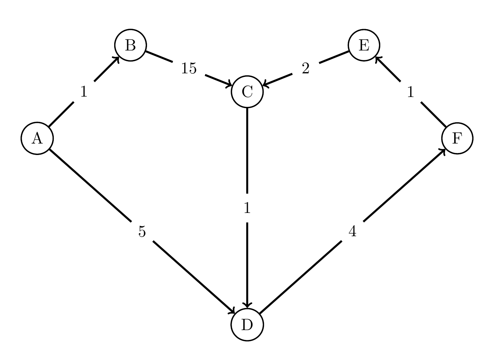
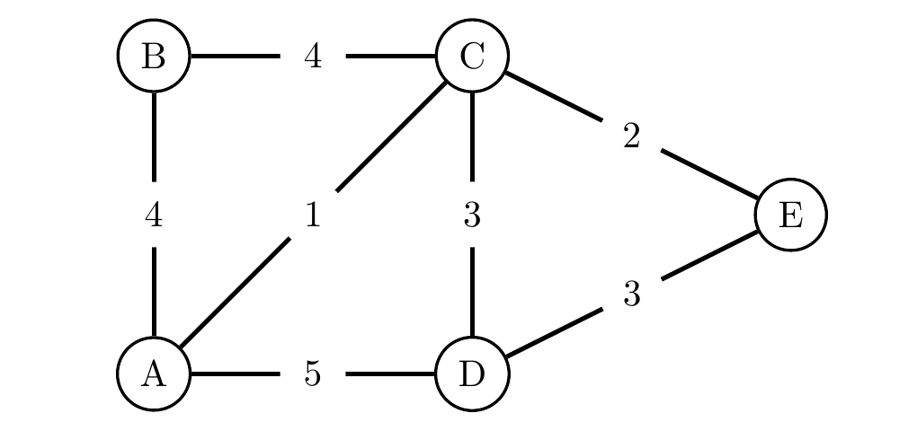
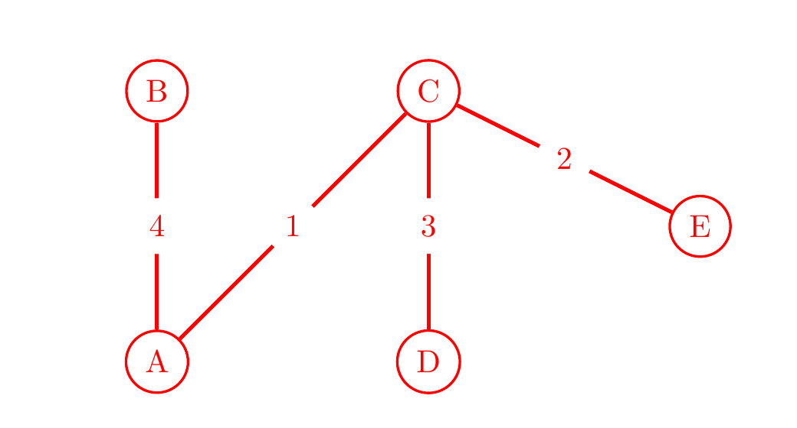
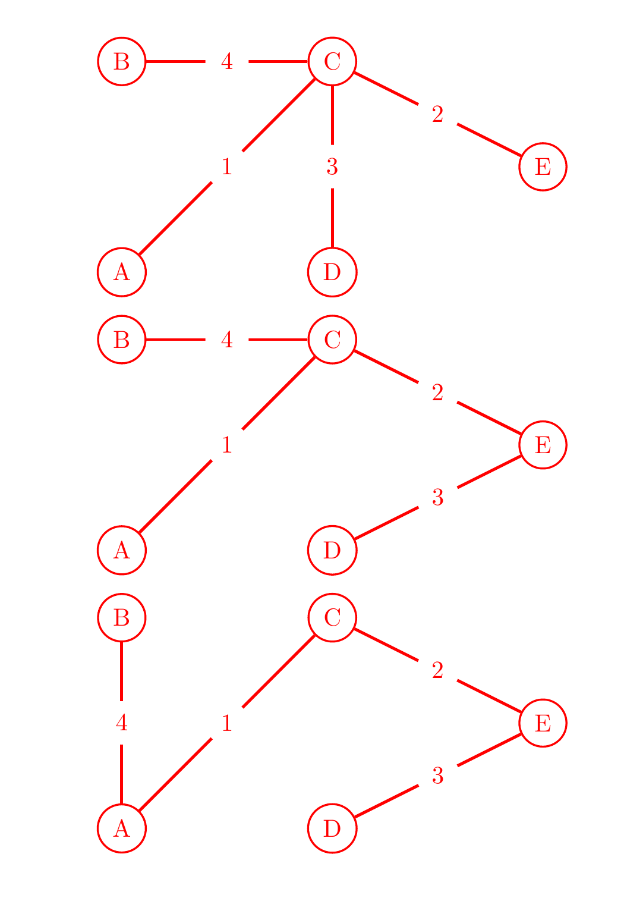
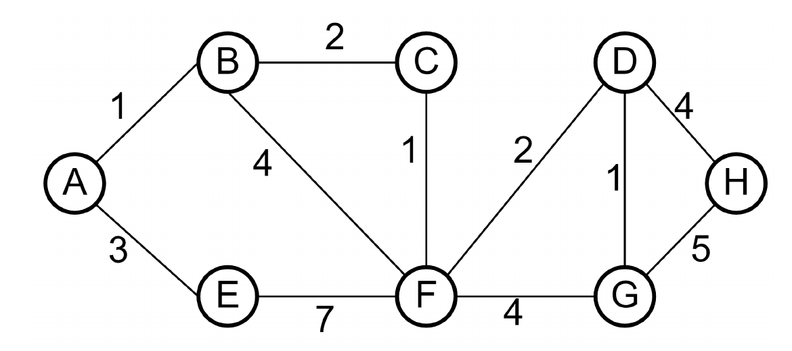
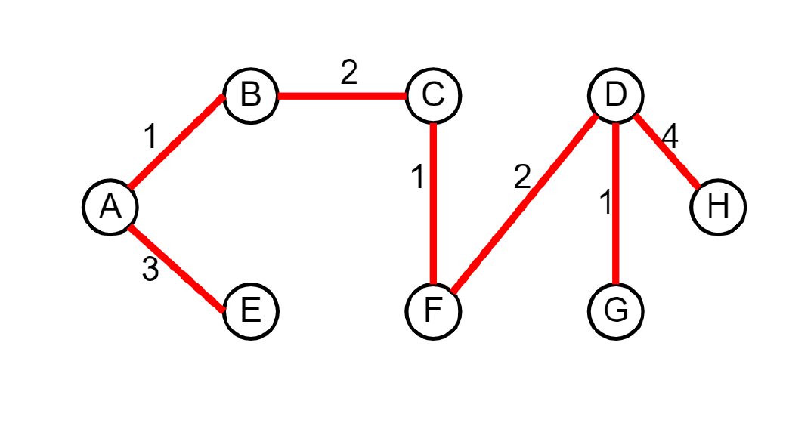
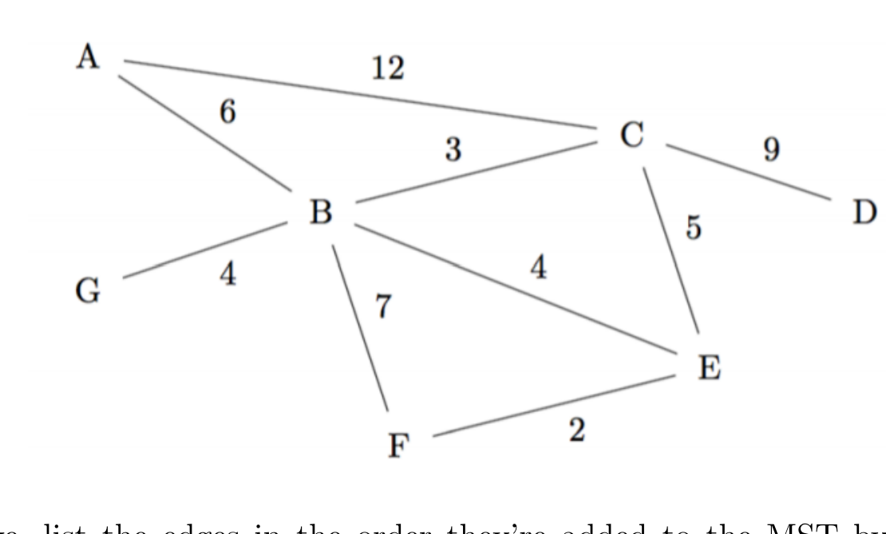

# Discussion 09 — Shortest Paths, MSTs / 最短路径与最小生成树

> UC Berkeley CS 61B, Spring 2024
> Discussion date: March 18, 2024

## Regular

### Question 1 — The Shortest Path To Your Heart / 通往你心中的最短路径

For the graph below, let $g(u,v)$ be the weight of the edge between any nodes $u$ and $v$. Let $h(u,v)$ be the value returned by the heuristic for any nodes $u$ and $v$.

> **中文翻译：** 对于下图，令 $g(u,v)$ 表示任意结点 $u$ 和 $v$ 之间边的权重，令 $h(u,v)$ 表示启发式函数对任意结点 $u$ 和 $v$ 返回的值。



Below, the pseudocode for Dijkstra’s and A* are both shown for your reference throughout the problem.

> **中文翻译：** 下面给出 Dijkstra 算法和 A* 算法的伪代码，供整道题参考。

**Dijkstra’s Pseudocode**

```text
PQ = new PriorityQueue()
PQ.add(A, 0)
PQ.add(v, infinity) # (all nodes except A).

distTo = {} # map
edgeTo = {} # map
distTo[A] = 0
distTo[v] = infinity # (all nodes except A).

while (not PQ.isEmpty()):
    poppedNode, poppedPriority = PQ.pop()

    for child in poppedNode.children:
        potentialDist = distTo[poppedNode] +
            edgeWeight(poppedNode, child)

        if potentialDist < distTo[child]:
            distTo.put(child, potentialDist)
            PQ.changePriority(child, potentialDist)
            edgeTo[child] = poppedNode
```

**A* Pseudocode**

```text
PQ = new PriorityQueue()
PQ.add(A, h(A, goal))
PQ.add(v, infinity) # (all nodes except A).

distTo = {} # map
distTo[A] = 0
distTo[v] = infinity # (all nodes except A).

while (not PQ.isEmpty()):
    poppedNode, poppedPriority = PQ.pop()
    if (poppedNode == goal): terminate

    for child in poppedNode.children:
        potentialDist = distTo[poppedNode] +
            edgeWeight(poppedNode, child)

        if potentialDist < distTo[child]:
            distTo.put(child, potentialDist)
            PQ.changePriority(child, potentialDist + h(child, goal))
            edgeTo[child] = poppedNode
```

#### 1a

Run Dijkstra’s algorithm to find the shortest paths from A to every other vertex. You may find it helpful to keep track of the priority queue. We have provided a table to keep track of best distances, and the adjacent vertex that has an edge going to the target vertex in the current shortest paths tree so far.

> **中文翻译：** 运行 Dijkstra 算法，求从 A 到其他所有顶点的最短路径。记录优先队列可能会有所帮助。题目提供了一张表，用于记录目前找到的最短距离，以及当前最短路径树中通过一条边指向目标顶点的相邻顶点。

|  | A | B | C | D | E | F |
|---|---|---|---|---|---|---|
| DistTo |  |  |  |  |  |  |
| EdgeTo |  |  |  |  |  |  |

#### ✍️ My Answer

> 在这里作答

<details>
<summary>✅ 查看答案与解析</summary>

#### 官方答案

`B = 1 ; D = 5 ; F = 9 ; E = 10 ; C = 12`

For the best explanation, it is recommended to check the slideshow linked on the website or watch the walkthrough video, as the text explanation is verbose.

We will maintain a priority queue and a table of distances found so far, as suggested in the problem and pseudocode. We will use `{}` to represent the PQ, and `(())` to represent the `distTo` array.

```text
{A:0, B:inf, C:inf, D:inf, E:inf, F:inf}. (()).

Pop A.
{B:inf, C:inf, D:inf, E:inf, F:inf}. ((A: 0)).
changePriority(B, 1). changePriority(D, 5).
{B:1, D:5, C:inf, E:inf, F:inf}. ((A: 0)).

Pop B.
{D:5, C:inf, E:inf, F:inf}. ((A: 0, B: 1)).
changePriority(C, 16).
{D:5, C:16, E:inf, F:inf}. ((A: 0, B: 1)).

Pop D.
{C:16, E:inf, F:inf}. ((A: 0, B: 1, D: 5)).
changePriority(F, 9).
{F: 9, C:16, E:inf, F:inf}. ((A: 0, B: 1, D: 5)).

Pop F.
{C:16, E:inf}. ((A: 0, B: 1, D: 5, F: 9)).
changePriority(E, 10).
{E:10, C:16}. ((A: 0, B: 1, D: 5, F: 9)).

Pop E.
{C:16}. ((A: 0, B: 1, D: 5, F: 9, E: 10)).
changePriority(C, 12).
{C:12}. ((A: 0, B: 1, D: 5, F: 9, E: 10)).

Pop C.
{}. ((A: 0, B: 1, D: 5, F: 9, E: 10, C: 12)).
```

At the end, our table looks like this:

|  | A | B | C | D | E | F |
|---|---:|---:|---:|---:|---:|---:|
| DistTo | 0 | 1 | 12 | 5 | 10 | 9 |
| EdgeTo | - | A | E | A | F | D |

#### 解析

Dijkstra 每次弹出当前 `distTo` 最小的顶点，并用它的出边进行松弛。弹出顺序为 `A, B, D, F, E, C`，对应最终最短路径树边为 $A\to B$、$A\to D$、$D\to F$、$F\to E$、$E\to C$。

**补充分析（非官方答案）：** 官方队列轨迹在 `changePriority(F, 9)` 后写成 `{F: 9, C:16, E:inf, F:inf}`，其中 `F` 重复出现了一次。按照算法状态，最后一项应被删去，逻辑上的队列是 `{F:9, C:16, E:inf}`。上方“官方答案”保留了 Solutions PDF 原文，没有静默修正。

使用二叉堆优先队列和邻接表时，运行时间为 $O((V+E)\log V)$。

#### 考点

- Dijkstra 的松弛操作
- `distTo` 与 `edgeTo`
- 优先队列中的优先级更新

</details>

#### 1b

Given the weights and heuristic values for the graph above, what path would A* search return, starting from A and with F as a goal?

| Edge weights | Heuristics |
|---|---|
| $g(A,B)=1$ | $h(A,F)=8$ |
| $g(A,D)=5$ | $h(B,F)=16$ |
| $g(B,C)=15$ | $h(C,F)=4$ |
| $g(C,D)=1$ | $h(D,F)=4$ |
| $g(D,F)=4$ | $h(E,F)=5$ |
| $g(F,E)=1$ |  |
| $g(E,C)=2$ |  |

> **中文翻译：** 给定上图的边权和启发式函数值，从 A 开始、以 F 为目标运行 A* 搜索会返回哪条路径？

|  | A | B | C | D | E | F |
|---|---|---|---|---|---|---|
| DistTo |  |  |  |  |  |  |
| EdgeTo |  |  |  |  |  |  |

#### ✍️ My Answer

> 在这里作答

<details>
<summary>✅ 查看答案与解析</summary>

#### 官方答案

A* would return $A-D-F$. The cost here is 9.

|  | A | B | C | D | E | F |
|---|---:|---:|---:|---:|---:|---:|
| DistTo | 0 | 1 | $\infty$ | 5 | $\infty$ | 9 |
| EdgeTo | - | A | - | A | - | D |

A* runs in a very similar fashion to Dijkstra’s. We got the same answer for the shortest path to F, though we actually explored less unnecessary nodes in the process (we never popped B, C, or E off the queue). The main difference is the priority in the priority queue. For A*, whenever computing the priority (for the purposes of the priority queue) of a particular node $n$, always add $h(n)$ to whatever you would use with Dijkstra’s. Additionally, note that A* will be run to find the shortest path to a particular goal node (as our heuristic is calculated as our estimate to our specific goal node), whereas Dijkstra’s may be run with a specific goal, or it may be run to find the shortest paths to ALL nodes. In the solutions above, we found the shortest paths to all nodes, but if we only needed to know the shortest path to E, for example, we could have stopped after visiting E.

#### 解析

A* 使用 $f(n)=g(n)+h(n)$ 作为优先级。弹出 A 后，B 的优先级为 $1+16=17$，D 的优先级为 $5+4=9$，因此先弹出 D；松弛 D 到 F 后，F 的优先级为 $9+0=9$，随后弹出目标 F 并终止，得到 $A\to D\to F$。

这里的 `DistTo` 表只记录终止前实际得到的距离；B 虽已被发现，但没有被弹出，C 与 E 仍为无穷。

#### 考点

- A* 的 $g+h$ 优先级
- 目标顶点出队时提前终止
- A* 与 Dijkstra 的区别

</details>

#### 1c

Based on the heuristics for part b, is the A* heuristic for this graph good? In other words, will it always give us the actual shortest path from A to F? If it is good, give an example of a change you would make to the heuristic so that it is no longer good. If it is not, correct it.

> **中文翻译：** 根据 1b 中的启发式函数，它对该图是否良好？也就是说，它是否总能给出从 A 到 F 的真实最短路径？若它良好，请举例说明怎样修改会使其不再良好；若它不好，请修正它。

#### ✍️ My Answer

> 在这里作答

<details>
<summary>✅ 查看答案与解析</summary>

#### 官方答案

The heuristic is admissible: for every node, the heuristic value is less than or equal to the shortest distance path from that node to the target node. It is also consistent: each estimate is less than or equal to the estimated distance from any neighboring vertex to the goal, plus the cost of reaching that neighbor. Because it is both admissible and consistent, we can say that the heuristic is good. If we changed the heuristic from D to F to be 6 (ie. $h(D,F)=6$), then the overall heuristic for the graph would no longer be admissible.

#### 解析

该图是有向图，必须按照箭头方向计算到 F 的真实剩余距离。例如从 B 到 F 的最短有向路径为 $B\to C\to D\to F$，成本为 $15+1+4=20$，所以 $h(B,F)=16$ 没有高估。所有启发值都不超过真实剩余距离，且每条有向边 $u\to v$ 均满足 $h(u,F)\le g(u,v)+h(v,F)$。

D 到 F 的真实最短距离为 4。若把 $h(D,F)$ 改为 6，就会高估并破坏可采纳性，也会在边 $D\to F$ 上破坏一致性。

#### 考点

- 可采纳启发式
- 一致启发式
- 有向图中的剩余距离

</details>

### Question 2 — Minimalist Moles / 极简鼹鼠隧道

Circle the mole wants to dig a network of tunnels connecting all of his secret hideouts. There are a few set paths between the secret hideouts that Circle can choose to possibly include in his tunnel system, shown below. However, some portions of the ground are harder to dig than others, and Circle wants to do as little work as possible. In the diagram below, the numbers next to the paths correspond to how hard that path is to dig for Circle. Lucky for us, he knows how to use MSTs to optimize the tunnel paths!

> **中文翻译：** 鼹鼠 Circle 想挖一套连接全部秘密藏身处的隧道网络。藏身处之间有若干条可选路径，如下图所示；不同地段的挖掘难度不同，Circle 希望总工作量尽可能小。图中路径旁的数字表示挖掘该路径的难度。幸运的是，他知道如何用最小生成树优化隧道路径。



Below, the pseudocode for Kruskal’s and Prim’s are shown for your reference throughout the problem.

> **中文翻译：** 下面给出 Kruskal 和 Prim 算法的伪代码，供整道题参考。

**Kruskal’s Pseudocode**

```text
while there are still nodes not in the MST:
    Add the lightest edge
        that does not create a cycle.
    Add the new node to the
        set of nodes in the MST.
```

**Prim’s Pseudocode**

```text
Start with any node.
Add that node to the set of nodes in the MST.
While there are still nodes not in the MST:
    Add the lightest edge from a node in the MST
        that leads to a new node that is unvisited.
    Add the new node to the set of
        nodes in the MST.
```

#### 2a

Find a valid MST for the graph above using Kruskal’s algorithm, then Prim’s. For Prim’s algorithm, take A as the start node. In both cases, if there is ever a tie, choose the edge that connects two nodes with lower alphabetical order.

> **中文翻译：** 先用 Kruskal 算法、再用 Prim 算法为上图求一棵有效的最小生成树。Prim 从 A 开始。两种算法遇到平局时，都选择连接字母序较小顶点的边。

#### ✍️ My Answer

> 在这里作答

<details>
<summary>✅ 查看答案与解析</summary>

#### 官方答案

Both Prim’s and Kruskal’s give the MST below.



#### 解析

按权重处理边时，`AC(1)` 和 `CE(2)` 必选。权重为 3 的 `CD` 与 `DE` 形成平局，按题目字母序选 `CD(3)`；为连接 B，再选 `AB(4)`。最终边集为 `{AC, CE, CD, AB}`，总权重为 $1+2+3+4=10$。

**补充分析（非官方答案）：** PDF 中的 Kruskal 伪代码把循环条件简化成“仍有结点不在 MST 中”，并写成每次加入一个“new node”。标准 Kruskal 实际从所有顶点各自成分开始，按权重选择不会成环的边，直到选满 $V-1$ 条边；所选边不一定每次都只连接一个此前未出现的顶点。原伪代码已在上方原样保留。

#### 考点

- Kruskal 与 Prim
- 平局处理
- MST 的 $V-1$ 条边

</details>

#### 2b

Are the above MSTs different or the same? If different, describe a tie-breaking scheme that would make them the same. If the same, describe a tie-breaking scheme that would make them different.

> **中文翻译：** 上面两棵 MST 相同还是不同？若不同，请描述一种能使它们相同的平局处理方案；若相同，请描述一种能使它们不同的平局处理方案。

#### ✍️ My Answer

> 在这里作答

<details>
<summary>✅ 查看答案与解析</summary>

#### 官方答案

In this particular case, the trees for Prim’s and Kruskal’s are the same. However, because our graph has edges with duplicate weights, then it would be possible for Prim’s and Kruskal’s **to give different answers with a different tiebreaking scheme**. For example, if in the graph above, depending on which node we start Prim’s from, as well as which tiebreaking scheme we use (ie. instead of lower alphabetical order, use higher alphabetical order, or randomness, or by most recently added node(s)), we could get other perfectly valid MSTs, like:



#### 解析

图中有两组重复权重：`AB` 与 `BC` 的权重都为 4，`CD` 与 `DE` 的权重都为 3。因此 MST 不唯一。改变 Prim 的起点或改变相同权重边的处理顺序，可能选择 `BC` 代替 `AB`，或选择 `DE` 代替 `CD`，但总权重仍为 10。

#### 考点

- 重复边权与 MST 非唯一性
- 平局规则对具体生成树的影响
- 不同 MST 的总权重相同

</details>

### Question 3 — Sticky Flights / 蜂蜜航班

Your airline company has been contracted to fly a large shipment of honey from Honeysville to the 61Bees in Apēs City. However, the airplane doesn’t have enough fuel capacity to fly directly to Apēs City so it will stop at at least one of $n$ airports along the way to refuel. Refueling takes an hour, and if the airport is one of $k<n$ airports, your airplane will be grounded for six hours due to curfews (refueling is included in the six hours). The 61Bees want their honey as soon as possible so please design an algorithm to find the route that will allow your airplane to reach Apēs City in the least amount of hours.

*Hint:* Think of the $n$ airports as a graph, where the paths between them are edges of weight equivalent to the number of hours it takes to fly from airport A to airport B. You may assume that the amount of time it takes to fly from A to B is equal to the amount of time it takes to fly from B to A.

> **中文翻译：** 航空公司需要把大量蜂蜜从 Honeysville 运到 Apēs City 的 61Bees。飞机油量不足以直飞，因此途中至少要在 $n$ 个机场中的一个停靠加油。普通加油耗时 1 小时；若机场属于其中受宵禁影响的 $k<n$ 个机场，飞机会停留 6 小时，且这 6 小时已经包含加油。请设计算法，找出总耗时最少的航线。提示：把 $n$ 个机场视为图的顶点，机场之间的航线边权为飞行小时数；A 到 B 与 B 到 A 的飞行时间相同。

#### ✍️ My Answer

> 在这里作答

<details>
<summary>✅ 查看答案与解析</summary>

#### 官方答案

Since we want to find a path of minimum time (weight), using a Shortest Paths Tree algorithm would make sense for this problem. The problem states that we can represent the airports as a graph, so we first create the graph. We have one node for each of the $n$ airports and for all airports directly reachable from a particular airport, we create an undirected edge with the flight time (in hours) between the two airports as the edge weight. From here, there are multiple approaches we can take to adjust the graph.

1. We can increase the edge weights by the associated refueling or grounding time. Think of undirected edges as two directed edges pointing in opposite directions; we can increase the weight of the directed edge by the refueling/grounding time of the node it points to.
2. We can attach the additional weights to the nodes themselves and modify Dijkstra’s algorithm to take into account both edge and node weight. This approach will end up looking very similar to A*.
3. We can split airports into two nodes, with the two nodes connected by an edge of weight equal to the refueling/grounding time.

Once the graph is prepared, we run Dijkstra’s algorithm starting at the node corresponding to Honeysville and terminate once the node corresponding to Apēs City is popped off the fringe. The `distTo` value of Apēs City is the minimum time and backtracking from Apēs City to Honeysville gives the shortest path.

#### 解析

核心是把“到达机场后必须付出的停留时间”转换成非负边权，使总路径权重恰好等于飞行时间与途中停留时间之和。最直接的做法是把每条无向航线拆成两个方向：进入普通中转机场的方向边额外加 1，进入宵禁机场的方向边额外加 6，然后运行 Dijkstra。

**补充分析（非官方答案）：** 题意只要求在“沿途”机场加油，因此进入最终目的地 Apēs City 时通常不应再加中转加油费；起点也不应被重复收费。官方三种建模方案没有显式说明这两个端点边界。若采用拆点法，应使用有方向的“到达端 $\to$ 离开端”收费边，以保证每次中转恰好收费一次。这些是实现细节补充，不属于官方答案。

构图为 $O(V+E)$，之后用二叉堆 Dijkstra 为 $O((V+E)\log V)$。

#### 考点

- 顶点代价向边权的转换
- Dijkstra 建模
- 起点与终点的收费边界

</details>

# Exam Prep

### Question 1 — Dijkstra’s, A* / Dijkstra 与 A*



#### 1a

Run Dijkstra’s Algorithm on the graph above starting from vertex A, breaking ties alphabetically. Fill in how the priority values change below. When you remove a node from the fringe, mark it with a check, and leave it blank for the subsequent rows. Stop when you remove G. Also sketch the resulting shortest paths tree in the end.

> **中文翻译：** 从顶点 A 开始在上图运行 Dijkstra 算法，平局时按字母顺序处理。填写各轮优先级的变化。某结点从 fringe 中移除时标记对勾，并在后续各行留空。移除 G 后停止，最后画出所得最短路径树。

| Node | A | B | C | D | E | F | G | H |
|---|---|---|---|---|---|---|---|---|
| Start | 0 | $\infty$ | $\infty$ | $\infty$ | $\infty$ | $\infty$ | $\infty$ | $\infty$ |
| Iter 1 | ✓ |  |  |  |  |  |  |  |
| Iter 2 |  |  |  |  |  |  |  |  |
| Iter 3 |  |  |  |  |  |  |  |  |
| Iter 4 |  |  |  |  |  |  |  |  |
| Iter 5 |  |  |  |  |  |  |  |  |
| Iter 6 |  |  |  |  |  |  |  |  |
| Iter 7 |  |  |  |  |  |  | ✓ |  |

#### ✍️ My Answer

> 在这里作答

<details>
<summary>✅ 查看答案与解析</summary>

#### 官方答案

| Node | A | B | C | D | E | F | G | H |
|---|---|---|---|---|---|---|---|---|
| Start | 0 | $\infty$ | $\infty$ | $\infty$ | $\infty$ | $\infty$ | $\infty$ | $\infty$ |
| Iter 1 | ✓ | 1 | $\infty$ | $\infty$ | 3 | $\infty$ | $\infty$ | $\infty$ |
| Iter 2 |  | ✓ | 3 | $\infty$ | 3 | 5 | $\infty$ | $\infty$ |
| Iter 3 |  |  | ✓ | $\infty$ | 3 | 4 | $\infty$ | $\infty$ |
| Iter 4 |  |  |  | $\infty$ | ✓ | 4 | $\infty$ | $\infty$ |
| Iter 5 |  |  |  | 6 |  | ✓ | 8 | $\infty$ |
| Iter 6 |  |  |  | ✓ |  |  | 7 | 10 |
| Iter 7 |  |  |  |  |  |  | ✓ |  |

The SPT of the whole graph is drawn below for your reference. You should be able to “read-off” the `edgeTo` pointers by locating the last time the priority value of a node changes, and search for where the “checkmark” is for that row - that row would be the edge you came from in the SPT!



#### 解析

弹出顺序是 `A, B, C, E, F, D, G`。C 与 E 在第三轮前的距离同为 3，因此按字母序先弹出 C。由最后一次距离更新的来源可得 `edgeTo`：`B←A`、`E←A`、`C←B`、`F←C`、`D←F`、`G←D`、`H←D`。

题目在 G 出队时停止，但 D 已经把 H 的距离更新为 10，因此官方图仍能画出整棵覆盖所有顶点的 SPT。

#### 考点

- Dijkstra 的逐轮状态
- 相同优先级的平局规则
- 从距离更新还原 `edgeTo`

</details>

#### 1b

The heuristic distance from all nodes to G is defined below. Run A*, starting from A and with G as a goal. For each entry in the table below, fill in the distance, followed by the priority value of each node, separated by a comma. Is the heuristic admissible?

> **中文翻译：** 下表给出所有结点到 G 的启发式距离。从 A 开始、以 G 为目标运行 A*。表中每项先填写当前距离，再填写优先级，中间以逗号分隔。该启发式是否可采纳？

| $u$ | A | B | C | D | E | F | G | H |
|---|---:|---:|---:|---:|---:|---:|---:|---:|
| $h(u,G)$ | 9 | 7 | 4 | 1 | 10 | 3 | 0 | 5 |

| Node | A | B | C | D | E | F | G | H |
|---|---|---|---|---|---|---|---|---|
| Start | 0, 9 | $\infty$ | $\infty$ | $\infty$ | $\infty$ | $\infty$ | $\infty$ | $\infty$ |
| Iter 1 | ✓ |  |  |  |  |  |  |  |
| Iter 2 |  |  |  |  |  |  |  |  |
| Iter 3 |  |  |  |  |  |  |  |  |
| Iter 4 |  |  |  |  |  |  |  |  |
| Iter 5 |  |  |  |  |  |  |  |  |
| Iter 6 |  |  |  |  |  |  | ✓ |  |

#### ✍️ My Answer

> 在这里作答

<details>
<summary>✅ 查看答案与解析</summary>

#### 官方答案

| Node | A | B | C | D | E | F | G | H |
|---|---|---|---|---|---|---|---|---|
| Start | 0, 9 | $\infty$ | $\infty$ | $\infty$ | $\infty$ | $\infty$ | $\infty$ | $\infty$ |
| Iter 1 | ✓ | 1, 8 | $\infty$ | $\infty$ | 3, 13 | $\infty$ | $\infty$ | $\infty$ |
| Iter 2 |  | ✓ | 3, 7 | $\infty$ | 3, 13 | 5, 8 | $\infty$ | $\infty$ |
| Iter 3 |  |  | ✓ | $\infty$ | 3, 13 | 4, 7 | $\infty$ | $\infty$ |
| Iter 4 |  |  |  | 6, 7 | 3, 13 | ✓ | 8, 8 | $\infty$ |
| Iter 5 |  |  |  | ✓ | 3, 13 |  | 7, 7 | 10, 15 |
| Iter 6 |  |  |  |  |  |  | ✓ |  |

The shortest path is: $A\to B, B\to C, C\to F, F\to D, D\to G$.

This heuristic is not admissible ($h(A,G)>dist(A,G)=7$). However, in this graph A* still returns the correct shortest path from A to G (recall in lecture, admissible and consistent heuristic is only a sufficient condition, so you can still have inadmissible heuristics and still correct results).

#### 解析

A* 的弹出顺序为 `A, B, C, F, D, G`，返回路径 $A\to B\to C\to F\to D\to G$，总成本为 $1+2+1+2+1=7$。起点的启发值为 9，大于真实最短距离 7，所以该启发式不可采纳。

可采纳且一致是图搜索版 A* 正确性的充分条件，并非某一次具体运行得到正确答案的必要条件；本例虽然违反可采纳性，仍恰好返回最短路径。

#### 考点

- A* 状态表中的距离与优先级
- 可采纳性的定义
- 充分条件与必要条件

</details>

### Question 2 — Conceptual Shortest Paths / 最短路径概念题

Answer the following questions regarding shortest path algorithms for a weighted, undirected graph. If the statement is true, provide an explanation. If the statement is false, provide a counterexample.

> **中文翻译：** 回答下列关于加权无向图最短路径算法的问题。若陈述为真，请解释；若为假，请给出反例。

#### 2a

(T/F) If all edge weights are equal and positive, the breadth-first search starting from node A will return the shortest path from a node A to a target node B.

> **中文翻译：** 判断正误：若所有边权都相等且为正数，从结点 A 开始的广度优先搜索会返回从 A 到目标结点 B 的最短路径。

#### ✍️ My Answer

> 在这里作答

<details>
<summary>✅ 查看答案与解析</summary>

#### 官方答案

True. If all edges are equal in weight, then the shortest path from A to each node is proportional to the number of nodes on the path, so breadth first search will return the shortest path.

#### 解析

每条边权都为同一个正数 $w$ 时，路径总权重等于边数乘以 $w$。BFS 最小化边数，因此也最小化总权重。

**补充分析（非官方答案）：** 官方说明写的是与“路径上的结点数”成正比；更精确地说应与边数成正比。对固定起终点的简单路径，结点数等于边数加一，所以这一措辞不影响结论。

#### 考点

- BFS 的无权最短路径
- 等权正边与边数

</details>

#### 2b

(T/F) If all edges have distinct weights, the shortest path between any two vertices is unique.

> **中文翻译：** 判断正误：如果所有边的权重都互不相同，则任意两个顶点之间的最短路径唯一。

#### ✍️ My Answer

> 在这里作答

<details>
<summary>✅ 查看答案与解析</summary>

#### 官方答案

False. Consider a case of 3 nodes where AB is 3, AC is 5, and BC is 2. Here, the two possible paths from A to C both are of length 5.

#### 解析

单条边的权重互异，并不保证不同路径的权重和互异。反例中直接边 `AC` 的权重为 5，经 B 的路径权重为 $3+2=5$，两条都是最短路径。

#### 考点

- 边权唯一与路径权重唯一的区别
- 最短路径反例

</details>

#### 2c

(T/F) Adding a constant positive integer $k$ to all edge weights will not affect any shortest path between two vertices.

> **中文翻译：** 判断正误：给所有边权都加上同一个正常数整数 $k$，不会影响任意两顶点之间的最短路径。

#### ✍️ My Answer

> 在这里作答

<details>
<summary>✅ 查看答案与解析</summary>

#### 官方答案

False. Consider a case of 3 nodes A, B, and C where AB is 1, AC is 2.5 and BC is 1. Clearly, the best path from A to C is through B, with weight 2. However, if we add 1 to each edge weight, suddenly the path going through B will have weight 4, while the direct path is only 3.5.

#### 解析

给每条边加 $k$ 后，一条含 $m$ 条边的路径总成本增加 $mk$。不同路径的边数可能不同，因此相对次序会改变。官方反例中，两边路径从 2 增到 4，而单边路径从 2.5 增到 3.5。

#### 考点

- 加法变换与路径边数
- 构造反例

</details>

#### 2d

(T/F) Multiplying a constant positive integer $k$ to all edge weights will not affect any shortest path between two vertices.

> **中文翻译：** 判断正误：把所有边权都乘以同一个正常数整数 $k$，不会影响任意两顶点之间的最短路径。

#### ✍️ My Answer

> 在这里作答

<details>
<summary>✅ 查看答案与解析</summary>

#### 官方答案

True. Suppose we have arbitrary nodes $u$ and $v$. Let’s say the shortest path from $u$ to $v$, before the multiplication by $k$, was of total weight $w$. This implies that every other path from $u$ to $v$ was of total weight greater than $w$. After multiplying each edge weight by $k$, the total weight of the shortest path becomes $w*k$ and the total weight of every other path becomes some number greater than $w*k$. Therefore, the original shortest path doesn’t change.

#### 解析

正常数乘法保持大小关系：若 $x<y$，则 $kx<ky$；若两条路径原本同权，乘法后仍同权。因此最短路径的整个集合保持不变。

**补充分析（非官方答案）：** 官方证明用“every other path ... greater than $w$”描述，隐含了最短路径唯一。即使存在并列最短路径，结论仍成立，只需把比较改为“大于或等于”。

#### 考点

- 正比例缩放
- 最短路径平局

</details>

### Question 3 — Shortest Paths Algorithm Design / 最短路径算法设计

Two countries, Mondstadt and Fontaine, are located in the fictional world of Teyvat. The railroad system of Teyvat can be modeled as a weighted directed graph, with $V$ vertices, $E$ edges, and weights being the length of the railway. Circle the traveler wishes to take railway from Mondstadt to Fontaine, and needs to determine the shortest railway distance between them. Define the set $M$ to be all cities in Mondstadt, and $F$ to be all cities in Fontaine. The shortest distance between the two countries is the shortest distance between any city $c_M$ in Mondstadt and $c_F$ in Fontaine.

For each of the subparts below, describe an algorithm that compute the minimum railway distance from Mondstadt to Fontaine, in $O((V+E)\log V)$ time. You are able to call all graph algorithms you learned in class as a black box. Hint: For some parts, consider modifying the graph so that running a graph algorithm yields an equivalent answer to solving the original problem.

> **中文翻译：** 提瓦特世界中有蒙德和枫丹两个国家。铁路系统可建模为含 $V$ 个顶点、$E$ 条边的加权有向图，边权为铁路长度。旅行者 Circle 想从蒙德乘火车到枫丹，需要确定两国间最短铁路距离。令 $M$ 为蒙德全部城市的集合，$F$ 为枫丹全部城市的集合。两国间距离定义为任意蒙德城市与任意枫丹城市之间的最短距离。对下面各小问，描述一个在 $O((V+E)\log V)$ 时间内求解的算法；可以把课上学过的图算法作为黑盒。提示：可修改图，使运行已有图算法等价于解决原问题。

#### 3a

Mondstadt only contains 1 city ($|M|=1$), but Fontaine contains many cities ($|F|>1$).

> **中文翻译：** 蒙德只有一个城市（$|M|=1$），枫丹有多个城市（$|F|>1$）。

#### ✍️ My Answer

> 在这里作答

<details>
<summary>✅ 查看答案与解析</summary>

#### 官方答案

Run Dijkstra’s, starting from the only city $m$ in $M$. This will generate the shortest distance to all cities of Teyvat. Then, iterate over every city $f$ in $F$, and take the minimum distance from $m$ to $f$.

#### 解析

一次单源 Dijkstra 得到从唯一源点 $m$ 到所有顶点的距离，再扫描 $F$ 取最小值。时间为 $O((V+E)\log V+|F|)=O((V+E)\log V)$。

#### 考点

- 单源多目标最短路径
- Dijkstra 结果的后处理

</details>

#### 3b

Mondstadt contains many cities ($|M|>1$), but Fontaine only contains one city ($|F|=1$).

> **中文翻译：** 蒙德有多个城市（$|M|>1$），枫丹只有一个城市（$|F|=1$）。

#### ✍️ My Answer

> 在这里作答

<details>
<summary>✅ 查看答案与解析</summary>

#### 官方答案

Create a dummy vertex $d$. For each city in $M$, create an edge from $d$ to that city, with edge weight 0. This creates a new graph $G'$. Run Dijkstra’s, starting from dummy vertex $d$, on the graph $G'$. Take the distance from $d$ to the only city in $F$ and return it. This works because for each path in the original graph from any city in $M$ to $F$, it corresponds to a path in the new graph $G'$ that starts from $d$ and ends in $F$, and they are equal in length. Therefore, our algorithm correctly computes the shortest path from any city in $M$ to any city in $F$.

#### 解析

零权超级源点把“从多个源点中任选一个”转换为普通单源最短路径。新增一个顶点和 $|M|$ 条边，不改变渐进复杂度；前提是原铁路长度非负，使 Dijkstra 适用。

#### 考点

- 超级源点
- 多源最短路径
- 零权边建模

</details>

#### 3c

Both countries contain many cities ($|M|,|F|>1$).

> **中文翻译：** 两个国家都包含多个城市（$|M|,|F|>1$）。

#### ✍️ My Answer

> 在这里作答

<details>
<summary>✅ 查看答案与解析</summary>

#### 官方答案

These steps are the same as previous part: Create a dummy vertex $d$. For each city in Mondstadt, create an edge from $d$ to that city, with edge weight 0. This creates a new graph $G'$. Run Dijkstra, starting from dummy vertex $d$, on the graph $G'$.

Now, instead of directly taking the distance from $d$ to the only city in $F$ as in the previous part, take the minimum distance from $d$ to all cities in $F$, and return it.

#### 解析

超级源点同时连接所有 $M$ 中城市，一次 Dijkstra 得到从任意蒙德城市出发的最小距离，再对 $F$ 中所有目标取最小值。

#### 考点

- 多源多目标最短路径
- 超级源点与目标集合扫描

</details>

### Question 4 — Introduction to MSTs / 最小生成树入门



#### 4a

For the graph above, list the edges in the order they’re added to the MST by Kruskal’s and Prim’s algorithm. Assume Prim’s algorithm starts at vertex A. Assume ties are broken in alphabetical order. Denote each edge as a pair of vertices (e.g. AB is the edge from A to B).

> **中文翻译：** 对上图，分别列出 Kruskal 和 Prim 算法把边加入 MST 的顺序。假设 Prim 从 A 开始，平局按字母顺序处理。每条边写成一对顶点，例如 AB 表示 A 到 B 的边。

- Prim’s algorithm order:
- Kruskal’s algorithm order:

#### ✍️ My Answer

> 在这里作答

<details>
<summary>✅ 查看答案与解析</summary>

#### 官方答案

- Prim’s algorithm order: `AB, BC, BE, EF, BG, CD`
- Kruskal’s algorithm order: `EF, BC, BE, BG, AB, CD`

#### 解析

Prim 从 A 出发，只能先选 `AB(6)`；随后依次选择跨越当前树与外部的最轻边。Kruskal 则全局按权重考虑边，并跳过会成环的 `CE(5)`、`BF(7)` 等边。两者最终得到相同边集，但加入顺序不同，总权重为 $2+3+4+4+6+9=28$。

#### 考点

- Prim 的割边选择
- Kruskal 的全局边排序
- 平局的字母序处理

</details>

#### 4b

True/False: Adding 1 to the smallest edge of a graph G with unique edge weights must change the total weight of its MST.

> **中文翻译：** 判断正误：对一个边权全部唯一的图 G，把最小边的权重加 1，必然会改变其 MST 的总权重。

#### ✍️ My Answer

> 在这里作答

<details>
<summary>✅ 查看答案与解析</summary>

#### 官方答案

True, either this smallest edge (now with weight +1) is included, or this smallest edge is not included and some larger edge takes its place since there was no other edge of equal weight. Either way, the total weight increases.

#### 解析

在通常假设的连通简单图中，全局唯一最小边必属于 MST。增重后若仍选择它，总权重增加 1；若改选其他边，替代边原权重严格更大，因此新 MST 总权重仍严格增加。

#### 考点

- 全局最轻边
- MST 交换论证

</details>

#### 4c

True/False: If all the weights in an MST are unique, there is only one possible MST.

> **中文翻译：** 判断正误：如果一棵 MST 中所有边的权重都互不相同，那么可能的 MST 只有一棵。

#### ✍️ My Answer

> 在这里作答

<details>
<summary>✅ 查看答案与解析</summary>

#### 官方答案

True, the cut property states that the minimum weight edge in a cut must be in the MST. Since all weights are unique, the minimum weight edge is always unique, so there is only one possible MST.

#### 解析

官方答案按“图中所有边权唯一”的常见定理作答：每个割上的最轻边唯一，因而 MST 唯一。

**补充分析（非官方答案）：** 原题英文严格写的是“all the weights **in an MST** are unique”，只保证某一棵 MST 内部的边权互异，这不足以推出 MST 唯一。例如一个三角形边权为 1、2、2，任取权重 1 的边和其中一条权重 2 的边都得到总权重 3 的 MST；每棵 MST 内部的权重仍是 `{1,2}`、互不相同。只有当**整幅图的所有边权**都唯一时，官方结论才成立。上方保留官方题目与答案，并明确按其出题意图解释。

#### 考点

- MST 唯一性定理
- “图中边权唯一”与“MST 内边权唯一”的区别
- 割性质

</details>

#### 4d

True/False: The shortest path from vertex $u$ to vertex $v$ in a graph G is the same as the shortest path from $u$ to $v$ using only edges in T, where T is the MST of G.

> **中文翻译：** 判断正误：图 G 中从顶点 $u$ 到 $v$ 的最短路径，与仅使用 G 的 MST——T 中的边所得的 $u$ 到 $v$ 路径相同。

#### ✍️ My Answer

> 在这里作答

<details>
<summary>✅ 查看答案与解析</summary>

#### 官方答案

False, consider vertices C and E in the graph above. The shortest path between C and E uses the edge CE, but it is not part of the MST of the graph.

#### 解析

MST 最小化连接全部顶点的总边权，并不保证树中任意两点路径分别最短。上图直接边 `CE` 权重为 5，而官方 MST 中 C 到 E 的树路径为 `C-B-E`，成本 $3+4=7$。

#### 考点

- MST 与最短路径树的目标差异
- 反例验证

</details>

## 完整性检查

- Regular：Question 1（1a–1c）、Question 2（2a–2b）、Question 3 均与 Regular Solutions 对应；两组伪代码、Dijkstra 队列轨迹、A* 表格、MST 主解与全部备用图均已核对。
- Exam Prep：Question 1（1a–1b）、Question 2（2a–2d）、Question 3（3a–3c）、Question 4（4a–4d）均与 Exam Prep Solutions 对应，无遗漏题目或小问。
- 图片提取情况：从官方 PDF 高分辨率页面提取 7 张图片，包括 Regular 的有向图、MST 原图与答案图，以及 Exam Prep 的 Dijkstra/A* 图、SPT 和 MST 图；表格均转换为 Markdown Table。
- 官方答案和补充分析的分区情况：Solutions PDF 内容保留在“官方答案”；官方队列中的重复 `F`、简化版 Kruskal 伪代码、航班端点收费、BFS 说明措辞、乘法证明的平局及 MST 唯一性题意歧义均在中文“解析”中明确标为补充分析。

## 官方资料

- [Regular PDF](https://sp24.datastructur.es/assets/discussions/regular09.pdf)
- [Regular Solutions PDF](https://sp24.datastructur.es/assets/discussions/regular09sol.pdf)
- [Exam Prep PDF](https://sp24.datastructur.es/assets/discussions/examlevel09.pdf)
- [Exam Prep Solutions PDF](https://sp24.datastructur.es/assets/discussions/examlevel09sol.pdf)
