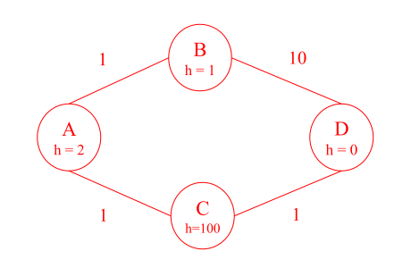
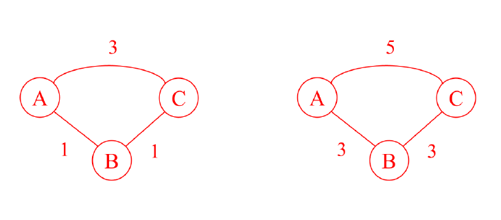
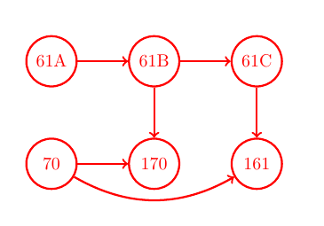
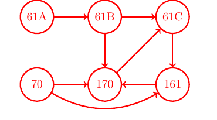
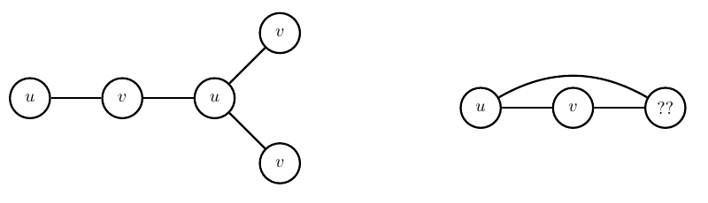
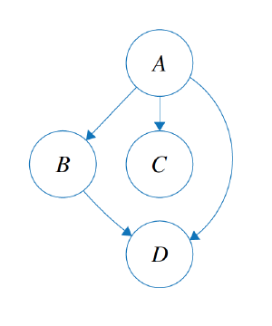
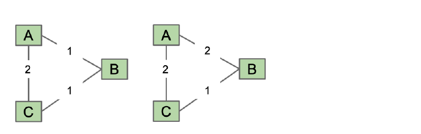
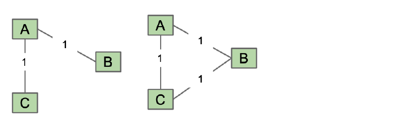
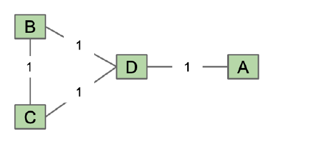
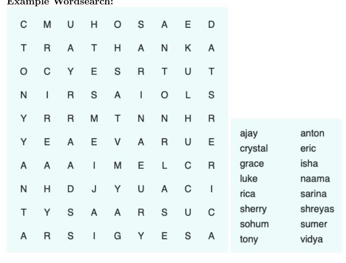

# Discussion 10 — Graphs II, Tries / 图（二）与字典树

> UC Berkeley CS 61B, Spring 2024
>
> Discussion date: April 1, 2024

## Regular

### Question 1 — Longest Prefix / 最长前缀

Fill in the `longestPrefixOf(String word)` method below such that it returns the longest prefix of `word` that is also a prefix of a key in the trie.

For example, if a `TrieSet t` contains keys `{"cryst", "tries", "cr"}`, then `t.longestPrefixOf("crystal")` returns `"cryst"` and `t.longestPrefixOf("crys")` returns `"crys"`.

The code uses the `StringBuilder` class to build strings character-by-character. To add a character to the end of the `StringBuilder`, use the `append(char c)` method. Once all characters have been appended, the resulting `String` is returned by the `toString()` method.

> **中文翻译：** 补全下面的 `longestPrefixOf(String word)` 方法，使其返回 `word` 的最长前缀，并且该前缀同时也是字典树中某个键的前缀。例如，若 `TrieSet t` 包含 `{"cryst", "tries", "cr"}`，则 `t.longestPrefixOf("crystal")` 返回 `"cryst"`，`t.longestPrefixOf("crys")` 返回 `"crys"`。代码使用 `StringBuilder` 逐字符构造字符串；用 `append(char c)` 在末尾加入字符，最后用 `toString()` 得到结果字符串。

```java
StringBuilder sb = new StringBuilder();
sb.append('a');
sb.append('b');
System.out.println(sb.toString()); // "ab"
```

> **代码注释翻译：** 最后一行输出字符串 `"ab"`。

```java
public class TrieSet {
    private Node root;
    private class Node {
        boolean isKey;
        Map<Character, Node> map;

        private Node() {
            isKey = false;
            map = new HashMap<>();
        }
    }

    public String longestPrefixOf(String word) {
        int n = word.length();
        StringBuilder prefix = new StringBuilder();
        Node curr = _________________________;

        for (_____________________________________________) {
            _____________________________________________________
            _____________________________________________________
            _____________________________________________________
            _____________________________________________________
            _____________________________________________________
            _____________________________________________________
        }

        return ______________________________________________
    }
}
```

#### ✍️ My Answer

> 在这里作答

<details>
<summary>✅ 查看答案与解析</summary>

#### 官方答案

```java
public String longestPrefixOf(String word) {
    int n = word.length();
    StringBuilder prefix = new StringBuilder();
    Node curr = root;
    for (int i = 0; i < n; i++) {
        char c = word.charAt(i);

        if (!curr.map.containsKey(c)) {
            break;
        }
        curr = curr.map.get(c);
        prefix.append(c);
    }
    return prefix.toString();
}
```

#### 解析

`curr` 从根结点开始，依次沿 `word` 的字符向下查找。只要当前结点存在对应子结点，就把字符加入结果；第一处不存在的边会使循环终止。

这里刻意没有检查 `isKey`：题目要找的是“某个键的前缀”，而不是“本身必须是键的最长前缀”。因此示例中的 `"crys"` 即使不是完整键，也可以作为 `"cryst"` 的前缀返回。若 `word` 为空或第一个字符就不存在，官方实现返回空字符串 `""`。

设返回前最多检查 $L=|word|$ 个字符；若 `HashMap` 查询按期望 $O(1)$ 计，时间为 $O(L)$，额外空间为 $O(L)$（用于结果字符串）。

#### 考点

- Trie 的逐字符遍历
- 键与键的前缀之间的区别
- `StringBuilder`

</details>

### Question 2 — A Tree Takes on Graphs / 树来挑战图

Your friend at Stanford has come to you for help on their homework! For each of the following statements, determine whether they are true or false; if false, provide counterexamples.

> **中文翻译：** 你在 Stanford 的朋友来请你帮忙完成作业。判断下面每个陈述的真假；若为假，请给出反例。

#### 2a

“A graph with edges that all have the same weight will always have multiple MSTs.”

> **中文翻译：** “所有边权都相同的图一定有多棵最小生成树。”

#### ✍️ My Answer

> 在这里作答

<details>
<summary>✅ 查看答案与解析</summary>

#### 官方答案

False: Consider a tree ($N$ nodes and $N-1$ edges, no cycles, connected) - there is only one way to connect a tree, so it will be its own MST (so there is only one MST for a tree).

#### 解析

边权相同只表示每棵生成树的总权重相同；如果底层图本身就是一棵树，它只有唯一的生成树，也就只有唯一的 MST。因此“一定有多棵”是假的。

#### 考点

- MST 是否唯一
- 树只有一棵生成树
- 用最小反例否定全称命题

</details>

#### 2b

“No matter what heuristic you use, A* search will always find the correct shortest path.”

> **中文翻译：** “无论使用什么启发式函数，A* 搜索总能找到正确的最短路径。”

#### ✍️ My Answer

> 在这里作答

<details>
<summary>✅ 查看答案与解析</summary>

#### 官方答案

False: Here, A* would incorrectly return $A-B-D$ as the shortest path from A to D. Starting at A, we would add B to the queue with priority $1+1$ (the known distance to B, as well as our estimated distance from B to the goal), and we would add C to the queue with priority $1+100$ (the known distance to C, as well as our estimated distance from C to the goal). We then pop B off the queue, and add D to the queue with priority $11+0$ (the known distance to D, as well as the estimated distance from D to the goal). Our queue now contains C with priority 101, and D with priority 11, so we pop D off the queue and complete our search, returning $A-B-D$ as the shortest path instead of the correct answer: $A-C-D$.

In general, A* is only guaranteed to be correct if the heuristic is good-specifically, it should be both admissible and consistent (note that applying admissibility and consistency are out of scope for this class, you only need to know the definition). In the example given, our heuristic is neither admissible nor consistent.



#### 解析

真实最短路 $A-C-D$ 的成本是 $1+1=2$，但 C 被赋予 $h(C)=100$，导致其优先级变为 101。较差的路径 $A-B-D$ 反而使目标 D 以优先级 11 先出队，于是 A* 提前返回错误结果。

启发式高估真实剩余距离会破坏可采纳性；本例在边 $A\to C$ 等位置也不满足一致性不等式。A* 的正确性依赖启发式条件，并非对任意启发式都成立。

#### 考点

- A* 的 $g+h$ 优先级
- 可采纳性与一致性
- 目标结点提前出队造成的错误

</details>

#### 2c

“If you add a constant factor to each edge in a graph, Dijkstra’s algorithm will return the same shortest paths tree.”

> **中文翻译：** “若给图中的每条边都加上同一个常数，Dijkstra 算法会返回相同的最短路径树。”

#### ✍️ My Answer

> 在这里作答

<details>
<summary>✅ 查看答案与解析</summary>

#### 官方答案

False: this can be disproved with the example below, where we add a constant $c=2$ to every edge. Adding a constant factor per edge will disadvantage paths with more edges. In our example, though $A-B-C$ had more edges, in our original graph it still has shorter total path cost, at $1+1=2$. On the other hand, $A-C$ had fewer edges but larger total path cost, 3. After adding a constant factor, however, the $A-B-C$ path cost was $(1+2)+(1+2)=6$ and the $A-C$ had a path cost of $(2+3)=5$. So before the addition, Dijkstra’s shortest path tree would have said the shortest path from A to C was $A-B-C$, but afterwards it would say $A-C$.



#### 解析

一条含 $m$ 条边的路径在每条边加 $c$ 后会增加 $mc$。不同路径的边数不同，所以加法可能改变路径成本的相对顺序。

**补充分析（非官方答案）：** 题目虽写作 “constant factor”，实际操作与官方示例都是“加上常数”，不是乘法缩放。

#### 考点

- 路径边数对统一加法的影响
- Dijkstra 最短路径树
- 构造反例

</details>

### Question 3 — Class Enrollment / 课程选课

You’re planning your CS classes for the upcoming semesters, but it’s hard to keep track of all the prerequisites! Let’s figure out a valid ordering of the classes you’re interested in. A valid ordering is an ordering of classes such that every prerequisite of a class is taken before the class itself. Assume we’re taking one CS class per semester.

> **中文翻译：** 你正在规划未来几个学期的 CS 课程，但先修关系很难追踪。我们要找出感兴趣课程的一种有效顺序，使每门课的所有先修课都在它之前修完。假设每学期只修一门 CS 课程。

#### 3a

The list of prerequisites for each course is given below (not necessarily accurate to actual courses!). Draw a graph to represent our scenario.

- CS 61A: None
- CS 61B: CS 61A
- CS 61C: CS 61B
- CS 70: None
- CS 170: CS 61B, CS 70
- CS 161: CS 61C, CS 70

> **中文翻译：** 下面给出每门课的先修课列表（不一定与实际课程要求一致）。画图表示这一情形。CS 61A 和 CS 70 无先修课；CS 61B 需要 CS 61A；CS 61C 需要 CS 61B；CS 170 需要 CS 61B 与 CS 70；CS 161 需要 CS 61C 与 CS 70。

#### ✍️ My Answer

> 在这里作答

<details>
<summary>✅ 查看答案与解析</summary>

#### 官方答案



#### 解析

用有向边“先修课 $\to$ 后续课程”表示约束：`61A→61B`、`61B→61C`、`61B→170`、`70→170`、`61C→161`、`70→161`。如果图为 DAG，它的拓扑序就是合法修课顺序。

#### 考点

- 用有向图建模先修关系
- DAG 与拓扑排序

</details>

#### 3b

Suppose we added a new prerequisite where the student must take CS 161 before CS 170 and CS 170 before CS 61C. Is there still a valid ordering of classes such that no prerequisites are broken? If no, explain.

> **中文翻译：** 假设增加新的先修要求：必须先修 CS 161 再修 CS 170，并且先修 CS 170 再修 CS 61C。是否仍存在不违反任何先修要求的课程顺序？若不存在，请解释。

#### ✍️ My Answer

> 在这里作答

<details>
<summary>✅ 查看答案与解析</summary>

#### 官方答案

The new graph looks like this:



There exists a cycle between $161\to170\to61C\to161$, so a valid ordering does not exist. Our graph must be directed and acyclic for a topological sort to work.

#### 解析

新增边 `161→170` 与 `170→61C`，而原图已有 `61C→161`，三条边组成有向环。环中的每门课都要求另一门课先完成，因此不可能给出合法线性顺序。

#### 考点

- 有向环与先修关系矛盾
- 拓扑序存在当且仅当图为 DAG

</details>

#### 3c

With the original graph, perform a topological sort to find a valid ordering of the 6 classes. Break ties by going to the lower course number first.

> **中文翻译：** 对原始图执行拓扑排序，找出 6 门课的一种有效顺序；遇到选择平局时，先选择课程编号较小者。

#### ✍️ My Answer

> 在这里作答

<details>
<summary>✅ 查看答案与解析</summary>

#### 官方答案

With topological sorting, if an edge from vertex $u$ to vertex $v$ exists in the graph, then $u$ must come before $v$ in the sorted order. Every edge in our graph represents a prerequisite where class $u$ must be taken before $v$. So, our topologically sorted order will ensure that we meet all prerequisites!

To topological sort on a graph, perform DFS from each vertex with indegree 0 (no incoming edges), but don’t clear the node’s we’ve marked between each new DFS traversal. Afterwards, we reverse the postorder to get our topologically sorted order.

In our graph, there are two vertices with indegree 0: CS 61A and CS 70. If we DFS from CS 61A then CS 70, we get a postorder of: `[CS 161, CS 61C, CS 170, CS 61B, CS 61A, CS 70]`. Reversing this order gives a valid ordering of: **`[CS 70, CS 61A, CS 61B, CS 170, CS 61C, CS 161]`**.

If we DFS from CS 70 then CS 61A, we get a postorder of: `[CS 161, CS 170, CS 70, CS 61C, CS 61B, CS 61A]`. Reversing this order gives a different but still valid ordering of: **`[CS 61A, CS 61B, CS 61C, CS 70, CS 170, CS 161]`**.

#### 解析

DFS 拓扑排序在顶点完成时加入后序，最后反转。按题目的初始平局规则先从 61A 再从 70 开始，对应官方给出的第一组结果；官方同时保留了交换 DFS 起点次序得到的另一组合法拓扑序。

“先访问较小编号”约束的是 DFS 的选择顺序，并不保证最终反转得到的拓扑序是所有合法拓扑序中字典序最小的一条。

时间复杂度为 $O(V+E)$，辅助空间为 $O(V)$（不计图本身）。

#### 考点

- DFS 后序的反转
- 多个合法拓扑序
- 遍历平局规则

</details>

### Question 4 — Graph Algorithm Design / 图算法设计

#### 4a

An undirected graph is said to be bipartite if all of its vertices can be divided into two disjoint sets $U$ and $V$ such that every edge connects an item in $U$ to an item in $V$. For example below, the graph on the left is bipartite, whereas on the graph on the right is not. Provide an algorithm which determines whether or not a graph is bipartite. What is the runtime of your algorithm?

*Hint:* Can you modify an algorithm we already know (ie. graph traversal)?

> **中文翻译：** 若无向图的所有顶点可分成两个不相交集合 $U$ 和 $V$，且每条边都连接一个 $U$ 中顶点与一个 $V$ 中顶点，则该图为二分图。下图左侧是二分图，右侧不是。请给出判断图是否为二分图的算法及其运行时间。提示：能否修改已学过的图遍历算法？



#### ✍️ My Answer

> 在这里作答

<details>
<summary>✅ 查看答案与解析</summary>

#### 官方答案

To solve this problem, we run a special version of a traversal from any vertex. This can be implemented using either DFS and BFS as the underlying traversal that we will modify. Our special version marks the start vertex with a $u$, then each of its neighbors with a $v$, and each of their neighbors with a $u$, and so forth. If at any point in the traversal we want to mark a node with $u$ but it is already marked with a $v$ (or vice versa), then the graph is not bipartite.

If the graph is not connected, we repeat this process for each connected component.

If the algorithm completes, successfully marking every vertex in the graph, then it is bipartite.

The runtime of the algorithm is the same whether you use BFS or DFS: $\Theta(E+V)$.

#### 解析

这就是图的二染色：给起点一种颜色，所有邻居染另一种颜色。遍历边 $(u,v)$ 时，若两端已有相同颜色，就发现奇环并返回 false；否则继续。非连通图必须从每个尚未染色的顶点重新开始遍历。

每个顶点、每条边只处理常数次，因此时间为 $\Theta(V+E)$，颜色与遍历结构需要 $O(V)$ 空间。

#### 考点

- 二分图与二染色
- BFS/DFS 的修改
- 非连通图

</details>

#### 4b

Consider the following implementation of DFS, which contains a crucial error:

> **中文翻译：** 考虑下面的 DFS 实现，其中包含一个关键错误：

```text
create the fringe, which is an empty Stack
push the start vertex onto the fringe and mark it
while the fringe is not empty:
    pop a vertex off the fringe and visit it

    for each neighbor of the vertex:
        if neighbor not marked:
            push neighbor onto the fringe
            mark neighbor
```

First, identify the bug in this implementation. Then, give an example of a graph where this algorithm may not traverse in DFS order.

*Hint:* When should we be marking vertices?

> **中文翻译：** 首先找出该实现中的错误，然后给出一个可能使它不按 DFS 顺序遍历的图。提示：顶点应在什么时候被标记？

#### ✍️ My Answer

> 在这里作答

<details>
<summary>✅ 查看答案与解析</summary>

#### 官方答案



For the graph above, it’s possible to visit in the order $A-B-C-D$ (which is not depth-first) because D won’t be put into the fringe after visiting B, since it’s already been marked after visiting A. One should only mark nodes when they have actually been visited, but in this buggy implementation, we mistakenly mark them before we visit them, as we’re putting them into the fringe.

#### 解析

该伪代码在结点入栈时就标记。A 的邻居 B、C、D 都可能先被标记并入栈；之后访问 B 时，即使 B 有边到 D，也会因 D 已标记而跳过，破坏“沿当前分支尽可能深入”的递归 DFS 行为。

按本题希望模拟递归 DFS 的语义，应在顶点真正从栈中弹出并访问时标记，并允许尚未访问的顶点再次入栈；弹出时若已访问则跳过。

**补充分析（非官方答案）：** 也存在入栈时标记的标准迭代 DFS 写法，但必须正确控制邻居的压栈次序；它不等同于题目中这段会提前阻止 D 再次入栈的实现。

#### 考点

- 迭代 DFS 的标记时机
- fringe 中与已访问的区别
- DFS 访问顺序

</details>

#### 4c

*Extra:* Provide an algorithm that finds the shortest cycle (in terms of the number of edges used) in a directed graph in $O(EV)$ time and $O(E)$ space, assuming $E>V$.

> **中文翻译：** 额外题：假设 $E>V$，设计一个算法，在 $O(EV)$ 时间和 $O(E)$ 空间内找出有向图中按边数计最短的环。

#### ✍️ My Answer

> 在这里作答

<details>
<summary>✅ 查看答案与解析</summary>

#### 官方答案

The key realization here is that the shortest directed cycle involving a particular source vertex $s$ is just the shortest path to a vertex $v$ that has an edge to $s$, along with that edge. Using this knowledge, we create a `shortestCycleFromSource(s)` subroutine. This subroutine runs BFS on $s$ to find the shortest path to every vertex in the graph. Afterwards, it iterates through all the vertices to find the shortest cycle involving $s$: if a vertex $v$ has an edge back to $s$, the length of the cycle involving $s$ and $v$ is one plus `distTo(v)` (which was computed by BFS).

An alternative approach to the above subroutine (that is slightly more optimized) actually modifies BFS to short circuit if it’s visiting a node $v$ and sees it has an edge $v\to s$. Because BFS visits in order of distance from S, we can know that the first vertex $v$ we see with an edge back to $s$ will be the shortest cycle.

Regardless of which approach you take, asymptotically our subroutine takes $O(E+V)$ time because it uses BFS and a linear pass through the vertices. To find the shortest cycle in an entire graph, we simply call the subroutine on each vertex, resulting in an $V\cdot O(E+V)=O(EV+V^2)$ runtime. Since $E>V$, this is still $O(EV)$, since $O(EV+V^2)\in O(EV+EV)\in O(EV)$.

#### 解析

对每个源点 $s$ 做一次 BFS，计算从 $s$ 到所有顶点的最少边数。再检查所有指向 $s$ 的入边 $v\to s$，候选环长为 $dist_s(v)+1$；在所有 $s$ 和候选入边中取最小值，并用 BFS 的父指针恢复环。

每次 BFS 为 $O(V+E)$，执行 $V$ 次得到 $O(V(V+E))$；由 $E>V$ 可化为 $O(EV)$。每次复用 BFS 队列、距离和父指针数组，空间为 $O(V+E)=O(E)$。

#### 考点

- BFS 的无权最短路
- 通过回到源点的边闭合有向环
- 利用 $E>V$ 化简复杂度

</details>

# Exam Prep

### Question 1 — Multiple MSTs / 多棵最小生成树

Recall a graph can have multiple MSTs if there are multiple spanning trees of minimum weight.

> **中文翻译：** 回顾：如果一个图存在多棵总权重最小的生成树，那么它就有多棵 MST。

#### 1a

For each subpart below, select the correct option and justify your answer. If you select “never” or “always,” provide a short explanation. If you select “sometimes”, provide two graphs that fulfill the given properties - one with multiple MSTs and one without. Assume G is an undirected, connected graph with at least 3 vertices.

> **中文翻译：** 为下面每个小问选择正确选项并说明理由。若选择 “never” 或 “always”，请简要解释；若选择 “sometimes”，请给出两个满足条件的图，一个具有多棵 MST，另一个没有。假设 G 是至少含 3 个顶点的连通无向图。

##### 1

If **some** of the edge weights are **identical**, there will

- ○ never be multiple MSTs in G.
- ○ sometimes be multiple MSTs in G.
- ○ always be multiple MSTs in G.

Justification:

> **中文翻译：** 如果有些边的权重相同，那么 G 中：○ 永远不会有多棵 MST；○ 有时会有多棵 MST；○ 总会有多棵 MST。请说明理由。

#### ✍️ My Answer

> 在这里作答

<details>
<summary>✅ 查看答案与解析</summary>

#### 官方答案

- ■ sometimes be multiple MSTs in G.



In the graph on the left, the only MST is `[AB, BC]`. In the graph on the right, two MSTs exist - `[AB, BC]` and `[AC, BC]`.

#### 解析

重复边权只是 MST 不唯一的必要可能性，并非充分条件。左图虽然有两条权重 1 的边，但它们都是连接三个顶点所必需的，所以 MST 唯一；右图的两条候选边形成等价选择，因此有两棵 MST。

#### 考点

- 重复边权与 MST 唯一性
- “有时成立”的正反例

</details>

##### 2

If **all** of the edge weights are **identical**, there will

- ○ never be multiple MSTs in G.
- ○ sometimes be multiple MSTs in G.
- ○ always be multiple MSTs in G.

Justification:

> **中文翻译：** 如果所有边的权重都相同，那么 G 中：○ 永远不会有多棵 MST；○ 有时会有多棵 MST；○ 总会有多棵 MST。请说明理由。

#### ✍️ My Answer

> 在这里作答

<details>
<summary>✅ 查看答案与解析</summary>

#### 官方答案

- ■ sometimes be multiple MSTs in G.



In the graph on the left, the only MST is `[AB, AC]`. Note that for any tree, we only have one MST, since the tree itself is the MST! In the graph on the right, three MSTs exist - `[AB, BC]`, `[AC, BC]`, and `[AB, AC]`.

#### 解析

当所有边等权时，每棵生成树的权重都相同，因此 MST 的数量等于生成树的数量。若图本身是树，只有一棵；若图含环，删除环中不同边可能得到多棵生成树。

#### 考点

- 等权图中的 MST
- 环与生成树数量

</details>

#### 1b

Suppose we have a connected, undirected graph G with $N$ vertices and $N$ edges, where all the **edge weights are identical**. Find the maximum and minimum number of MSTs in G and explain your reasoning.

```text
Minimum: _________
Maximum: _________

Justification:
```

> **中文翻译：** 假设连通无向图 G 有 $N$ 个顶点和 $N$ 条边，且所有边权都相同。求 G 的 MST 数量的最大值与最小值，并说明理由。

#### ✍️ My Answer

> 在这里作答

<details>
<summary>✅ 查看答案与解析</summary>

#### 官方答案

Minimum: 3, Maximum: $N$

Notice that if all the edge weights are the same, an MST is just a spanning tree. Let’s begin by creating a tree, i.e. a connected graph with $N-1$ edges. Now, notice that there is only one spanning tree, since the graph is itself a tree.

As such, the problem reduces to: how many spanning trees can the insertion of one edge create? If we add an edge to a tree, it will create a cycle that can be of length at minimum 3 and at maximum $N$. Then, notice that we can only remove any edge from a cycle to create a spanning tree, so we have at minimum 3 and at maximum $N$ possible MSTs in G.

#### 解析

连通图有 $N$ 个顶点、$N$ 条边，因此恰好比树多一条边，是单环图。唯一环长记为 $k$；删除环上任意一条边都会得到一棵生成树，且等权条件使这些生成树都是 MST，所以 MST 数量正好为 $k$。简单无向图的环长范围为 $3\le k\le N$。

**补充分析（非官方答案）：** 官方最小值 3 隐含图是简单图；若允许两个顶点之间存在平行边，则可能出现长度为 2 的环，最小值会变成 2。CS61B 此处按普通简单无向图语境作答。

#### 考点

- 单环连通图
- 等权图的生成树计数
- 简单图假设

</details>

#### 1c

It is possible that Prim’s and Kruskal’s find **different** MSTs on the same graph G (as an added exercise, construct a graph where this is the case!). Given any graph G with integer edge weights, modify the edge weights of G to **ensure** that (1) Prim’s and Kruskal’s will output the same results, and (2) the output edges still form a MST correctly in the original graph. You may not modify Prim’s or Kruskal’s, and you may not add or remove any nodes/edges.

*Hint:* Look at subpart 1 of part a.

> **中文翻译：** Prim 与 Kruskal 可能在同一图 G 上找到不同的 MST（额外练习：构造这样的图）。给定任意整数边权图 G，请修改其边权，保证：（1）Prim 与 Kruskal 输出相同结果；（2）输出的边在原图中仍正确构成一棵 MST。不得修改算法，也不得增删顶点或边。提示：参考 1a 的第 1 小问。

#### ✍️ My Answer

> 在这里作答

<details>
<summary>✅ 查看答案与解析</summary>

#### 官方答案

To ensure that Prim’s and Kruskal’s will always produce the same MST, notice that if G has unique edges, only one MST can exist, and Prim’s and Kruskal’s will always find that MST! So, what if we modify G to ensure that all the edge weights are unique?

To achieve this, let’s strategically add a small, unique `offset` between 0 and 1, exclusive, to each edge. It is important that we choose an `offset` between 0 and 1. This is to ensure that the edges picked in the modified graph is still a correct MST in the original graph, since all the edge weights are integers. It is also important that the offset is unique for each edge, because then we ensure each weight is distinct. Pseudocode for such a change is shown below:

```text
E = number of edges in the graph
offset = 0
for edge in graph:
    edge.weight += offset
    offset += 1 / E
```

In regard to the added exercise, here is a simple graph G where Prim’s and Kruskal’s produce different MSTs. Prim’s starting from A will select AD, BD, and CD, whereas Kruskal’s will select AD, BC, and BD.



#### 解析

整数边权之间若不同，差至少为 1；给每条边加入互不相同且小于 1 的偏移量，不会颠倒原本不同整数权重的先后，只会打破同权边之间的平局。修改后所有边权唯一，因此 MST 唯一，Prim 与 Kruskal 必须返回同一棵树；去掉偏移量后，该树仍是原图的一棵 MST。

**补充分析（非官方答案）：** 官方文字要求每个偏移量严格位于开区间 $(0,1)$，但伪代码从 `offset = 0` 开始，第一条边实际得到偏移量 0。这个字面不一致不影响方案正确性：$0,1/E,\ldots,(E-1)/E$ 仍互不相同且都小于 1。另需注意，伪代码里的 `1 / E` 是数学除法；若直接照搬到 Java 且 `E` 是整数，整数除法会得到 0，必须改用 `1.0 / E`。

#### 考点

- 唯一边权推出唯一 MST
- 用微小扰动稳定打破平局
- 整数除法陷阱

</details>

### Question 2 — Topological Sorting for Cats / 猫咪拓扑排序

The big brain cat, Duncan, is currently studying topological sorts! However, he has a variety of curiosities that he wishes to satisfy.

> **中文翻译：** 聪明猫 Duncan 正在研究拓扑排序，并有一系列问题想弄明白。

#### 2a

Describe at a high level in plain English how to perform a topological sort using an algorithm we already know (hint: it involves DFS), and provide the time complexity.

> **中文翻译：** 用简明英语从高层描述如何利用已经学过的算法进行拓扑排序（提示：涉及 DFS），并给出时间复杂度。

#### ✍️ My Answer

> 在这里作答

<details>
<summary>✅ 查看答案与解析</summary>

#### 官方答案

Reverse the edges of the graph, then perform a postorder traversal from any unvisited vertices until you visit all of them. The runtime is linear with respect to the number of vertices and edges.

#### 解析

官方方法是在反图上记录 DFS 后序；这等价于在原图上取逆后序，所得顺序满足每条原边 $u\to v$ 中 $u$ 位于 $v$ 之前。构造反图和 DFS 都是 $O(V+E)$。

#### 考点

- DFS 后序与拓扑序
- 反图
- $O(V+E)$ 遍历

</details>

#### 2b

Duncan came up with another way to possibly do topological sorts, and he wants you to check him on its correctness and tell him if it is more efficient than our current way! Let’s derive the algorithm.

> **中文翻译：** Duncan 想出了另一种可能的拓扑排序方法，希望你验证它的正确性，并判断它是否比现有方法更高效。下面逐步推导该算法。

##### 1

First, provide a logical reasoning for the following claim (or a proof!): Every DAG has at least one source node, and at least one sink node.

> **中文翻译：** 首先论证：每个 DAG 至少有一个源点，并且至少有一个汇点。

#### ✍️ My Answer

> 在这里作答

<details>
<summary>✅ 查看答案与解析</summary>

#### 官方答案

Suppose a DAG had no sinks. Then every node has a outgoing edge. If we traversed the graph, then given that there are no sinks, there is always another vertex we can go to from the current one, and therefore after $V$ steps we must be repeating vertices. Therefore, the graph has a cycle, and is not a DAG. Suppose a DAG had no sources. Then every node has at least one edge going into it. Note that then, if we reverse the graph, this graph has no sinks, but should still be a DAG. However, we proved in the previous part this cannot be the case, so this too cannot be a DAG.

#### 解析

在有限图中，如果每个顶点都有出边，沿出边不断前进，经过多于 $V$ 个顶点后必然重复顶点，从而产生有向环；所以 DAG 必有汇点。把所有边反向后 DAG 仍是 DAG，汇点对应原图的源点，因此原图也必有源点。

#### 考点

- DAG 的源点与汇点
- 鸽巢原理
- 反图论证

</details>

##### 2

Duncan wishes to extend from the `Graph` class to create a `DAG` class. He wants to eventually add a method that enables topological sorting, but needs to write some helper methods first! Complete the following instance methods `computeInDegrees` and `findAllSourceNodes()`.

> **中文翻译：** Duncan 要继承 `Graph` 创建 `DAG` 类，并最终加入拓扑排序方法。先补全辅助实例方法 `computeInDegrees` 与 `findAllSourceNodes()`。

```java
public class Graph {
    public Graph(int V) // Create empty graph with v vertices, numbered 0 to V - 1
    public void addEdge(int v, int w) // Adds edge from v to w
    Iterable<Integer> adj(int v) // Gets vertices adjacent to v
    int V() // Number of vertices
    int E() // Number of edges
}

public class DAG extends Graph {
    // Computes the number of incoming edges to a vertex
    public int[] computeInDegrees() {
        int[] indegree = ______________________;

        for (_________________________________) {
            for (__________________________) {
                ______________________________
            }
        }

        return indegree;
    }

    // Finds all source nodes in the graph
    public List<Integer> findAllSourceNodes(int[] indegree) {
        List<Integer> sources = new ArrayList<>();

        for (_________________________________) {
            if (__________________________) {
                __________________________
            }
        }

        return ___________________;
    }
}

Runtime of computeInDegrees is:

Runtime of findAllSourceNodes is:
```

> **代码注释翻译：** `Graph(int V)` 创建编号为 0 到 $V-1$ 的空图；`addEdge` 添加从 `v` 到 `w` 的边；`adj` 返回与 `v` 相邻的顶点；`V()` 与 `E()` 分别返回顶点数和边数。`computeInDegrees` 计算顶点入边数，`findAllSourceNodes` 查找图中全部源点。

#### ✍️ My Answer

> 在这里作答

<details>
<summary>✅ 查看答案与解析</summary>

#### 官方答案

```java
public class Graph {
    public Graph(int V) // Create empty graph with v vertices, numbered 0 to V - 1
    public void addEdge(int v, int w) // Adds edge from v to w
    Iterable<Integer> adj(int v) // Gets vertices adjacent to v
    int V() // Number of vertices
    int E() // Number of edges
}

public class DAG extends Graph {
    // Computes the number of incoming edges to a vertex
    public int[] computeInDegrees() {
        int[] indegree = new int[V()];
        for (int i = 0; i < V(); i++) {
            for (int w : adj(i)) {
                indegree[w]++;
            }
        }
        return indegree;
    }

    // Finds all source nodes in the graph
    public List<Integer> findAllSourceNodes(int[] indegree) {
        List<Integer> sources = new ArrayList<>();
        for (int i = 0; i < V(); i++) {
            if (indegree[i] == 0) {
                sources.add(i);
            }
        }

        return sources;
    }
}
```

> **代码注释翻译：** 与题目代码相同：各注释分别说明图构造、加边、邻接访问、顶点/边计数，以及两个辅助方法的用途。

The idea behind `computeInDegrees()` is to create an array of size $V$, where `indegree[i]` represents the number of incoming edges to vertex `i`. Then, we consider each edge coming out of each vertex. Each time, we increment the indegree of the destination vertex by one.

The idea behind `findAllSourceNodes()` is to iterate through the `indegree` array, and if the indegree of a vertex is 0, add it to the list of sources.

The runtime of `computeInDegrees` is $O(V+E)$, and the runtime of `findAllSourceNodes` is $O(V)$. This is because we iterate through all the vertices and edges in the graph in the first method, and only the vertices in the second method.

#### 解析

先建立长度为 $V$ 的零数组。枚举每个顶点的每条出边 $i\to w$，就把目的顶点 `w` 的入度加一。源点正是入度为零的顶点，扫描数组即可收集。

#### 考点

- 邻接表中的入度统计
- 源点定义
- $O(V+E)$ 与 $O(V)$

</details>

##### 3

Now, make the following observation: If we remove all of the source nodes from a DAG, we are guaranteed to have at least one new source node. Inspired by this fact, and using the previous parts, complete the `topologicalSort()` method. What is its runtime?

> **中文翻译：** 观察：从 DAG 中移除所有源点后，保证会出现至少一个新源点。利用前面各部分补全 `topologicalSort()`，并给出其运行时间。

```java
public class DAG extends Graph {
    public int[] computeInDegrees() { ... }
    public List<Integer> findAllSourceNodes(int[] indegree) { ... }

    public List<Integer> topologicalSort() {
        List<Integer> sorted = new ArrayList<>();

        ____________________________________________

        // Hint: add elements from another iterable here
        Queue<Integer> sources = new ArrayDeque<>(_______________________);

        while (________________________________) {
            int source = sources.poll();

            ______________________________________

            for (______________________________________) {
                ______________________________________

                if (________________________) {
                    ________________________
                }
            }
        }
        return sorted;
    }
}

Runtime of topologicalSort is:
```

> **代码注释翻译：** 提示在此处从另一个可迭代对象加入元素。

#### ✍️ My Answer

> 在这里作答

<details>
<summary>✅ 查看答案与解析</summary>

#### 官方答案

```java
public class DAG extends Graph {
    public int[] computeInDegrees() { ... }
    public List<Integer> findAllSourceNodes(int[] indegree) { ... }

    public List<Integer> topologicalSort() {
        List<Integer> sorted = new ArrayList<>();
        int[] indegree = computeInDegrees();

        // Hint: add elements from another iterable here
        Queue<Integer> sources = new ArrayDeque<>(findAllSourceNodes(indegree));

        while (!sources.isEmpty()) {
            int source = sources.poll();
            sorted.add(source);

            for (int w : adj(source)) {
                indegree[w]--;

                if (indegree[w] == 0) {
                    sources.add(w);
                }
            }
        }
    }
}
```

> **代码注释翻译：** 提示在队列构造时从另一个可迭代对象加入元素。

The algorithm is as follows. Create the indegree array described in the previous part. Get all of the source nodes from it, which are guaranteed to exist by part a. Add them to a queue. Then, until the set is queue, remove any vertex from the queue, output it, and ”removes” it from the graph (we are not really removing the edge and vertex here, just decrementing the array `indegree`): For each edge that that vertex has outgoing, decrement the indegree of the destination vertex by one. If that vertex now has 0 indegree in the array, add it to the queue.

The runtime of `topologicalSort` is $O(V+E)$. We made one call to `computeInDegrees`, which is $O(V+E)$, and `findAllSourceNodes`, which is $O(V)$. The while loop attempts to ”remove” all vertices and its outgoing edges from the graph when it becomes a source, and will run in $O(V+E)$ time.

Wow, it actually works! Nice work Duncan! However, this algorithm has already been discovered and is known as Kahn’s algorithm, and so we cannot call it Duncan’s algorithm :(

#### 解析

这是 Kahn 拓扑排序：先把所有零入度顶点入队；每次取出源点并加入结果，随后把其每条出边的终点入度减一，新变为零的顶点再入队。每个顶点入队一次、每条边处理一次，总时间 $O(V+E)$，额外空间 $O(V)$。

**补充分析（非官方答案）：** Solutions PDF 中的官方代码缺少题目模板原有的 `return sorted;`。按 Java 语法，返回类型为 `List<Integer>` 的方法若执行到末尾而没有返回值，会产生编译错误。正确实现应在 `while` 循环之后、方法结束之前保留 `return sorted;`；上面的“官方答案”仍忠实保留了 PDF 中的缺失。官方说明中的 “until the set is queue” 也是原文病句，结合代码应理解为“当队列非空时持续处理”。

#### 考点

- Kahn 算法
- 动态维护入度
- 编译错误与算法思路的区别

</details>

##### 4

Venti, the bard from Mondstadt is allergic to cats. He wanted to trick Duncan and created a `DAG` object, but it actually represents a graph with a cycle! How can you modify the method `topologicalSort()` above to detect whether the graph has a cycle?

> **中文翻译：** 蒙德吟游诗人 Venti 对猫过敏。他创建了一个实际含环的 `DAG` 对象来捉弄 Duncan。应如何修改上面的 `topologicalSort()` 来检测图中是否有环？

#### ✍️ My Answer

> 在这里作答

<details>
<summary>✅ 查看答案与解析</summary>

#### 官方答案

If the graph has a cycle, at some point we will not be able to find any more sources, but there will still be things that we have not “removed” from the graph. Therefore, we can check if there are any non-zero elements in the `indegree` array after the while loop. If there are, then the graph has a cycle.

#### 解析

有向环内每个剩余顶点都有环内入边，所以它们永远不会变成零入度，队列会在处理完全部可移除顶点之前变空。循环结束后检查是否仍有非零入度即可；等价地，也可以检查 `sorted.size() != V()`。

#### 考点

- Kahn 算法检测有向环
- 未处理顶点与剩余入度

</details>

### Question 3 — A Wordsearch / 单词搜索

Given an $N$ by $N$ wordsearch and $N$ words, devise an algorithm (using pseudocode or describe it in plain English) to solve the wordsearch in $O(N^3)$. For simplicity, assume no word is contained within another, i.e. if the word “bear” is given, “be” wouldn’t also be given.

If you are unfamiliar with wordsearches or want to gain some wordsearch solving intuition, see below for an example wordsearch. Note that the below wordsearch doesn’t follow the precise specification of an $N$ by $N$ wordsearch with $N$ words, but your algorithm should work on this wordsearch regardless.

> **中文翻译：** 给定一个 $N\times N$ 单词搜索方格和 $N$ 个单词，设计一个 $O(N^3)$ 算法（可用伪代码或自然语言描述）找出这些单词。为简化问题，假设没有一个给定单词包含在另一个给定单词中，例如给出 “bear” 时不会同时给出 “be”。下图是示例；它不严格满足 $N\times N$ 方格配 $N$ 个单词的规格，但算法仍应适用。



*Hint:* Add the words to a Trie, and you may find the `longestPrefixOf` operation helpful. Recall that `longestPrefixOf` accepts a `String key` and returns the longest prefix of `key` that exists in the Trie, or `null` if no prefix exists.

> **中文翻译：** 提示：把单词加入 Trie；`longestPrefixOf` 操作可能有用。回顾：它接收一个 `String key`，返回 `key` 中存在于 Trie 的最长前缀；若不存在前缀则返回 `null`。

#### ✍️ My Answer

> 在这里作答

<details>
<summary>✅ 查看答案与解析</summary>

#### 官方答案

Algorithm: Begin by adding all the words we are querying for into a Trie. Next, we will iterate through each letter in the wordsearch and see if any words start with that letter. For a word to start with a given letter, note that it can go in one of eight directions - N, NE, E, SE, S, SW, W, NW.

Looking at each direction, we will check if the string going in that direction has a prefix that exists in our Trie, which we can do using `longestPrefixOf`. Note that words are not nested inside of others, so at most one word can start from a given letter in a given direction. As such, if `longestPrefixOf` returns a word, we know it is the only word that goes in that direction from that letter.

For instance, if we are at the letter ”S” in the middle of the top row of the wordsearch above and are considering the direction west, we would want to see if the string `"SOHUMC"` has a prefix that exists in the given wordsearch. To efficiently perform this query, we call `longestPrefixOf("SOHUMC")`, which, in this case, returns `"SOHUM"`, and we proceed by removing `"SOHUM"` from our Trie to signal that we found the word `"SOHUM"`.

We will repeat this process until the all the words have been found, i.e. when the Trie is empty. Finally, note that this is a very open ended problem, so this is one of many possible solutions.

Runtime: We look at $N^2$ letters. At each letter, we execute eight calls to `longestPrefixOf` which runs in time linear to the length of the inputted string, which can be of at most length $N$, since that is the height and width of the wordsearch. Thus, if we perform on the order of $N$ work per letter and we look at $N^2$ letters, the runtime is $O(N^3)$.

#### 解析

先把 $N$ 个目标词加入 Trie。对方格中每个起点和八个方向，构造从该点沿直线到边界的字符串，并查询其 Trie 前缀；若得到完整目标词，就记录并从 Trie 删除。共有 $N^2$ 个起点、每点 8 个方向，每个方向最长检查 $N$ 个字符，因此总时间为 $O(N^3)$。Trie、方向字符串和结果所需空间为 $O(N^2)$（所有目标词总长度在最坏情况下为 $N\cdot N$）。

**补充分析（非官方答案）：** Exam Prep 的提示说无匹配时 `longestPrefixOf` 返回 `null`，但本 Discussion Regular Question 1 的官方实现会返回空字符串 `""`。两份官方材料的返回约定不一致，使用时应明确选择一种并统一判断。

**补充分析（非官方答案）：** Regular Question 1 定义的 `longestPrefixOf` 返回“仍是某个键前缀的最长字符串”，它不保证返回值本身是完整键；例如 Trie 只有 `"bear"` 时，查询 `"beaX"` 会得到 `"bea"`。因此实际实现还必须用 `contains(result)` 或结点的 `isKey` 验证结果确实是完整目标词，再将它报告并删除。“没有一个目标词包含于另一个目标词”的假设只能排除两个完整键嵌套，不能排除这种未完成前缀。

#### 考点

- Trie 前缀查询
- 八方向单词搜索
- $N^2\times 8\times N=O(N^3)$
- 前缀与完整键的区别

</details>

## 完整性检查

- Regular：Question 1、Question 2（2a-2c）、Question 3（3a-3c）、Question 4（4a-4c，含 Extra）均与 Regular Solutions 对应；代码空白、三组图论反例、课程先修图、二分图示例、DFS 反例和最短环算法均已核对。
- Exam Prep：Question 1（1a 的两个编号情形、1b、1c）、Question 2（2a、2b 的 1-4）、Question 3 均与 Exam Prep Solutions 对应，无遗漏题目或嵌套小问。
- 图片提取情况：从四份官方 PDF 的高分辨率渲染页提取 10 张图片，包括 A*/Dijkstra 反例、课程先修图、二分图与 DFS 图、多 MST 示例和单词搜索；没有重新绘制原图。
- 官方答案和补充分析的分区情况：Solutions PDF 内容保留在“官方答案”；简单图假设、术语歧义、偏移量开区间与 Java 整数除法、官方 `topologicalSort()` 缺少返回语句及说明病句，以及 `longestPrefixOf` 返回约定和完整键判断问题均在中文“解析”中明确标为补充分析。

## 官方资料

- [Regular PDF](https://sp24.datastructur.es/assets/discussions/regular10.pdf)
- [Regular Solutions PDF](https://sp24.datastructur.es/assets/discussions/regular10sol.pdf)
- [Exam Prep PDF](https://sp24.datastructur.es/assets/discussions/examlevel10.pdf)
- [Exam Prep Solutions PDF](https://sp24.datastructur.es/assets/discussions/examlevel10sol.pdf)
