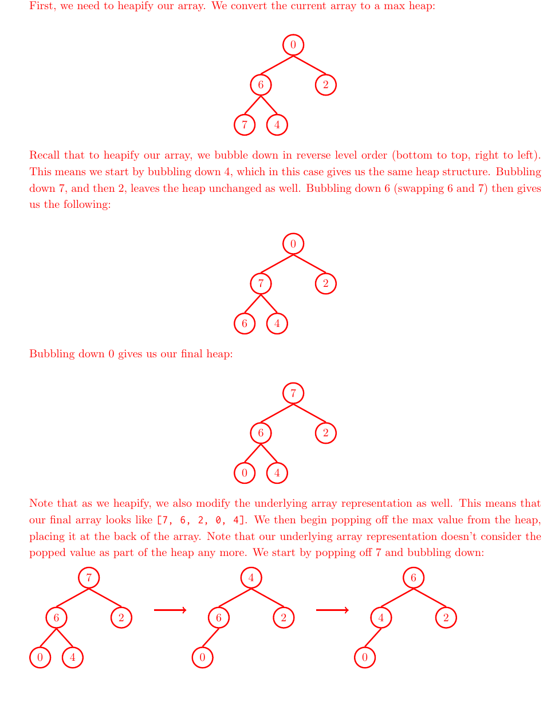
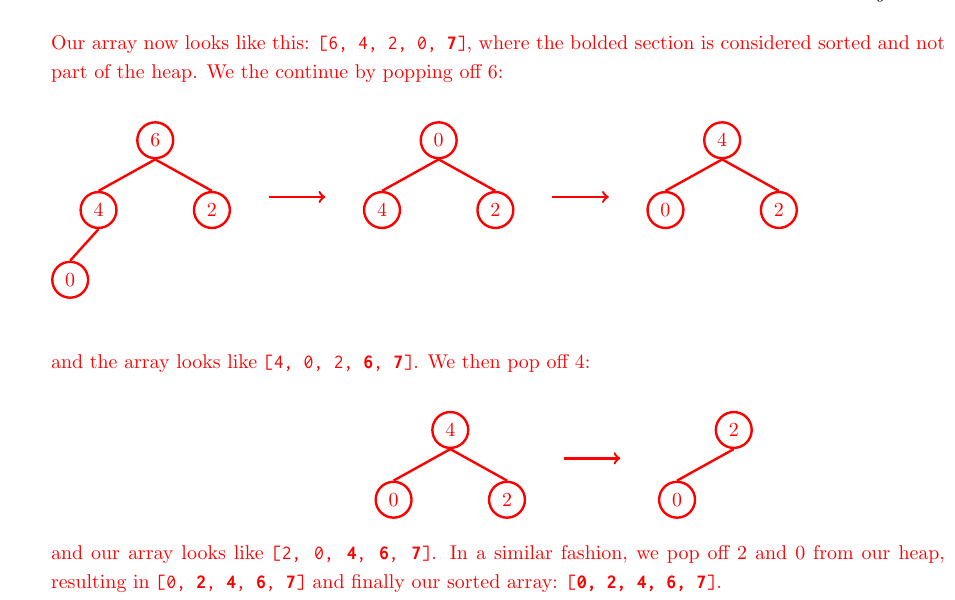

# Discussion 11 — Sorting / 排序

> UC Berkeley CS 61B, Spring 2024
>
> Discussion date: April 8, 2024

## Regular

### Question 1 — All Sorts Of Sorts / 各种各样的排序

Show the steps taken by each sort on the following unordered list:

`0, 4, 2, 7, 6, 1, 3, 5`

> **中文翻译：** 展示每种排序算法对上述无序列表执行排序时的各个步骤。

#### 1a

Insertion sort

> **中文翻译：** 插入排序。

#### ✍️ My Answer

> 在这里作答

<details>
<summary>✅ 查看答案与解析</summary>

#### 官方答案

```text
0 | 4 2 7 6 1 3 5
0 4 | 2 7 6 1 3 5
0 2 4 | 7 6 1 3 5
0 2 4 7 | 6 1 3 5
0 2 4 6 7 | 1 3 5
0 1 2 4 6 7 | 3 5
0 1 2 3 4 6 7 | 5
0 1 2 3 4 5 6 7 |
```

#### 解析

竖线左侧是已经排好序的前缀。每轮取右侧第一个元素，向左移动到合适位置。输入中元素 `1` 需要跨过 `7、6、4、2`，因此这一轮移动最多。插入排序的时间复杂度为最好 $\Theta(N)$、最坏 $\Theta(N^2)$，原地实现的额外空间为 $O(1)$，并且可以稳定。

#### 考点

- 插入排序的不变式
- 已排序前缀
- 最好与最坏运行时间

</details>

#### 1b

Selection sort

> **中文翻译：** 选择排序。

#### ✍️ My Answer

> 在这里作答

<details>
<summary>✅ 查看答案与解析</summary>

#### 官方答案

```text
0 | 4 2 7 6 1 3 5
0 1 | 2 7 6 4 3 5
0 1 2 | 7 6 4 3 5
0 1 2 3 | 6 4 7 5
0 1 2 3 4 | 6 7 5
0 1 2 3 4 5 | 7 6
0 1 2 3 4 5 6 | 7
0 1 2 3 4 5 6 7 |
```

#### 解析

每轮从未排序部分选出最小值，与该部分的首元素交换，竖线左侧因此逐步固定。无论输入初始顺序如何，选择排序都要扫描剩余元素，时间复杂度为 $\Theta(N^2)$；原地实现只需 $O(1)$ 额外空间。普通交换式选择排序通常不稳定。

#### 考点

- 选择排序的不变式
- 选择最小值与交换
- 稳定性

</details>

#### 1c

Merge sort

> **中文翻译：** 归并排序。

#### ✍️ My Answer

> 在这里作答

<details>
<summary>✅ 查看答案与解析</summary>

#### 官方答案

```text
[0 4 2 7 6 1 3 5]
[0 4 2 7] [6 1 3 5]
[0 4] [2 7] [6 1] [3 5]
[0] [4] [2] [7] [6] [1] [3] [5]
[0 4] [2 7] [1 6] [3 5]
[0 2 4 7] [1 3 5 6]
[0 1 2 3 4 5 6 7]
```

#### 解析

数组不断二分，直到每个子数组只含一个元素；随后相邻的有序子数组逐层合并。每层处理 $N$ 个元素，共有 $\log N$ 层，因此时间复杂度为 $\Theta(N\log N)$。标准数组归并排序需要 $\Theta(N)$ 辅助空间，并且在相等时优先取左侧元素即可保持稳定。

#### 考点

- 分治
- 合并有序序列
- 递归层数与复杂度

</details>

#### 1d

Use heapsort to sort the following array (hint: draw out the heap). Draw out the array at each step:

`0, 6, 2, 7, 4`

> **中文翻译：** 使用堆排序对上述数组排序（提示：画出堆），并画出每一步对应的数组。

#### ✍️ My Answer

> 在这里作答

<details>
<summary>✅ 查看答案与解析</summary>

#### 官方答案

First, we need to heapify our array. We convert the current array to a max heap. Recall that to heapify our array, we bubble down in reverse level order (bottom to top, right to left). Bubbling down `6` (swapping `6` and `7`) and then bubbling down `0` gives the final heap, whose underlying array is `[7, 6, 2, 0, 4]`.

We then begin popping off the max value from the heap, placing it at the back of the array. The arrays become `[6, 4, 2, 0, 7]`, `[4, 0, 2, 6, 7]`, `[2, 0, 4, 6, 7]`, `[0, 2, 4, 6, 7]`, and finally `[0, 2, 4, 6, 7]`.





#### 解析

先把数组原地建成最大堆，再反复把堆顶最大值与当前堆的最后一个元素交换；交换出去的元素进入右侧已排序区，剩余堆再执行下沉恢复堆性质。建堆为 $\Theta(N)$，之后最多 $N$ 次下沉各需 $O(\log N)$，总时间为 $\Theta(N\log N)$，额外空间为 $O(1)$。普通堆排序不稳定。

#### 考点

- 数组表示的最大堆
- `heapify` 与下沉
- 原地堆排序

</details>

### Question 2 — Crystal Has Been Waiting For This / Crystal 等这一刻很久了

Claire and Ada, two alumni 61B TAs, are trying to sort the TAs by height so they can snap a photo. Can you help them out?

> **中文翻译：** Claire 和 Ada 是两位 61B 前助教，她们想按身高排列助教以拍照。你能帮助她们吗？

```java
public class TA {
    private String name;
    private int height;

    public TA(String name, int height) {
        this.name = name;
        this.height = height;
    }
}
```

#### 2a

Implement a `TAComparator` below such that it compares two TAs’ height. Recall that a Comparator’s `compare` method returns a negative number when `o1` is ”less than” `o2`, positive number when `o1` is ”greater than” `o2`, and 0 when they are the same.

> **中文翻译：** 实现一个 `TAComparator`，使其比较两位 TA 的身高。回顾一下：当 `o1` “小于” `o2` 时，`Comparator` 的 `compare` 方法返回负数；当 `o1` “大于” `o2` 时返回正数；二者相同时返回 0。

#### ✍️ My Answer

> 在这里作答

<details>
<summary>✅ 查看答案与解析</summary>

#### 官方答案

```java
public class TAComparator implements Comparator<TA> {
    @Override
    public int compare(TA o1, TA o2) {
        if (o1.height < o2.height) {
            return -1;
        } else if (o1.height > o2.height) {
            return 1;
        }
        return 0;
    }
}
```

Alternatively, you could also just do:

```java
@Override
public int compare(TA o1, TA o2) {
    return o1.height - o2.height;
}
```

or

```java
@Override
public int compare(TA o1, TA o2) {
    return Integer.compare(o1.height, o2.height);
}
```

#### 解析

比较器只需依据身高给出负数、零或正数。三段官方代码都表达升序关系；其中 `Integer.compare` 不会因减法溢出而返回错误符号，实际工程中更稳妥。

**补充分析（非官方答案）：** 原题中的 `height` 是 `private`，而官方把 `TAComparator` 写成另一个 `public class` 并直接访问 `o1.height`。若它不是 `TA` 的嵌套类，这段代码会因私有访问权限而无法编译；可增加访问器并调用 `o1.getHeight()`，或把比较器放到具有合法访问权限的位置。另一个备用写法 `o1.height - o2.height` 还可能发生整数溢出；这些修正均不是 Solutions PDF 的原文。

#### 考点

- `Comparator<T>` 合约
- Java 访问控制
- 整数溢出

</details>

#### 2b

Anniyat suggests that we use Quicksort with our comparator. Given the following list of TAs, who would make the worst pivot? What about the best pivot?

> **中文翻译：** Anniyat 建议配合这个比较器使用快速排序。对于下面的 TA 列表，谁会成为最差的枢轴？谁会成为最好的枢轴？

```java
TA eddie = new TA("Eddie", 6);
TA ronnie = new TA("Ronnie", 9001);
TA aditya = new TA("Aditya", 1);
TA elana = new TA("Elana", 5);
TA sree = new TA("Sree", 7);
TA noah = new TA("Noah", 25);
TA dhruti = new TA("Dhruti", 9);
TA william = new TA("William", 4);
TA jasmine = new TA("Jasmine", 8);
TA austin = new TA("Austin", 8);
```

#### ✍️ My Answer

> 在这里作答

<details>
<summary>✅ 查看答案与解析</summary>

#### 官方答案

Generally speaking, the worst pivot for Quicksort on a collection is that collection’s minimum and maximum values, because the sublists would be partitioned very poorly. The worst pivots in the list are therefore Ronnie (maximum height) and Aditya (minimum height). On the other hand, the best pivot for Quicksort on a collection is that collection’s median value. Since there are an even number of elements, we would say that Sree, Jasmine, or Austin would all make good pivots.

#### 解析

极值枢轴会产生一个空侧和一个几乎包含所有元素的侧，递归极不平衡，最坏会退化为 $\Theta(N^2)$。接近中位数的枢轴使两侧规模接近，递归深度约为 $\log N$，期望或最好时间为 $\Theta(N\log N)$。

#### 考点

- 快速排序的枢轴选择
- 平衡分区
- 最坏情况

</details>

#### 2c

Austin points out that even though he got in line after Jasmine, he ended up in front of Jasmine in the sorted list produced by Quicksort (which he doesn’t like because that makes it seem like he’s shorter than Jasmine)! How might we ensure that Austin ends up behind Jasmine?

> **中文翻译：** Austin 指出，虽然他排在 Jasmine 后面，但快速排序后的列表中他却到了 Jasmine 前面，这看起来像是他更矮。怎样保证 Austin 最终仍在 Jasmine 后面？

#### ✍️ My Answer

> 在这里作答

<details>
<summary>✅ 查看答案与解析</summary>

#### 官方答案

If we want to preserve ordering of same-valued elements in the original collection when sorted, we should use a stable sort like insertion sort or merge sort! Technically speaking, there is a stable Quicksort possible, but we generally don’t use that version.

#### 解析

两人的身高相同，因此需要稳定排序来保留相等键的原始相对次序。插入排序和稳定实现的归并排序都能做到这一点；课程中通常讨论的快速排序版本不稳定。

#### 考点

- 排序稳定性
- 相等键的相对顺序

</details>

#### 2d

Our TAs have just been sorted by height, but suddenly Elisa and Wilson come running in late! Which sort will do the most minimal work to get them in their correct spots, and what is the additional runtime it will take (ie. not including the runtime for sorting all the other TAs first)?

> **中文翻译：** TA 刚按身高排好队，Elisa 和 Wilson 却迟到了。哪种排序能以最少工作量把他们放到正确位置？额外运行时间是多少（不包含此前排列其他 TA 的时间）？

#### ✍️ My Answer

> 在这里作答

<details>
<summary>✅ 查看答案与解析</summary>

#### 官方答案

Insertion sort: it is the most efficient on an already-sorted or nearly-sorted list (ie. on a completely sorted list, it will make a linear pass and terminate without any swaps, as opposed to something like Quicksort, merge sort, or heapsort, which would indiscriminately try and sort the list without checking if it is already sorted).

We can get everyone in sorted order by tacking on Elisa and Wilson to the end of the already-sorted list of TAs, and running insertion sort starting with them (instead of the beginning of the list). At worst, we’d have to make two linear passes (ie. Elisa and Wilson are the two shortest TAs), so our overall runtime to get everyone sorted again would be $\Theta(N)$.

#### 解析

原队列已经有序，只需把两个新元素分别向左插入。每个新元素最坏跨过 $N$ 位，两次仍是 $\Theta(N)$；无需重新对全部元素执行一般的 $\Theta(N\log N)$ 排序。

#### 考点

- 插入排序对近乎有序输入的适应性
- 增量维护有序序列

</details>

### Question 3 — Zero One Two-Step / 零一二步

#### 3a

Given an array that only contains 0’s, 1’s and 2’s, write an algorithm to sort it in linear time without creating a new array. You may want to use the provided helper method, `swap`.

Hint: Consider how Hoare partitioning rearranges elements in an array.

> **中文翻译：** 给定一个只包含 0、1 和 2 的数组，编写一个不创建新数组、在线性时间内完成排序的算法。你可能会用到给定的辅助方法 `swap`。提示：思考 Hoare 分区如何重新排列数组元素。

```java
public static void specialSort(int[] arr) {
    int front = 0;
    int back = arr.length - 1;
    int curr = 0;

    while (______________________________) {
        if (arr[curr] < 1) {
            _____________________________;
            _____________________________;
            _____________________________;
        } else if (arr[curr] > 1) {
            _____________________________;
            _____________________________;
        } else {
            _____________________________;
        }
    }
}

private static void swap(int[] arr, int i, int j) {
    int temp = arr[i];
    arr[i] = arr[j];
    arr[j] = temp;
}
```

#### ✍️ My Answer

> 在这里作答

<details>
<summary>✅ 查看答案与解析</summary>

#### 官方答案

The solution below is designed in the style of comparison swaps we have seen thus far (indeed, we see it has flavor similar to quicksort with 1 as the pivot, and other sorts that use swapping). Note that there is also a completely valid counting sort approach, but counting sorts are not the focus of this discussion.

```java
public static void specialSort(int[] arr) {
    int front = 0;
    int back = arr.length - 1;
    int curr = 0;

    while (curr <= back) {
        if (arr[curr] < 1) {
            swap(arr, curr, front);
            front += 1;
            curr += 1;
        } else if (arr[curr] > 1) {
            swap(arr, curr, back);
            back -= 1;
        } else {
            curr += 1;
        }
    }

private static void swap(int[] arr, int i, int j) {
    int temp = arr[i];
    arr[i] = arr[j];
    arr[j] = temp;
}
```

#### 解析

循环维护三个已分类区域：`[0, front)` 全为 0，`[front, curr)` 全为 1，`(back, end]` 全为 2；`[curr, back]` 尚未检查。遇到 0 时与 `front` 交换并同时推进 `front` 和 `curr`；遇到 2 时与 `back` 交换，只缩小 `back`，因为换到 `curr` 的值仍未知；遇到 1 时仅推进 `curr`。每个元素被处理常数次，时间为 $\Theta(N)$，额外空间为 $O(1)$。

**补充分析（非官方答案）：** Solutions PDF 的完整代码在 `while` 结束后直接开始声明 `swap`，少了一个用于结束 `specialSort` 的 `}`，因此按页面原样复制会产生编译错误。上面的“官方答案”刻意保留该缺失；实际可编译代码应在 `private static void swap` 前再补一个 `}`。这项修正不是官方答案。

#### 考点

- 三向分区（Dutch National Flag）
- 循环不变式
- 原地线性排序
- 编译错误与算法逻辑的区分

</details>

#### 3b

We just wrote a linear time sort, how cool! Why can’t we always use this sort, even though it has better runtime than Mergesort or Quicksort?

> **中文翻译：** 我们刚写出了线性时间排序！既然它比归并排序或快速排序的运行时间更好，为什么不能总是使用它？

#### ✍️ My Answer

> 在这里作答

<details>
<summary>✅ 查看答案与解析</summary>

#### 官方答案

While our algorithm is super cool, we were only able to write it because we knew there were exactly 3 possible values that could be in our array! For the general case, when the collections we’re sorting have much more variety, we can’t make these kinds of guarantees.

#### 解析

线性算法利用了键域只有 `{0, 1, 2}` 这一强约束。对任意可比较元素，基于比较的排序在一般情形下受 $\Omega(N\log N)$ 下界约束；只有键域结构、范围等额外信息允许使用计数或基数类方法绕开该比较下界。

#### 考点

- 有限键域
- 比较排序下界
- 问题前提对算法的影响

</details>

#### 3c

The sort we wrote above is also ”in place”. What does it mean to sort ”in place”, and why would we want this?

> **中文翻译：** 上面的排序还是“原地”的。“原地排序”是什么意思？为什么希望算法具备这一性质？

#### ✍️ My Answer

> 在这里作答

<details>
<summary>✅ 查看答案与解析</summary>

#### 官方答案

In general, we consider a sorting operation to be done in place if it does not require significant extra space. ”Significant extra space” is often defined as linear or greater, with respect to the number of elements we are sorting. For example, if our sorting algorithm requires making a whole new array and copying elements over to it, then it is NOT in place because we had to allocate significant space for this new array. Some algorithms that can be implemented in place are selection sort, insertion sort, and heap sort. Mergesort technically can be implemented in place, but it’s rather complex.

Doing operations in place is beneficial because we typically want to use as little memory/computer resources as possible. Though in this class, we focus on time efficiency, space efficiency is important too in the real world!

#### 解析

原地通常表示额外空间不随输入规模线性增长；本题算法只维护三个索引并在原数组交换，额外空间为 $O(1)$。这样能降低内存占用和分配成本。不过“原地”不等于“稳定”，本题的跨区交换也可能改变相等对象的相对次序。

#### 考点

- 原地算法
- 空间复杂度
- 原地性与稳定性的区别

</details>

# Exam Prep

### Question 1 — Identifying Sorts / 识别排序算法

Below you will find intermediate steps in performing various sorting algorithms on the same input list. The steps do not necessarily represent consecutive steps in the algorithm (that is, many steps are missing), but they are in the correct sequence. For each of them, select the algorithm it illustrates from among the following choices: insertion sort, selection sort, mergesort, quicksort (first element of sequence as pivot), and heapsort. When we split an odd length array in half in mergesort, assume the larger half is on the right.

Input list: `1429, 3291, 7683, 1337, 192, 594, 4242, 9001, 4392, 129, 1000`

> **中文翻译：** 下面给出了若干排序算法处理同一输入列表时的中间步骤。这些步骤不一定连续（省略了许多步骤），但顺序正确。请从插入排序、选择排序、归并排序、快速排序（以序列第一个元素为枢轴）和堆排序中识别每组步骤。归并排序拆分奇数长度数组时，假设较大的一半在右侧。

#### 1a

```text
1429, 3291, 7683, 1337, 192, 594, 4242, 9001, 4392, 129, 1000
1429, 3291, 192, 1337, 7683, 594, 4242, 9001, 129, 1000, 4392
192, 1337, 1429, 3291, 7683, 129, 594, 1000, 4242, 4392, 9001
```

#### ✍️ My Answer

> 在这里作答

<details>
<summary>✅ 查看答案与解析</summary>

#### 官方答案

Mergesort. One identifying feature of mergesort is that the left and right halves do not interact with each other until the very end. Further, note that the first line has had several steps applied to it, and yet is completely unchanged. This is reflective of how mergesort at first simply partitions the array without sorting anything.

#### 解析

左右半区在最终合并前分别演化，而且最初的递归拆分不会改变数组值的显示顺序，这是归并排序的明显特征。

#### 考点

- 归并排序中间状态
- 独立递归子问题

</details>

#### 1b

```text
1337, 192, 594, 129, 1000, 1429, 3291, 7683, 4242, 9001, 4392
192, 594, 129, 1000, 1337, 1429, 3291, 7683, 4242, 9001, 4392
129, 192, 594, 1000, 1337, 1429, 3291, 4242, 4392, 7683, 9001
```

#### ✍️ My Answer

> 在这里作答

<details>
<summary>✅ 查看答案与解析</summary>

#### 官方答案

Quicksort. First item was chosen as pivot, so the first pivot is 1429, meaning the first iteration should break up the array into something like `| < 1429 | = 1429 | > 1429`.

#### 解析

首个枢轴 `1429` 把较小值放到左侧、较大值放到右侧；后续两个分区继续独立排序，符合快速排序的分区递归结构。

#### 考点

- 快速排序分区
- 枢轴的最终位置

</details>

#### 1c

```text
1337, 1429, 3291, 7683, 192, 594, 4242, 9001, 4392, 129, 1000
192, 1337, 1429, 3291, 7683, 594, 4242, 9001, 4392, 129, 1000
192, 594, 1337, 1429, 3291, 7683, 4242, 9001, 4392, 129, 1000
```

#### ✍️ My Answer

> 在这里作答

<details>
<summary>✅ 查看答案与解析</summary>

#### 官方答案

Insertion Sort. Insertion sort starts at the front, and for each item, move to the front as far as possible. These are the first few iterations of insertion sort so the right side is left unchanged.

#### 解析

有序前缀从左到右持续增长，而尚未处理的右侧保持原样，这是插入排序的标志。

#### 考点

- 插入排序有序前缀
- 局部变化识别

</details>

#### 1d

```text
1429, 3291, 7683, 9001, 1000, 594, 4242, 1337, 4392, 129, 192
7683, 4392, 4242, 3291, 1000, 594, 192, 1337, 1429, 129, 9001
129, 4392, 4242, 3291, 1000, 594, 192, 1337, 1429, 7683, 9001
```

In all these cases, the final step of the algorithm will be this:

`129, 192, 594, 1000, 1337, 1429, 3291, 4242, 4392, 7683, 9001`

> **中文翻译：** 在所有这些情形中，算法的最终步骤都会得到上述升序列表。

#### ✍️ My Answer

> 在这里作答

<details>
<summary>✅ 查看答案与解析</summary>

#### 官方答案

Heapsort. This one’s a bit more tricky. Basically what’s happening is that the second line is in the middle of heapifying this list into a maxheap. Then we continually remove the max and place it at the end.

#### 解析

中间状态的前部正在形成最大堆，而最大的元素逐个固定到数组末尾。末尾的 `9001`、随后 `7683` 不再参与堆操作，这是堆排序的识别线索。

#### 考点

- 最大堆建堆
- 右侧已排序区

</details>

### Question 2 — Conceptual Sorts / 排序概念

Answer the following questions regarding various sorting algorithms that we’ve discussed in class. If the question is T/F and the statement is true, provide an explanation. If the statement is false, provide a counterexample.

> **中文翻译：** 回答关于课堂所讨论排序算法的问题。若题目为判断题且陈述为真，请解释；若为假，请给出反例。

#### 2a

We have a system running insertion sort and we find that it’s completing faster than expected. What could we conclude about the input to the sorting algorithm?

> **中文翻译：** 系统运行插入排序时比预期更快。由此可以对输入作出什么推断？

#### ✍️ My Answer

> 在这里作答

<details>
<summary>✅ 查看答案与解析</summary>

#### 官方答案

The array is nearly sorted. Note that the time complexity of insertion sort is $\Theta(N + K)$, where $K$ is the number of inversions. When the number of inversions is small, insertion sort runs fast.

#### 解析

逆序对越少，元素需要向左跨越的位置越少。除至少一次线性扫描外，主要工作量与逆序对数 $K$ 成正比。

#### 考点

- 逆序对
- 输入敏感复杂度

</details>

#### 2b

Give a 5 integer array that elicits the worst case runtime for insertion sort.

> **中文翻译：** 给出一个含 5 个整数、能触发插入排序最坏运行时间的数组。

#### ✍️ My Answer

> 在这里作答

<details>
<summary>✅ 查看答案与解析</summary>

#### 官方答案

A simple example is: `5 4 3 2 1`. Any 5 integer array in descending order would work.

#### 解析

完全降序数组具有最大逆序对数 $\binom{5}{2}=10$。每个新元素都要越过此前所有元素，因此耗时为 $\Theta(N^2)$。

#### 考点

- 插入排序最坏输入
- 最大逆序对数

</details>

#### 2c

(T/F) Heapsort is stable.

> **中文翻译：**（真/假）堆排序是稳定的。

#### ✍️ My Answer

> 在这里作答

<details>
<summary>✅ 查看答案与解析</summary>

#### 官方答案

False, stability for sorting algorithms mean that if two elements in the list are defined to be equal, then they will retain their relative ordering after the sort is complete. Heap operations may mess up the relative ordering of equal items and thus is not stable. As a concrete example, consider the max heap: `21 20a 20b 12 11 8 7`.

#### 解析

删除最大值时，根与堆尾的长距离交换以及随后的下沉都可能让 `20a` 与 `20b` 的先后关系反转。因此普通堆排序不稳定。

#### 考点

- 稳定排序定义
- 堆操作中的长距离交换

</details>

#### 2d

Compare mergesort and quicksort in terms of (1) runtime, (2) stability, and (3) memory efficiency for sorting linked lists.

> **中文翻译：** 针对链表排序，从（1）运行时间、（2）稳定性和（3）内存效率三个方面比较归并排序与快速排序。

#### ✍️ My Answer

> 在这里作答

<details>
<summary>✅ 查看答案与解析</summary>

#### 官方答案

(1) Mergesort has $\Theta(N\log N)$ worst case runtime versus quicksort’s $\Theta(N^2)$. (2) Mergesort is stable, whereas quicksort typically isn’t. (3) Mergesort is also more memory efficient for sorting a linked list, because it is not necessary to create the auxiliary array to store the intermediate results. One can just modify the pointers of the linked list nodes to “snakeweave” the nodes in order.

#### 解析

链表可通过慢/快指针拆分，并在合并时重连结点，无需数组式归并所需的线性辅助数组。归并排序还保证最坏 $\Theta(N\log N)$ 并易于稳定实现；普通快速排序的枢轴选择可能导致极不平衡分区和 $\Theta(N^2)$ 最坏时间。

#### 考点

- 链表归并排序
- 最坏时间复杂度
- 稳定性与辅助空间

</details>

#### 2e

You will be given an answer bank, each item of which may be used multiple times. You may not need to use every answer, and each statement may have more than one answer.

```text
A. QuickSort (in-place using Hoare partitioning and choose the leftmost item as the pivot)
B. MergeSort
C. Selection Sort
D. Insertion Sort
E. HeapSort
N. (None of the above)
```

List all letters that apply. List them in alphabetical order, or if the answer is none of them, use N indicating none of the above. All answers refer to the entire sorting process, not a single step of the sorting process. For each of the problems below, assume that $N$ indicates the number of elements being sorted.

1. `_______________` Bounded by $\Omega(N\log N)$ lower bound.
2. `_______________` Has a worst case runtime that is asymptotically better than Quicksort’s worstcase runtime.
3. `_______________` Never compares the same two elements twice.
4. `_______________` Runs in best case $\Theta(\log N)$ time for certain inputs.

> **中文翻译：** 使用答案库作答；每项可重复使用，也可能不用，且每个陈述可能有多个答案。列出所有适用字母并按字母顺序排列；若没有适用项则填 N。答案针对完整排序过程，$N$ 表示元素数量。四项依次询问：受 $\Omega(N\log N)$ 下界约束；最坏时间渐近优于快速排序的最坏时间；绝不重复比较同一对元素；某些输入下最好时间为 $\Theta(\log N)$。

#### ✍️ My Answer

> 在这里作答

<details>
<summary>✅ 查看答案与解析</summary>

#### 官方答案

1. **Bounded by $\Omega(N\log N)$ lower bound: A, B, C.** All these sorts take at least $\Omega(N\log N)$. In a sorted list, insertion sort has linear runtime. Similarly, heapsort has linear runtime on a heap of equal items.
2. **Has a worst case runtime that is asymptotically better than Quicksort’s worstcase runtime: B, E.** Only these two sorts are guaranteed to be better than $\Theta(N^2)$.
3. **Never compares the same two elements twice: A, B, D.** Quicksort never compares the same two elements, since after partitioning around a pivot that pivot is never used again for comparison. Mergesort also never compares two elements twice: the comparisons happen in the merge stage and we only compare items from diferent ”halves” of the recursive call. Selection sort can compare the same items twice, since it requires finding the maximum on each iteration. Insertion sort never compares the same elements twice; comparisons happen when swapping to the front and once an item is at it’s correct location it is never compared or swapped again. Heapsort may require multiple comparisons of the same items: during heapification and during bubbling down after a removal.
4. **Runs in best case $\Theta(\log N)$ time for certain inputs: N.** Sorting is theoretically lower-bounded by $\Theta(N)$—any sorting algorithm must examine each element at least once.

#### 解析

第 1 项考查的是算法在所有输入上的渐近下界，而不是某个实现的典型时间；选择排序的 $\Theta(N^2)$ 当然也属于 $\Omega(N\log N)$。第 2 项比较最坏保证：归并与堆排序均为 $\Theta(N\log N)$，优于快速排序可能出现的 $\Theta(N^2)$。第 3 项追踪“同一对具体元素”是否可能再次相遇。第 4 项利用读取全部输入所需的 $\Omega(N)$ 基本下界排除所有选项。

**补充分析（非官方答案）：** 第 1 项中“heapsort has linear runtime on a heap of equal items”依赖下沉在父子相等时立即停止的实现；它解释了官方为何不选 E。若某实现仍无条件走完整堆高，结论会不同，因此应按题目采用的实现模型理解，而不要把这句话当作所有堆排序实现的普遍保证。

#### 考点

- 渐近上下界
- 最好与最坏情况
- 比较次数
- 必须读取输入的线性下界

</details>

### Question 3 — Bears and Beds / 熊与床

In this problem, we will see how we can sort “pairs” of things without sorting out each individual entry. The hot new Cal startup AirBearsnBeds has hired you to create an algorithm to help them place their bear customers in the best possible beds to improve their experience. Now, a little known fact about bears is that they are very, very picky about their bed sizes: they do not like their beds too big or too little - they like them just right. Bears are also sensitive creatures who don’t like being compared to other bears, but they are perfectly fine with trying out beds.

The Problem:

- **Inputs:**
  - A list of Bears with unique but unknown sizes
  - A list of Beds with unique but unknown sizes
  - Note: these two lists are not necessarily in the same order
- **Output:** a list of Bears and a list of Beds such that the ith Bear is the same size as the ith Bed
- **Constraints:**
  - Bears can only be compared to Beds and we can get feedback on if the Bed is too large, too small, or just right.
  - Beds can only be compared to Bears and we can get feedback on if the Bear is too large, too small, or just right for it.
  - Your algorithm should run in $O(N\log N)$ time on average.

> **中文翻译：** 本题展示如何在不能分别排序两类对象的情况下匹配成对对象。AirBearsnBeds 希望把每只熊放到尺寸恰好的床上。输入是大小各不相同但未知的熊列表和床列表，二者顺序不必一致；输出要求第 $i$ 只熊与第 $i$ 张床大小相同。熊只能与床比较，床也只能与熊比较，并且比较结果只说明过大、过小或正好。算法平均时间应为 $O(N\log N)$。

#### ✍️ My Answer

> 在这里作答

<details>
<summary>✅ 查看答案与解析</summary>

#### 官方答案

Our solution will modify quicksort. Let’s begin by choosing a pivot from the Bears list. To avoid quicksort’s worst case behavior on a sorted array, we will choose a random Bear as the pivot. Next we will partition the Beds into three groups — those less than, equal to, and greater than the pivot Bear. Next, we will select a pivot from the Beds list. This is very important — our pivot Bed will be the Bed that is equal to the pivot Bear. Given that the Beds and Bears have unique sizes, we know that exactly one Bed will be equal to the pivot Bear. Next we will partition the Bears into three groups — those less than, equal to, and greater than the pivot Bed.

Next, we will ”match” the pivot Bear with the pivot Bed by adding them to the Bears and Beds lists at the same index, which is as easy as just adding to the end. Finally, in the same fashion as quicksort, we will have two recursive calls. The first recursive call will contain the Beds and Bears that are less than their respective pivots. The second recursive call will contain the Beds and Bears that are greater than their respective pivots.

[Here is a video walkthrough of the solutions as well](https://youtu.be/EF3_vcXADfc)

#### 解析

随机选一只熊作枢轴，用它把所有床分成小于、等于和大于三组；唯一匹配的床随后反过来把熊分成相同的三组。匹配的熊床对占据同一位置，对左右两组递归。整个过程从不执行熊—熊或床—床比较。随机枢轴使递归期望平衡，每层分区总工作为 $\Theta(N)$，期望递归深度为 $O(\log N)$，所以期望时间为 $O(N\log N)$；极端不平衡时仍可能达到 $O(N^2)$。

#### 考点

- 受限比较模型
- 随机化快速排序
- 成对分区与递归
- 期望时间复杂度

</details>

## 完整性检查

- Regular：题目 1–3 与 Regular Solutions 的题号一一对应；完整保留 1a–1d、2a–2d、3a–3c。
- Exam Prep：题目 1–3 与 Exam Prep Solutions 的题号一一对应；完整保留 1a–1d、2a–2e 和 Question 3。
- 图片提取情况：从 Regular Solutions PDF 提取 2 张堆排序过程图，保存于 `assets/`；其余内容可由 Markdown、代码块与 LaTeX 准确表达，无需另存图片。
- 官方答案和补充分析的分区情况：官方答案按 Solutions PDF 保留；`TAComparator` 的私有字段访问、减法溢出风险、`specialSort` 缺少结束花括号，以及堆排序相等元素的实现依赖均只在中文解析中标为补充分析，没有冒充官方答案。

## 官方资料

- [Regular PDF](https://sp24.datastructur.es/assets/discussions/regular11.pdf)
- [Regular Solutions PDF](https://sp24.datastructur.es/assets/discussions/regular11sol.pdf)
- [Exam Prep PDF](https://sp24.datastructur.es/assets/discussions/examlevel11.pdf)
- [Exam Prep Solutions PDF](https://sp24.datastructur.es/assets/discussions/examlevel11sol.pdf)
